# Policy Simulation Report: Coordinated Regional Outage

## Executive Summary

**Verdict:** `PASS`. This run simulates `coordinated-regional-outage` with `120` providers, `220` data users, `80` deals, and an RS `8+4` layout for `12` epochs. Enforcement is configured as `REWARD_EXCLUSION`.

Model a smaller correlated regional outage than the expensive scale case. This provides a cheaper fixture for placement diversity, repair, and regional risk analysis.

Expected policy behavior: Regional offline responses appear, repair starts, availability remains within contract, and data-loss events remain zero.

Observed result: retrieval success was `100.00%`, reward coverage was `92.77%`, repairs started/ready/completed were `96` / `96` / `96`, and `0` providers ended with negative modeled P&L. The run recorded `0` unavailable reads, `0` modeled data-loss events, `0` bandwidth saturation responses and `698` repair backoffs across `794` repair attempts. Slot health recorded `22` suspect slot-epochs and `925` delinquent slot-epochs. High-bandwidth promotions were `0` and final high-bandwidth providers were `0`.

## Review Focus

Use this case to decide whether regional placement assumptions should become keeper parameters or simulator-only launch analysis.

A human reviewer should focus less on the pass/fail label and more on whether the scenario, assertions, and threshold values encode the policy we actually want to enforce on-chain.

## Run Configuration

| Field | Value |
|---|---:|
| Seed | `36` |
| Providers | `120` |
| Data users | `220` |
| Deals | `80` |
| Epochs | `12` |
| Erasure coding | `K=8`, `M=4`, `N=12` |
| User MDUs per deal | `16` |
| Retrievals/user/epoch | `1` |
| Liveness quota | `2`-`8` blobs/slot/epoch |
| Repair delay | `2` epochs |
| Repair attempt cap/slot | `0` (`0` means unlimited) |
| Repair backoff window | `0` epochs |
| Dynamic pricing | `false` |
| Storage price | `1.0000` |
| New deal requests/epoch | `0` |
| Storage demand price ceiling | `0.0000` (`0` means disabled) |
| Retrieval price/slot | `0.0100` |
| Provider capacity range | `8`-`16` slots |
| Provider bandwidth range | `80`-`240` serves/epoch (`0` means unlimited) |
| Service class | `General` |
| Performance market | `false` |
| Provider latency range | `0`-`0` ms |
| Latency tier windows | Platinum <= `100` ms, Gold <= `250` ms, Silver <= `500` ms |
| High-bandwidth promotion | `false` |
| High-bandwidth capacity threshold | `0` serves/epoch |
| Hot retrieval share | `0.00%` |
| Operators | `120` |
| Dominant operator provider share | `0.00%` |
| Operator assignment cap/deal | `0` (`0` means disabled) |
| Provider regions | `na, eu, apac, sa` |

## Economic Assumptions

The economic model is intentionally simple and deterministic. It is useful for comparing policy directions, not for setting final token economics without external market data.

| Assumption | Value | Interpretation |
|---|---:|---|
| Storage price | `1.0000` | Unitless price applied by the controller and optional affordability gate for modeled new deal demand. |
| New deal requests/epoch | `0` | Optional modeled write demand. Requests are accepted only when price and capacity gates pass. |
| Storage demand price ceiling | `0.0000` | If non-zero, new deal demand above this storage price is rejected as unaffordable. |
| Storage target utilization | `70.00%` | If dynamic pricing is enabled, utilization above this target steps storage price up, otherwise down. |
| Retrieval price per slot | `0.0100` | Paid per successful provider slot served, before the configured variable burn. |
| Retrieval target per epoch | `80` | If dynamic pricing is enabled, retrieval attempts above this target step retrieval price up, otherwise down. |
| Dynamic pricing max step | `5.00%` | Per-epoch controller movement cap. Lower values are safer but slower to equilibrate. |
| Base reward per slot | `0.0200` | Modeled issuance/subsidy paid only to reward-eligible active slots. |
| Provider storage cost/slot/epoch | `0.0100` | Simplified provider cost basis; jitter may create marginal-provider distress. |
| Provider bandwidth cost/retrieval | `0.0010` | Simplified egress cost basis for retrieval-heavy scenarios. |
| Performance reward per serve | `0.0000` | Optional tiered QoS reward. Multipliers are applied by latency tier and Fail tier receives the configured fail multiplier. |
| Audit budget per epoch | `1.0000` | Minted audit budget; spending is capped by available budget and unmet miss-driven demand carries forward as backlog. |
| Evidence spam claims/epoch | `0` | Synthetic low-quality deputy claims used to test bond burn and bounty gating economics. |
| Evidence bond / bounty | `0.0000` / `0.0000` | Spam claims burn bond unless convicted; bounty is paid only on convicted evidence. |
| Retrieval burn | `5.00%` | Fraction of variable retrieval fees burned before provider payout. |

## What Happened

User-facing retrieval availability stayed intact: every modeled retrieval completed successfully. That does not mean every provider behaved correctly; it means redundancy, routing, or deputy service absorbed the fault.

The policy layer recorded `1540` evidence events: `1540` soft, `0` threshold, `0` hard, and `0` spam events. Soft evidence is suitable for repair and reward exclusion; hard or convicted threshold evidence is the category that can later justify slashing or stronger sanctions.

Repair was exercised: `96` repair operations started, `96` produced pending-provider readiness evidence, and `96` completed. The simulator models this as make-before-break reassignment, so the old assignment remains visible until replacement work catches up and the readiness gate is satisfied.

Reward exclusion was active: `16.3200` modeled reward units were burned instead of paid to non-compliant slots.

Repair coordination was constrained: `698` repair backoffs occurred across `794` repair attempts. Cooldown backoffs accounted for `0` events and attempt-cap backoffs accounted for `0` events.

The directly implicated provider set begins with: `sp-001, sp-005, sp-009, sp-013, sp-017`.

## Diagnostic Signals

These are derived from the raw CSV/JSON outputs and are intended to make scale behavior reviewable without manually scanning ledgers.

| Signal | Value | Why It Matters |
|---|---:|---|
| Worst epoch success | `100.00%` at epoch `1` | Identifies the availability cliff instead of hiding it in aggregate success. |
| Unavailable reads | `0` | Temporary read failures are a scale/reliability signal; they are not automatically permanent data loss. |
| Modeled data-loss events | `0` | Durability-loss signal. This should remain zero for current scale fixtures. |
| Degraded epochs | `0` | Counts epochs with unavailable reads or success below 99.9%. |
| Recovery epoch after worst | `2` | Shows whether the network returned to clean steady state after the worst point. |
| Saturation rate | `0.00%` | Provider bandwidth saturation per retrieval attempt. |
| Peak saturation | `0` at epoch `1` | Reveals when bandwidth, not storage correctness, became the bottleneck. |
| Repair readiness ratio | `100.00%` | Measures whether pending providers catch up before promotion. |
| Repair completion ratio | `100.00%` | Measures whether healing catches up with detection. |
| Repair attempts | `794` | Counts bounded attempts to open a repair or discover replacement pressure. |
| Repair backoff pressure | `7.2708` backoffs per started repair | Shows whether repair coordination is saturated. |
| Repair backoffs per attempt | `0.8791` | Distinguishes capacity/cooldown pressure from successful repair starts. |
| Repair cooldowns / attempt caps | `0` / `0` | Shows whether throttling, rather than candidate selection alone, is bounding repair churn. |
| Suspect / delinquent slot-epochs | `22` / `925` | Separates early warning state from threshold-crossed delinquency. |
| Final repair backlog | `0` slots | Started repairs minus completed repairs at run end. |
| High-bandwidth providers | `0` | Providers currently eligible for hot/high-bandwidth routing. |
| High-bandwidth promotions/demotions | `0` / `0` | Shows capability changes under measured demand. |
| Hot high-bandwidth serves/retrieval | `0` | Measures whether hot retrievals actually use promoted providers. |
| Avg latency / Fail tier rate | `0` ms / `0.00%` | Separates correctness from QoS: slow-but-valid service can be available while still earning lower or no performance rewards. |
| Platinum / Gold / Silver / Fail serves | `0` / `0` / `0` / `0` | Shows the latency-tier distribution for performance-market policy. |
| Performance reward paid | `0.0000` | Quantifies the tiered QoS reward stream separately from baseline storage and retrieval settlement. |
| Provider latency p10 / p50 / p90 | `0` / `0` / `0` ms | Shows whether aggregate averages hide slow provider tails. |
| New deal demand accepted/rejected | `0` / `0` | Shows whether modeled write demand is entering the network or being blocked by price/capacity. |
| New deal acceptance rate | `0.00%` | Demand-side market health signal; a technically available network can still fail if users cannot afford storage. |
| Audit demand / spent | `8.4800` / `7.7000` | Shows whether enforcement evidence consumed the available audit budget. |
| Audit backlog / exhausted epochs | `0.0000` / `2` | Makes budget exhaustion explicit instead of hiding unmet audit work behind capped spending. |
| Evidence spam claims / convictions | `0` / `0` | Shows whether the evidence-market spam fixture exercised low-quality claims and any successful convictions. |
| Evidence spam bond / net gain | `0.0000` / `0.0000` | Spam should be negative-EV unless conviction-gated bounties justify the claim volume. |
| Top operator provider share | `0.83%` | Shows whether many SP identities are controlled by one operator. |
| Top operator assignment share | `1.14%` | Shows whether placement caps translate identity concentration into slot concentration. |
| Max operator slots/deal | `1` | Checks per-deal blast-radius limits against operator Sybil concentration. |
| Operator cap violations | `0` | Counts deals where operator slot concentration exceeded the configured cap. |
| Final storage utilization | `67.41%` | Active slots versus modeled provider capacity. |
| Provider utilization p50 / p90 / max | `71.42%` / `100.00%` / `100.00%` | Detects assignment concentration and capacity cliffs. |
| Provider P&L p10 / p50 / p90 | `0.3920` / `2.0405` / `2.2745` | Shows whether aggregate P&L hides marginal-provider distress. |
| Storage price start/end/range | `1.0000` -> `1.0000` (`1.0000`-`1.0000`) | Shows dynamic pricing movement and bounds. |
| Retrieval price start/end/range | `0.0100` -> `0.0100` (`0.0100`-`0.0100`) | Shows whether demand pressure moved retrieval pricing. |

### Regional Signals

| Region | Providers | Utilization | Offline Responses | Saturated Responses | Negative P&L Providers | Avg P&L |
|---|---:|---:|---:|---:|---:|---:|
| `apac` | 30 | 76.01% | 0 | 0 | 0 | 2.1140 |
| `eu` | 30 | 48.43% | 1887 | 0 | 0 | 0.3991 |
| `na` | 30 | 70.27% | 0 | 0 | 0 | 2.0803 |
| `sa` | 30 | 74.78% | 0 | 0 | 0 | 2.1353 |

### Top Bottleneck Providers

| Provider | Region | Slots/Capacity | Utilization | Bandwidth Cap | Attempts | Offline | Saturated | P&L |
|---|---|---:|---:|---:|---:|---:|---:|---:|
| `sp-021` | `eu` | 6/14 | 42.85% | 85 | 183 | 78 | 0 | 0.4725 |
| `sp-073` | `eu` | 7/15 | 46.66% | 218 | 178 | 77 | 0 | 0.4785 |
| `sp-105` | `eu` | 7/15 | 46.66% | 154 | 180 | 76 | 0 | 0.5040 |
| `sp-077` | `eu` | 5/15 | 33.33% | 185 | 158 | 74 | 0 | 0.2940 |
| `sp-045` | `eu` | 8/15 | 53.33% | 88 | 185 | 72 | 0 | 0.5905 |
| `sp-081` | `eu` | 6/12 | 50.00% | 215 | 171 | 72 | 0 | 0.4415 |
| `sp-093` | `eu` | 6/9 | 66.66% | 169 | 174 | 71 | 0 | 0.4755 |
| `sp-065` | `eu` | 6/12 | 50.00% | 133 | 170 | 71 | 0 | 0.4215 |

### Top Operators

| Operator | Providers | Provider Share | Assigned Slots | Assignment Share | Retrieval Attempts | Success | P&L |
|---|---:|---:|---:|---:|---:|---:|---:|
| `op-006` | 1 | 0.83% | 11 | 1.14% | 207 | 100.00% | 2.1995 |
| `op-051` | 1 | 0.83% | 11 | 1.14% | 243 | 100.00% | 2.5155 |
| `op-059` | 1 | 0.83% | 11 | 1.14% | 235 | 100.00% | 2.4675 |
| `op-083` | 1 | 0.83% | 11 | 1.14% | 229 | 100.00% | 2.4065 |
| `op-004` | 1 | 0.83% | 10 | 1.04% | 209 | 100.00% | 2.1865 |
| `op-014` | 1 | 0.83% | 10 | 1.04% | 234 | 100.00% | 2.4290 |
| `op-019` | 1 | 0.83% | 10 | 1.04% | 231 | 100.00% | 2.4235 |
| `op-026` | 1 | 0.83% | 10 | 1.04% | 219 | 100.00% | 2.3015 |

### Timeline

| Epoch | Retrieval Success | Evidence | Repairs Started | Repairs Ready | Repairs Completed | Reward Burned | Provider P&L | Notes |
|---:|---:|---:|---:|---:|---:|---:|---:|---|
| 1 | 100.00% | 0 | 0 | 0 | 0 | 0.0000 | 18.5600 | steady state |
| 2 | 100.00% | 0 | 0 | 0 | 0 | 0.0000 | 18.5600 | steady state |
| 3 | 100.00% | 0 | 0 | 0 | 0 | 0.0000 | 18.5600 | steady state |
| 4 | 100.00% | 983 | 24 | 0 | 0 | 4.8000 | 13.7600 | 525 offline responses, 240 quota misses, 194 repair backoffs, 22 suspect slots, 218 delinquent slots |
| 5 | 100.00% | 878 | 24 | 0 | 0 | 4.3200 | 13.7600 | 482 offline responses, 216 quota misses, 192 repair backoffs, 24 slots repairing, 240 delinquent slots |
| 6 | 100.00% | 818 | 24 | 18 | 18 | 3.8400 | 13.7600 | 456 offline responses, 192 quota misses, 168 repair backoffs, 48 slots repairing, 222 delinquent slots |
| 7 | 100.00% | 748 | 24 | 18 | 18 | 3.3600 | 14.1200 | 424 offline responses, 168 quota misses, 144 repair backoffs, 54 slots repairing, 204 delinquent slots |
| 8 | 100.00% | 0 | 0 | 19 | 19 | 0.0000 | 17.3600 | 60 slots repairing, 41 delinquent slots |
| 9 | 100.00% | 0 | 0 | 41 | 41 | 0.0000 | 17.7400 | 41 slots repairing |
| 10 | 100.00% | 0 | 0 | 0 | 0 | 0.0000 | 18.5600 | steady state |
| 11 | 100.00% | 0 | 0 | 0 | 0 | 0.0000 | 18.5600 | steady state |
| 12 | 100.00% | 0 | 0 | 0 | 0 | 0.0000 | 18.5600 | steady state |

## Enforcement Interpretation

The simulator recorded `1540` evidence events and `986` repair ledger events. The first evidence epoch was `4` and the first repair-start epoch was `4`.

Evidence by reason:

- `quota_shortfall`: `816`
- `deputy_served_zero_direct`: `724`

Evidence by provider:

- `sp-073`: `56`
- `sp-077`: `56`
- `sp-061`: `54`
- `sp-069`: `54`
- `sp-089`: `54`
- `sp-113`: `54`
- `sp-117`: `54`
- `sp-065`: `53`

Repair summary:

- Repairs started: `96`
- Repairs marked ready: `96`
- Repairs completed: `96`
- Repair attempts: `794`
- Repair backoffs: `698`
- Repair cooldown backoffs: `0`
- Repair attempt-cap backoffs: `0`
- Suspect slot-epochs: `22`
- Delinquent slot-epochs: `925`
- Final active slots in last epoch: `960`

Candidate exclusion summary:

- No no-candidate repair backoffs were recorded.

### Repair Ledger Excerpt

| Epoch | Event | Deal | Slot | Old Provider | New Provider | Reason | Attempt | Cooldown Until |
|---:|---|---:|---:|---|---|---|---:|---:|
| 4 | `repair_started` | 1 | 5 | `sp-005` | `sp-049` | `deputy_served_zero_direct` | 1 | 0 |
| 4 | `repair_started` | 1 | 9 | `sp-009` | `sp-076` | `deputy_served_zero_direct` | 1 | 0 |
| 4 | `repair_started` | 2 | 1 | `sp-013` | `sp-112` | `deputy_served_zero_direct` | 1 | 0 |
| 4 | `repair_started` | 2 | 5 | `sp-017` | `sp-048` | `deputy_served_zero_direct` | 1 | 0 |
| 4 | `repair_started` | 2 | 9 | `sp-021` | `sp-051` | `deputy_served_zero_direct` | 1 | 0 |
| 4 | `repair_started` | 3 | 9 | `sp-033` | `sp-117` | `deputy_served_zero_direct` | 1 | 0 |
| 4 | `repair_started` | 4 | 1 | `sp-037` | `sp-019` | `deputy_served_zero_direct` | 1 | 0 |
| 4 | `repair_started` | 4 | 9 | `sp-045` | `sp-021` | `deputy_served_zero_direct` | 1 | 0 |
| 4 | `repair_started` | 5 | 1 | `sp-049` | `sp-030` | `deputy_served_zero_direct` | 1 | 0 |
| 4 | `repair_started` | 5 | 5 | `sp-053` | `sp-019` | `deputy_served_zero_direct` | 1 | 0 |
| 4 | `repair_started` | 5 | 9 | `sp-057` | `sp-105` | `deputy_served_zero_direct` | 1 | 0 |
| 4 | `repair_started` | 6 | 1 | `sp-061` | `sp-045` | `deputy_served_zero_direct` | 1 | 0 |
| ... | ... | ... | ... | ... | ... | `974` more events omitted | ... | ... |

## Economic Interpretation

The run minted `237.8600` reward/audit units and burned `29.5200` units, for a burn-to-mint ratio of `12.41%`.

Providers earned `410.1800` in modeled revenue against `208.3200` in modeled cost, ending with aggregate P&L `201.8600`.

Retrieval accounting paid providers `200.6400`, burned `2.6400` in base fees, and burned `10.5600` in variable retrieval fees.

Performance-tier accounting paid `0.0000` in QoS rewards.

Audit accounting saw `8.4800` of demand, spent `7.7000`, and ended with `0.0000` backlog after `2` exhausted epochs.

No provider ended with negative modeled P&L under the current assumptions.

Final modeled storage price was `1.0000` and retrieval price per slot was `0.0100`.

### Provider P&L Extremes

| Provider | Assigned Slots | Revenue | Cost | Slashed | P&L | Churn Risk |
|---|---:|---:|---:|---:|---:|---:|
| `sp-005` | 4 | 0.8800 + 0.7790 | 1.4520 | 0.0000 | 0.2070 | no |
| `sp-001` | 4 | 0.8800 + 0.7695 | 1.4310 | 0.0000 | 0.2185 | no |
| `sp-009` | 4 | 0.8800 + 0.8170 | 1.4560 | 0.0000 | 0.2410 | no |
| `sp-097` | 5 | 0.9800 + 0.7600 | 1.4800 | 0.0000 | 0.2600 | no |
| `sp-013` | 4 | 0.8800 + 0.8455 | 1.4590 | 0.0000 | 0.2665 | no |

## Assertion Contract

Assertions are the machine-readable policy contract for this fixture. Passing means this simulator run satisfied the current contract; it does not mean the policy is production-ready.

| Assertion | Status | Meaning | Detail |
|---|---|---|---|
| `min_success_rate` | `PASS` | Availability floor: user-facing reads must stay above this success rate. | success_rate=1, required>=0.98 |
| `min_offline_responses` | `PASS` | Custom assertion. Review the detail and fixture threshold. | offline_responses=1887, required>=1 |
| `min_repairs_started` | `PASS` | Repair liveness: policy must start reassignment when evidence warrants it. | repairs_started=96, required>=1 |
| `min_repairs_ready` | `PASS` | Repair readiness: pending providers must produce catch-up evidence before promotion. | repairs_ready=96, required>=1 |
| `min_repairs_completed` | `PASS` | Repair completion: make-before-break reassignment must finish within the run. | repairs_completed=96, required>=1 |
| `max_data_loss_events` | `PASS` | Durability invariant: stress may allow unavailable reads, but modeled data loss must stay at zero. | data_loss_events=0, required<=0 |
| `max_paid_corrupt_bytes` | `PASS` | Corrupt data must not earn payment. | paid_corrupt_bytes=0, required<=0 |

## Evidence Ledger Excerpt

These rows are representative raw evidence events. Use `evidence.csv` for the complete ledger.

| Epoch | Deal | Slot | Provider | Class | Reason | Consequence |
|---:|---:|---:|---|---|---|---|
| 4 | 1 | 1 | `sp-001` | `soft` | `quota_shortfall` | `repair_candidate` |
| 4 | 1 | 5 | `sp-005` | `soft` | `deputy_served_zero_direct` | `repair_candidate` |
| 4 | 1 | 5 | `sp-005` | `soft` | `quota_shortfall` | `repair_candidate` |
| 4 | 1 | 9 | `sp-009` | `soft` | `deputy_served_zero_direct` | `repair_candidate` |
| 4 | 1 | 9 | `sp-009` | `soft` | `quota_shortfall` | `repair_candidate` |
| 4 | 2 | 1 | `sp-013` | `soft` | `deputy_served_zero_direct` | `repair_candidate` |
| 4 | 2 | 1 | `sp-013` | `soft` | `quota_shortfall` | `repair_candidate` |
| 4 | 2 | 5 | `sp-017` | `soft` | `deputy_served_zero_direct` | `repair_candidate` |
| 4 | 2 | 5 | `sp-017` | `soft` | `quota_shortfall` | `repair_candidate` |
| 4 | 2 | 9 | `sp-021` | `soft` | `deputy_served_zero_direct` | `repair_candidate` |
| 4 | 2 | 9 | `sp-021` | `soft` | `quota_shortfall` | `repair_candidate` |
| 4 | 3 | 1 | `sp-025` | `soft` | `quota_shortfall` | `repair_candidate` |
| ... | ... | ... | ... | ... | ... | `1528` more events omitted |

## Generated Graphs

The following SVG graphs are generated beside this report and embedded here with relative Markdown links so the report is readable as a self-contained artifact in GitHub or a local Markdown viewer.

### Retrieval Success Rate

Should stay near 1.0 unless availability is actually lost.

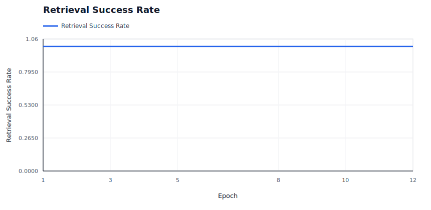

### Slot State Transitions

Shows active slots and repair slots; spikes indicate reassignment churn.

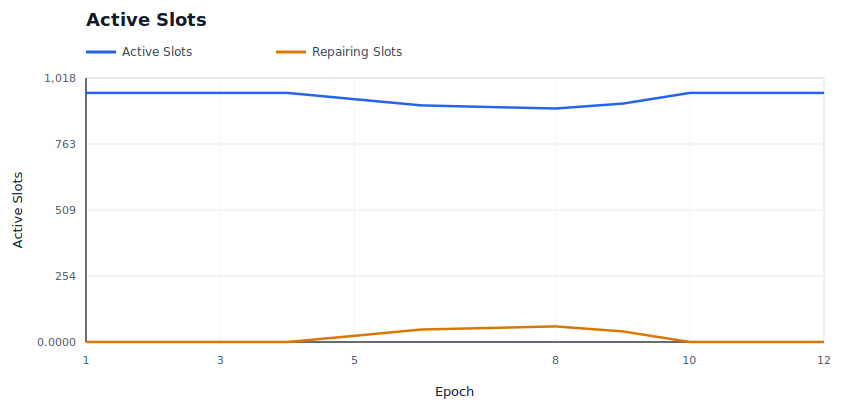

### Provider P&L

Shows aggregate provider economics over time.

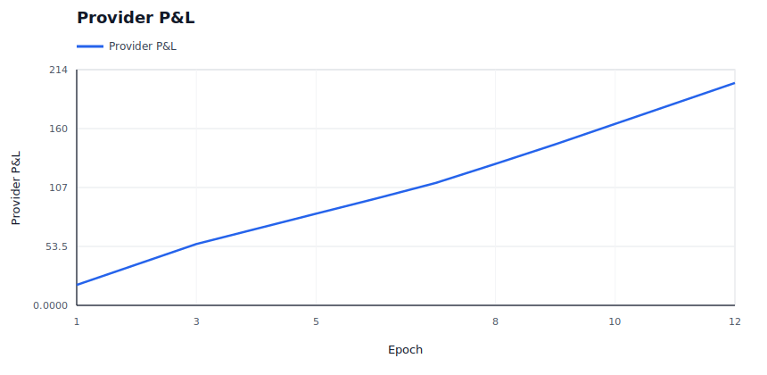

### Burn / Mint Ratio

Shows whether burns are material relative to minted rewards and audit budget.

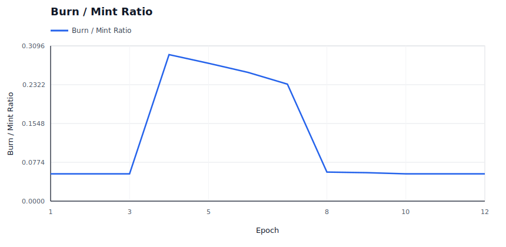

### Price Trajectory

Shows storage price and retrieval price movement under dynamic pricing.

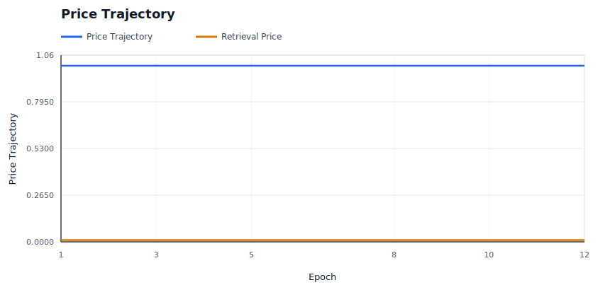

### Storage Demand

Shows modeled new deal demand accepted versus rejected by price.

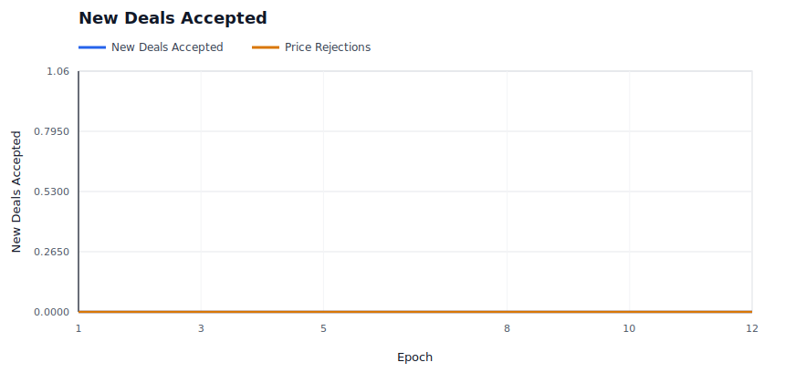

### Capacity Utilization

Shows active storage responsibility against modeled provider capacity.

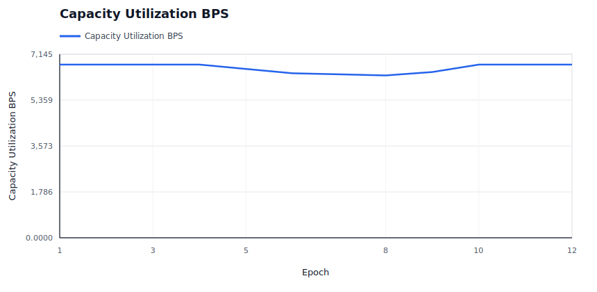

### Saturation And Repair Pressure

Shows provider bandwidth saturation and repair backoffs, which are scale-specific stress signals.

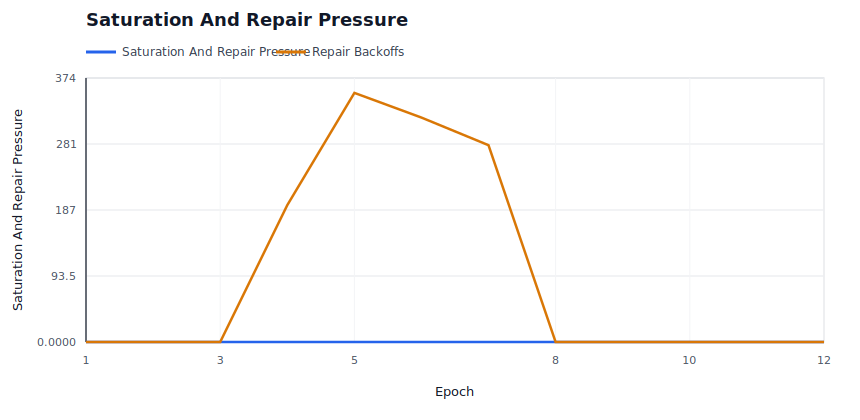

### Repair Backlog

Shows whether started repairs are accumulating faster than they complete.

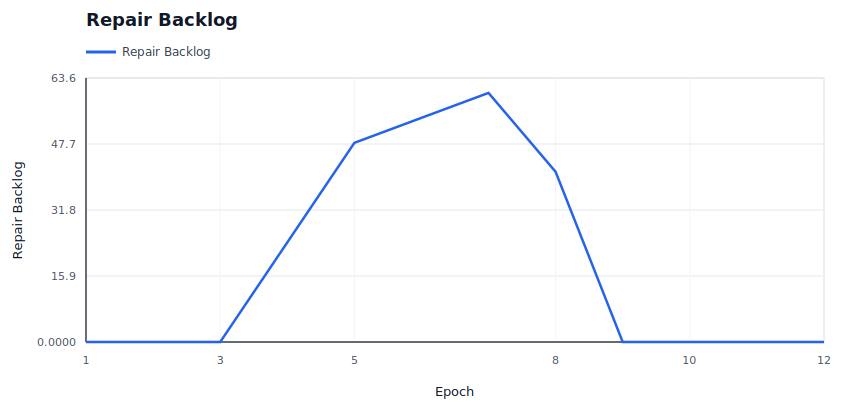

### High-Bandwidth Promotion

Shows capability promotion/demotion state over time for hot-path eligibility.

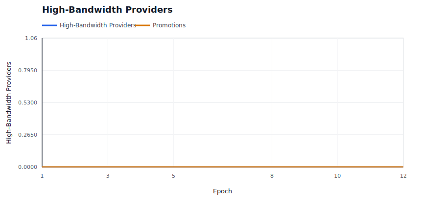

### Hot Retrieval Routing

Shows whether hot retrieval attempts are being served by promoted high-bandwidth providers.

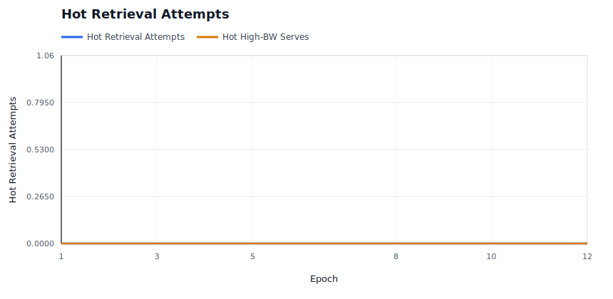

### Performance Tiers

Shows the fast positive tier and Fail-tier service counts under the performance market.

### Operator Concentration

Shows whether operator assignment share is bounded despite provider identity concentration.

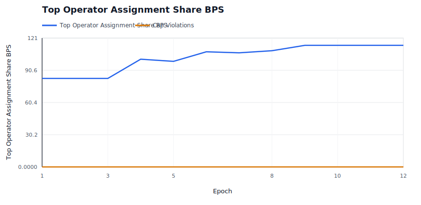

### Evidence Pressure

Shows soft liveness evidence and hard invalid-proof evidence by epoch.

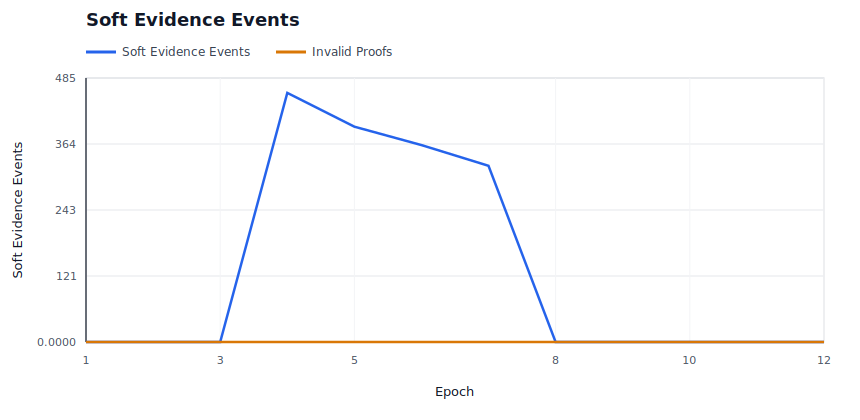

### Evidence Spam Economics

Shows bond burn and bounty payout for low-quality deputy evidence claims.

### Audit Budget

Shows whether miss-driven audit demand is spending budget or accumulating carryover.

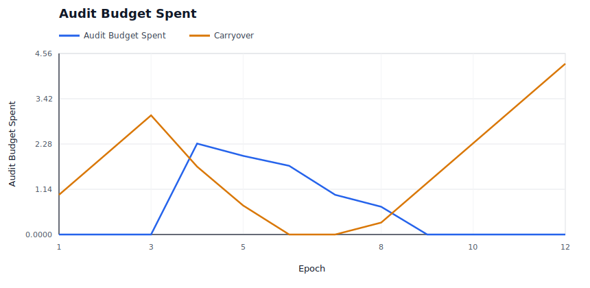

### Audit Backlog

Shows unmet audit demand and exhausted-budget epochs when evidence exceeds available enforcement budget.

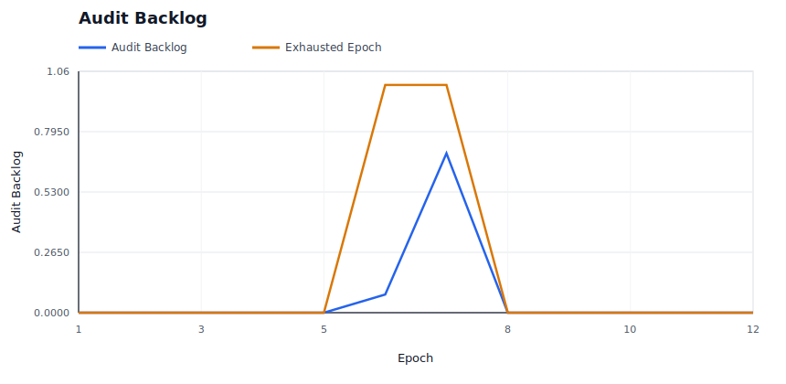

### Elasticity Spend

Shows demand-funded elasticity spend and rejected expansion attempts.

## Raw Artifacts

- `summary.json`: compact machine-readable run summary.
- `epochs.csv`: per-epoch availability, liveness, reward, repair, and economics metrics.
- `providers.csv`: final provider-level economics, fault counters, and capability tier.
- `operators.csv`: final operator-level provider count, assignment share, success, and P&L metrics.
- `slots.csv`: per-slot epoch ledger, including health state and reason.
- `evidence.csv`: policy evidence events.
- `repairs.csv`: repair start, pending-provider readiness, completion, attempt-count, cooldown, candidate-exclusion, attempt-cap, and backoff events.
- `economy.csv`: per-epoch market and accounting ledger.
- `signals.json`: derived availability, saturation, repair, capacity, economic, regional, concentration, and provider bottleneck signals.
