# Policy Simulation Report: Storage Demand Elasticity Recovery

## Executive Summary

**Verdict:** `PASS`. This run simulates `demand-elasticity-recovery` with `80` providers, `100` data users, `8` deals, and an RS `8+4` layout for `10` epochs. Enforcement is configured as `REWARD_EXCLUSION`.

Model latent storage demand that initially pauses because storage price is above a reference willingness-to-pay level, then recovers as the utilization-based controller steps price down.

Expected policy behavior: Some latent demand is suppressed early, effective requests recover later, accepted deals become non-zero, and capacity rejections stay zero.

Observed result: retrieval success was `100.00%`, reward coverage was `100.00%`, repairs started/ready/completed were `0` / `0` / `0`, and `0` providers ended with negative modeled P&L. The run recorded `0` unavailable reads, `0` modeled data-loss events, `0` bandwidth saturation responses and `0` repair backoffs across `0` repair attempts. Slot health recorded `0` suspect slot-epochs and `0` delinquent slot-epochs. High-bandwidth promotions were `0` and final high-bandwidth providers were `0`.

## Review Focus

Use this fixture to calibrate demand elasticity, quote telemetry, and price-step timing before encoding market defaults.

A human reviewer should focus less on the pass/fail label and more on whether the scenario, assertions, and threshold values encode the policy we actually want to enforce on-chain.

## Run Configuration

| Field | Value |
|---|---:|
| Seed | `59` |
| Providers | `80` |
| Data users | `100` |
| Deals | `8` |
| Epochs | `10` |
| Erasure coding | `K=8`, `M=4`, `N=12` |
| User MDUs per deal | `16` |
| Retrievals/user/epoch | `1` |
| Liveness quota | `2`-`8` blobs/slot/epoch |
| Repair delay | `2` epochs |
| Repair attempt cap/slot | `0` (`0` means unlimited) |
| Repair backoff window | `0` epochs |
| Dynamic pricing | `true` |
| Storage price | `2.0000` |
| New deal requests/epoch | `20` |
| Storage demand price ceiling | `0.0000` (`0` means disabled) |
| Storage demand reference price | `1.0000` (`0` disables elasticity) |
| Storage demand elasticity | `100.00%` |
| Retrieval price/slot | `0.0100` |
| Provider capacity range | `64`-`64` slots |
| Provider bandwidth range | `0`-`0` serves/epoch (`0` means unlimited) |
| Service class | `General` |
| Performance market | `false` |
| Provider latency range | `0`-`0` ms |
| Latency tier windows | Platinum <= `100` ms, Gold <= `250` ms, Silver <= `500` ms |
| High-bandwidth promotion | `false` |
| High-bandwidth capacity threshold | `0` serves/epoch |
| Hot retrieval share | `0.00%` |
| Operators | `80` |
| Dominant operator provider share | `0.00%` |
| Operator assignment cap/deal | `0` (`0` means disabled) |
| Provider regions | `global` |

## Economic Assumptions

The economic model is intentionally simple and deterministic. It is useful for comparing policy directions, not for setting final token economics without external market data.

| Assumption | Value | Interpretation |
|---|---:|---|
| Storage price | `2.0000` | Unitless price applied by the controller, demand-elasticity curve, and optional affordability gate. |
| New deal requests/epoch | `20` | Latent modeled write demand before optional price elasticity suppression. Effective requests are accepted only when price and capacity gates pass. |
| Storage demand price ceiling | `0.0000` | If non-zero, new deal demand above this storage price is rejected as unaffordable. |
| Storage demand reference price | `1.0000` | If non-zero with elasticity enabled, demand scales around this price before hard affordability rejection. |
| Storage demand elasticity | `100.00%` | Demand multiplier change for a 100% price move relative to the reference price, clamped by configured min/max demand bps. |
| Storage target utilization | `65.00%` | If dynamic pricing is enabled, utilization above this target steps storage price up, otherwise down. |
| Retrieval price per slot | `0.0100` | Paid per successful provider slot served, before the configured variable burn. |
| Retrieval target per epoch | `80` | If dynamic pricing is enabled, retrieval attempts above this target step retrieval price up, otherwise down. |
| Retrieval demand shocks | `[]` | Optional epoch-scoped retrieval demand multipliers used to test price shock response and oscillation. |
| Dynamic pricing max step | `10.00%` | Per-epoch controller movement cap. Lower values are safer but slower to equilibrate. |
| Base reward per slot | `0.0200` | Modeled issuance/subsidy paid only to reward-eligible active slots. |
| Provider storage cost/slot/epoch | `0.0100` | Simplified provider cost basis; jitter may create marginal-provider distress. |
| Provider bandwidth cost/retrieval | `0.0010` | Simplified egress cost basis for retrieval-heavy scenarios. |
| Provider cost shocks | `[]` | Optional epoch-scoped fixed/storage/bandwidth cost multipliers used to model sudden operator cost pressure. |
| Provider churn policy | enabled `False`, threshold `0.0000`, after `1` epochs, cap `0`/epoch | Converts sustained negative economics into draining exits; cap `0` means unbounded by this policy. |
| Provider churn floor | `0` providers | Prevents an economic shock fixture from exiting the entire active set unless intentionally configured. |
| Performance reward per serve | `0.0000` | Optional tiered QoS reward. Multipliers are applied by latency tier and Fail tier receives the configured fail multiplier. |
| Audit budget per epoch | `1.0000` | Minted audit budget; spending is capped by available budget and unmet miss-driven demand carries forward as backlog. |
| Evidence spam claims/epoch | `0` | Synthetic low-quality deputy claims used to test bond burn and bounty gating economics. |
| Evidence bond / bounty | `0.0000` / `0.0000` | Spam claims burn bond unless convicted; bounty is paid only on convicted evidence. |
| Retrieval burn | `5.00%` | Fraction of variable retrieval fees burned before provider payout. |

## What Happened

User-facing retrieval availability stayed intact and no operational enforcement evidence was recorded. For this run, the main question is the scenario-specific control or economic result rather than recovery from a provider fault.

The policy layer recorded no evidence events, which is expected only for cooperative or pure-market control scenarios.

Modeled write demand was exercised: `200` latent new deal requests became `128` effective requests after price elasticity, with `72` suppressed by price response. Effective requests produced `128` accepted deals, `0` price rejections, and `0` capacity rejections. The effective-request acceptance rate was `100.00%` and latent-demand acceptance was `64.00%`.

No repair events occurred. For healthy or economic-only scenarios this is correct; for fault scenarios it may mean the policy is too passive.

## Diagnostic Signals

These are derived from the raw CSV/JSON outputs and are intended to make scale behavior reviewable without manually scanning ledgers.

| Signal | Value | Why It Matters |
|---|---:|---|
| Worst epoch success | `100.00%` at epoch `1` | Identifies the availability cliff instead of hiding it in aggregate success. |
| Unavailable reads | `0` | Temporary read failures are a scale/reliability signal; they are not automatically permanent data loss. |
| Modeled data-loss events | `0` | Durability-loss signal. This should remain zero for current scale fixtures. |
| Degraded epochs | `0` | Counts epochs with unavailable reads or success below 99.9%. |
| Recovery epoch after worst | `2` | Shows whether the network returned to clean steady state after the worst point. |
| Saturation rate | `0.00%` | Provider bandwidth saturation per retrieval attempt. |
| Peak saturation | `0` at epoch `1` | Reveals when bandwidth, not storage correctness, became the bottleneck. |
| Repair readiness ratio | `100.00%` | Measures whether pending providers catch up before promotion. |
| Repair completion ratio | `100.00%` | Measures whether healing catches up with detection. |
| Repair attempts | `0` | Counts bounded attempts to open a repair or discover replacement pressure. |
| Repair backoff pressure | `0` backoffs per started repair | Shows whether repair coordination is saturated. |
| Repair backoffs per attempt | `0` | Distinguishes capacity/cooldown pressure from successful repair starts. |
| Repair cooldowns / attempt caps | `0` / `0` | Shows whether throttling, rather than candidate selection alone, is bounding repair churn. |
| Suspect / delinquent slot-epochs | `0` / `0` | Separates early warning state from threshold-crossed delinquency. |
| Final repair backlog | `0` slots | Started repairs minus completed repairs at run end. |
| High-bandwidth providers | `0` | Providers currently eligible for hot/high-bandwidth routing. |
| High-bandwidth promotions/demotions | `0` / `0` | Shows capability changes under measured demand. |
| Hot high-bandwidth serves/retrieval | `0` | Measures whether hot retrievals actually use promoted providers. |
| Avg latency / Fail tier rate | `0` ms / `0.00%` | Separates correctness from QoS: slow-but-valid service can be available while still earning lower or no performance rewards. |
| Platinum / Gold / Silver / Fail serves | `0` / `0` / `0` / `0` | Shows the latency-tier distribution for performance-market policy. |
| Performance reward paid | `0.0000` | Quantifies the tiered QoS reward stream separately from baseline storage and retrieval settlement. |
| Provider latency p10 / p50 / p90 | `0` / `0` / `0` ms | Shows whether aggregate averages hide slow provider tails. |
| New deal latent/effective demand | `200` / `128` | Shows how much modeled write demand survived the price-elasticity curve. |
| New deal demand accepted/rejected/suppressed | `128` / `0` / `72` | Shows whether modeled write demand is entering the network, blocked by price/capacity, or never arriving because quotes are unattractive. |
| New deal effective/latent acceptance | `100.00%` / `64.00%` | Demand-side market health signal; a technically available network can still fail if users cannot afford storage. |
| Audit demand / spent | `0.0000` / `0.0000` | Shows whether enforcement evidence consumed the available audit budget. |
| Audit backlog / exhausted epochs | `0.0000` / `0` | Makes budget exhaustion explicit instead of hiding unmet audit work behind capped spending. |
| Evidence spam claims / convictions | `0` / `0` | Shows whether the evidence-market spam fixture exercised low-quality claims and any successful convictions. |
| Evidence spam bond / net gain | `0.0000` / `0.0000` | Spam should be negative-EV unless conviction-gated bounties justify the claim volume. |
| Top operator provider share | `1.25%` | Shows whether many SP identities are controlled by one operator. |
| Top operator assignment share | `1.28%` | Shows whether placement caps translate identity concentration into slot concentration. |
| Max operator slots/deal | `1` | Checks per-deal blast-radius limits against operator Sybil concentration. |
| Operator cap violations | `0` | Counts deals where operator slot concentration exceeded the configured cap. |
| Final storage utilization | `31.87%` | Active slots versus modeled provider capacity. |
| Provider utilization p50 / p90 / max | `31.25%` / `32.81%` / `32.81%` | Detects assignment concentration and capacity cliffs. |
| Provider P&L p10 / p50 / p90 | `1.5666` / `1.7997` / `2.0385` | Shows whether aggregate P&L hides marginal-provider distress. |
| Provider cost shock epochs/providers | `0` / `0` | Shows when external cost pressure was active and how much of the provider population it affected. |
| Max cost shock fixed/storage/bandwidth | `100.00%` / `100.00%` / `100.00%` | Distinguishes fixed-cost, storage-cost, and egress-cost shocks. |
| Provider churn events / final churned | `0` / `0` | Shows whether sustained economic distress became modeled provider exits rather than only a warning label. |
| Churn pressure provider-epochs / peak | `12` / `10` | Shows the breadth and duration of providers below the configured churn threshold. |
| Active / exited provider capacity | `5120` / `0` slots | Measures supply actually remaining after modeled exits. |
| Peak assigned slots on churned providers | `0` | Shows the maximum repair burden created by economic exits. |
| Storage price start/end/range | `2.0000` -> `0.7748` (`0.7748`-`2.0000`) | Shows dynamic pricing movement and bounds. |
| Retrieval price start/end/range | `0.0100` -> `0.0236` (`0.0100`-`0.0236`) | Shows whether demand pressure moved retrieval pricing. |
| Retrieval latent/effective attempts | `1000` / `1000` | Shows how much retrieval load was added by demand-shock multipliers. |
| Retrieval demand shock epochs/multiplier | `0` / `100.00%` | Shows the size and duration of the modeled read-demand shock. |
| Price direction changes storage/retrieval | `0` / `0` | Detects controller oscillation rather than relying on visual inspection. |

### Regional Signals

| Region | Providers | Utilization | Offline Responses | Saturated Responses | Negative P&L Providers | Avg P&L |
|---|---:|---:|---:|---:|---:|---:|
| `global` | 80 | 31.87% | 0 | 0 | 0 | 1.8021 |

### Top Bottleneck Providers

| Provider | Region | Slots/Capacity | Utilization | Bandwidth Cap | Attempts | Offline | Saturated | P&L |
|---|---|---:|---:|---:|---:|---:|---:|---:|
| `sp-007` | `global` | 21/64 | 32.81% | 0 | 125 | 0 | 0 | 2.1760 |
| `sp-004` | `global` | 21/64 | 32.81% | 0 | 121 | 0 | 0 | 2.1549 |
| `sp-072` | `global` | 20/64 | 31.25% | 0 | 121 | 0 | 0 | 2.0385 |
| `sp-000` | `global` | 21/64 | 32.81% | 0 | 120 | 0 | 0 | 2.1227 |
| `sp-048` | `global` | 20/64 | 31.25% | 0 | 120 | 0 | 0 | 2.0520 |
| `sp-006` | `global` | 21/64 | 32.81% | 0 | 119 | 0 | 0 | 2.1215 |
| `sp-049` | `global` | 20/64 | 31.25% | 0 | 119 | 0 | 0 | 2.0688 |
| `sp-051` | `global` | 20/64 | 31.25% | 0 | 119 | 0 | 0 | 2.0356 |

### Top Operators

| Operator | Providers | Provider Share | Assigned Slots | Assignment Share | Retrieval Attempts | Success | P&L |
|---|---:|---:|---:|---:|---:|---:|---:|
| `op-000` | 1 | 1.25% | 21 | 1.28% | 120 | 100.00% | 2.1227 |
| `op-001` | 1 | 1.25% | 21 | 1.28% | 111 | 100.00% | 1.9725 |
| `op-002` | 1 | 1.25% | 21 | 1.28% | 117 | 100.00% | 2.1122 |
| `op-003` | 1 | 1.25% | 21 | 1.28% | 117 | 100.00% | 2.0770 |
| `op-004` | 1 | 1.25% | 21 | 1.28% | 121 | 100.00% | 2.1549 |
| `op-005` | 1 | 1.25% | 21 | 1.28% | 116 | 100.00% | 2.0302 |
| `op-006` | 1 | 1.25% | 21 | 1.28% | 119 | 100.00% | 2.1215 |
| `op-007` | 1 | 1.25% | 21 | 1.28% | 125 | 100.00% | 2.1760 |

### Timeline

| Epoch | Retrieval Success | Evidence | Repairs Started | Repairs Ready | Repairs Completed | Reward Burned | Provider P&L | Notes |
|---:|---:|---:|---:|---:|---:|---:|---:|---|
| 1 | 100.00% | 20 | 0 | 0 | 0 | 0.0000 | 3.7600 | 20 price-suppressed deals |
| 2 | 100.00% | 16 | 0 | 0 | 0 | 0.0000 | 5.0000 | 4 new deals accepted, 16 price-suppressed deals |
| 3 | 100.00% | 13 | 0 | 0 | 0 | 0.0000 | 6.6760 | 7 new deals accepted, 13 price-suppressed deals |
| 4 | 100.00% | 10 | 0 | 0 | 0 | 0.0000 | 8.7956 | 10 new deals accepted, 10 price-suppressed deals |
| 5 | 100.00% | 7 | 0 | 0 | 0 | 0.0000 | 11.3672 | 13 new deals accepted, 7 price-suppressed deals |
| 6 | 100.00% | 4 | 0 | 0 | 0 | 0.0000 | 14.3999 | 16 new deals accepted, 4 price-suppressed deals |
| 7 | 100.00% | 2 | 0 | 0 | 0 | 0.0000 | 17.7839 | 18 new deals accepted, 2 price-suppressed deals |
| 8 | 100.00% | 0 | 0 | 0 | 0 | 0.0000 | 21.5302 | 20 new deals accepted |
| 9 | 100.00% | 0 | 0 | 0 | 0 | 0.0000 | 25.4113 | 20 new deals accepted |
| 10 | 100.00% | 0 | 0 | 0 | 0 | 0.0000 | 29.4404 | 20 new deals accepted |

## Enforcement Interpretation

The simulator recorded `0` evidence events and `0` repair ledger events. The first evidence epoch was `none` and the first repair-start epoch was `none`.

Evidence by reason:

- None recorded.

Evidence by provider:

- None recorded.

Repair summary:

- Repairs started: `0`
- Repairs marked ready: `0`
- Repairs completed: `0`
- Repair attempts: `0`
- Repair backoffs: `0`
- Repair cooldown backoffs: `0`
- Repair attempt-cap backoffs: `0`
- Suspect slot-epochs: `0`
- Delinquent slot-epochs: `0`
- Final active slots in last epoch: `1632`

Candidate exclusion summary:

- No no-candidate repair backoffs were recorded.

### Repair Ledger Excerpt

- No repair ledger events were recorded.

## Economic Interpretation

The run minted `152.0800` reward/audit units and burned `7.3750` units, for a burn-to-mint ratio of `4.85%`.

Providers earned `263.2044` in modeled revenue against `119.0400` in modeled cost, ending with aggregate P&L `144.1644`.

Retrieval accounting paid providers `121.1244`, burned `1.0000` in base fees, and burned `6.3750` in variable retrieval fees.

Performance-tier accounting paid `0.0000` in QoS rewards.

Audit accounting saw `0.0000` of demand, spent `0.0000`, and ended with `0.0000` backlog after `0` exhausted epochs.

Demand accounting saw `200` latent new deal requests, `128` effective requests after elasticity, accepted `128`, suppressed `72` by price response, rejected `0` on price, and rejected `0` on capacity. Effective-request acceptance rate was `100.00%`.

No provider ended with negative modeled P&L under the current assumptions.

Final modeled storage price was `0.7748` and retrieval price per slot was `0.0236`.

### Provider P&L Extremes

| Provider | Assigned Slots | Revenue | Cost | Slashed | P&L | Churn Risk |
|---|---:|---:|---:|---:|---:|---:|
| `sp-020` | 20 | 1.6800 + 1.1551 | 1.4140 | 0.0000 | 1.4211 | no |
| `sp-065` | 20 | 1.7400 + 1.1426 | 1.4470 | 0.0000 | 1.4356 | no |
| `sp-023` | 20 | 1.6800 + 1.2174 | 1.4180 | 0.0000 | 1.4794 | no |
| `sp-062` | 20 | 1.7400 + 1.2263 | 1.4510 | 0.0000 | 1.5153 | no |
| `sp-067` | 20 | 1.7400 + 1.2292 | 1.4530 | 0.0000 | 1.5162 | no |

## Assertion Contract

Assertions are the machine-readable policy contract for this fixture. Passing means this simulator run satisfied the current contract; it does not mean the policy is production-ready.

| Assertion | Status | Meaning | Detail |
|---|---|---|---|
| `min_success_rate` | `PASS` | Availability floor: user-facing reads must stay above this success rate. | success_rate=1, required>=1 |
| `min_new_deal_latent_requests` | `PASS` | Demand fixture must exercise latent modeled write demand before price elasticity. | new_deal_latent_requests=200, required>=200 |
| `min_new_deals_suppressed_price` | `PASS` | Elastic demand fixture must suppress some latent demand when storage price is above the reference price. | new_deals_suppressed_price=72, required>=1 |
| `min_new_deal_requests` | `PASS` | Demand fixture must exercise effective modeled write demand after price elasticity. | new_deal_requests=128, required>=1 |
| `min_new_deals_accepted` | `PASS` | Demand fixture must admit at least this many new storage deals. | new_deals_accepted=128, required>=1 |
| `min_new_deal_latent_acceptance_rate` | `PASS` | Recovery fixture should accept at least this share of latent demand after price response. | new_deal_latent_acceptance_rate=0.64, required>=0.05 |
| `max_new_deals_rejected_price` | `PASS` | Healthy affordability fixture should keep price-driven deal rejection bounded. | new_deals_rejected_price=0, required<=0 |
| `max_new_deals_rejected_capacity` | `PASS` | Demand fixture should not accidentally reject requests because provider capacity was exhausted. | new_deals_rejected_capacity=0, required<=0 |
| `max_final_storage_price` | `PASS` | Dynamic pricing should keep storage price at or below this value by run end. | final_storage_price=0.774840978, required<=1 |
| `max_data_loss_events` | `PASS` | Durability invariant: stress may allow unavailable reads, but modeled data loss must stay at zero. | data_loss_events=0, required<=0 |

## Evidence Ledger Excerpt

These rows are representative raw evidence events. Use `evidence.csv` for the complete ledger.

| Epoch | Deal | Slot | Provider | Class | Reason | Consequence |
|---:|---:|---:|---|---|---|---|
| n/a | n/a | n/a | n/a | n/a | n/a | No evidence events were recorded. |

## Generated Graphs

The following SVG graphs are generated beside this report and embedded here with relative Markdown links so the report is readable as a self-contained artifact in GitHub or a local Markdown viewer.

### Retrieval Success Rate

Should stay near 1.0 unless availability is actually lost.

### Slot State Transitions

Shows active slots and repair slots; spikes indicate reassignment churn.

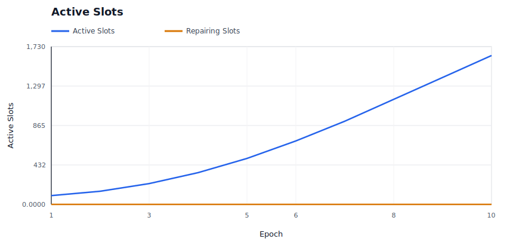

### Provider P&L

Shows aggregate provider economics over time.

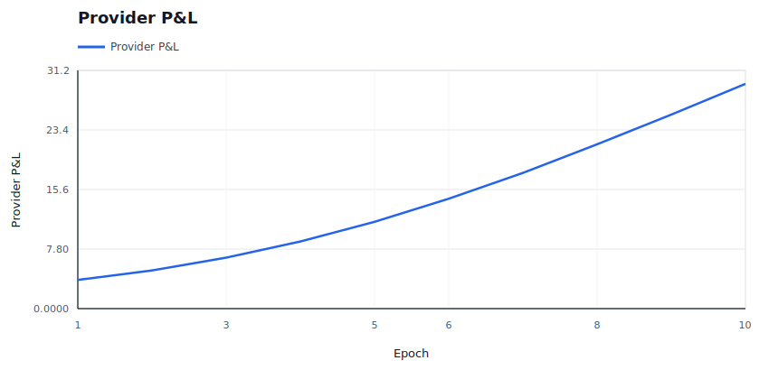

### Provider Cost Shock

Shows modeled provider cost pressure against provider revenue.

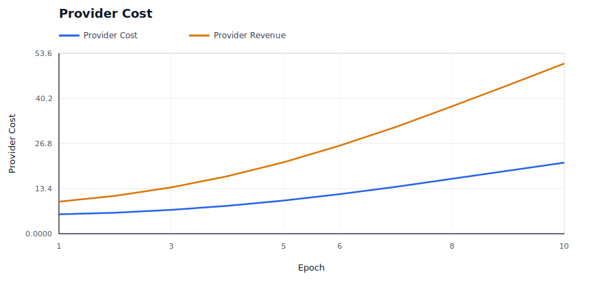

### Provider Churn

Shows modeled provider exits and per-epoch churn events.

### Burn / Mint Ratio

Shows whether burns are material relative to minted rewards and audit budget.

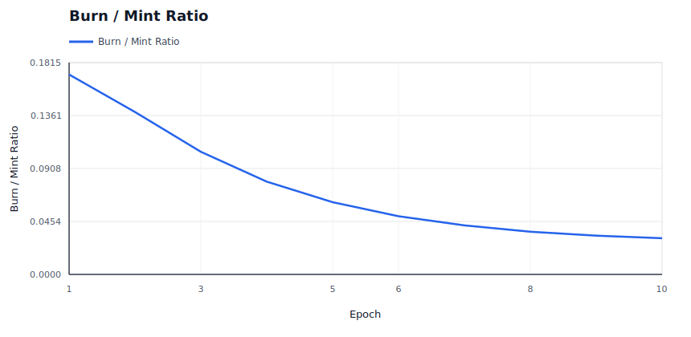

### Price Trajectory

Shows storage price and retrieval price movement under dynamic pricing.

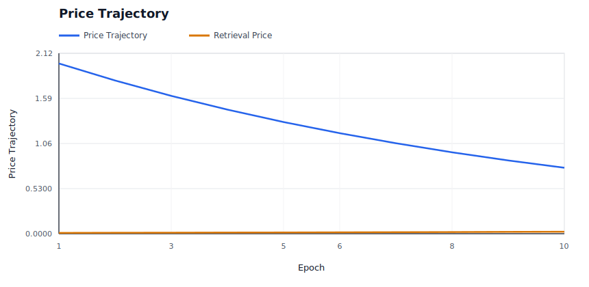

### Retrieval Demand

Shows effective retrieval attempts against latent baseline demand.

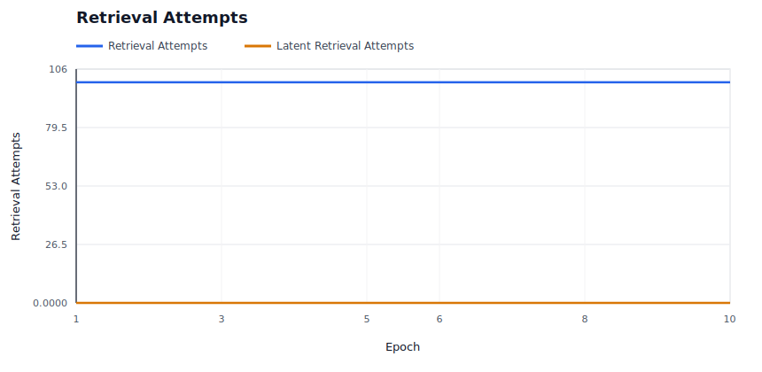

### Storage Demand

Shows modeled new deal demand accepted versus rejected by price.

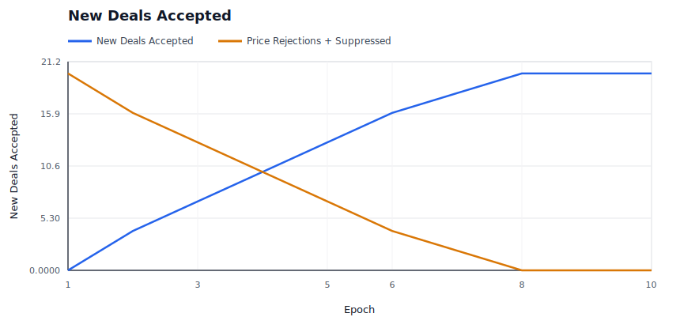

### Capacity Utilization

Shows active storage responsibility against modeled provider capacity.

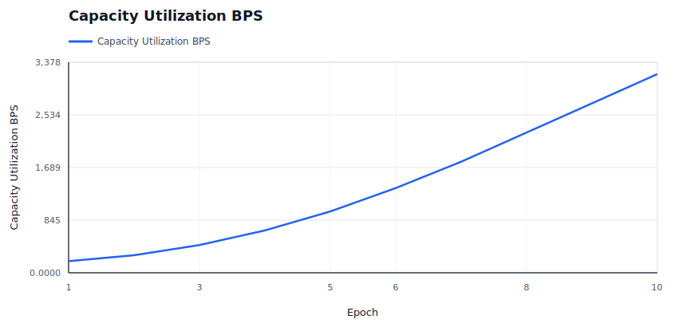

### Saturation And Repair Pressure

Shows provider bandwidth saturation and repair backoffs, which are scale-specific stress signals.

### Repair Backlog

Shows whether started repairs are accumulating faster than they complete.

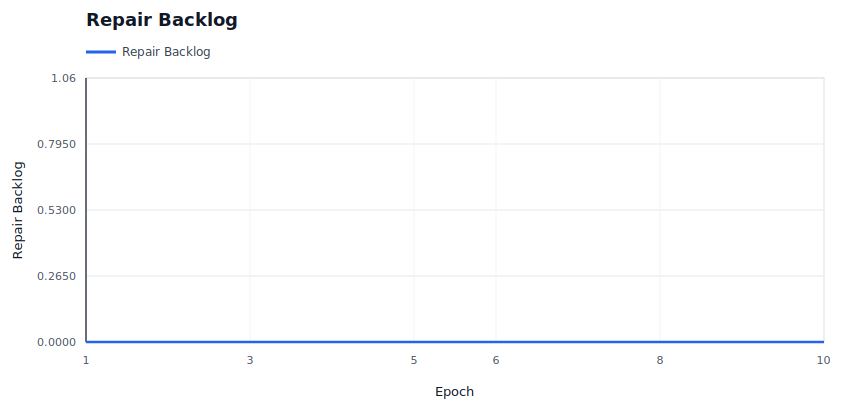

### High-Bandwidth Promotion

Shows capability promotion/demotion state over time for hot-path eligibility.

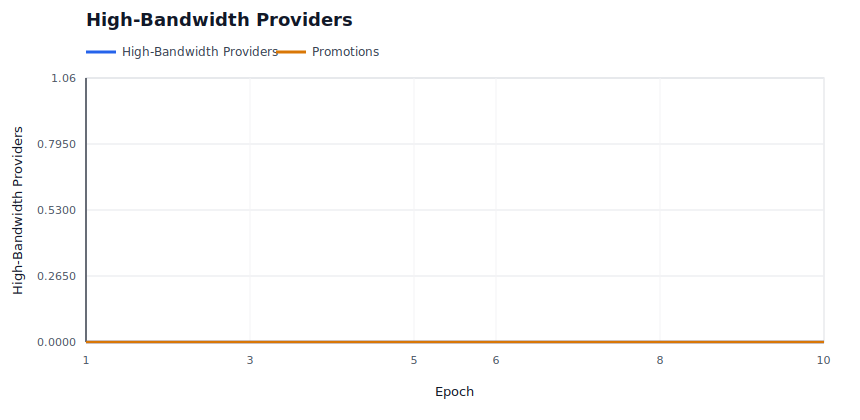

### Hot Retrieval Routing

Shows whether hot retrieval attempts are being served by promoted high-bandwidth providers.

### Performance Tiers

Shows the fast positive tier and Fail-tier service counts under the performance market.

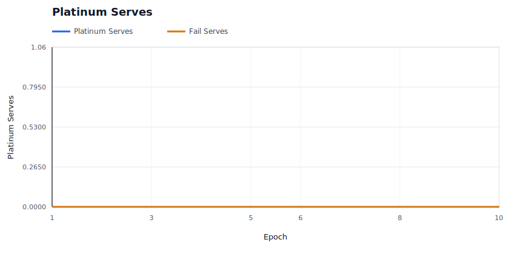

### Operator Concentration

Shows whether operator assignment share is bounded despite provider identity concentration.

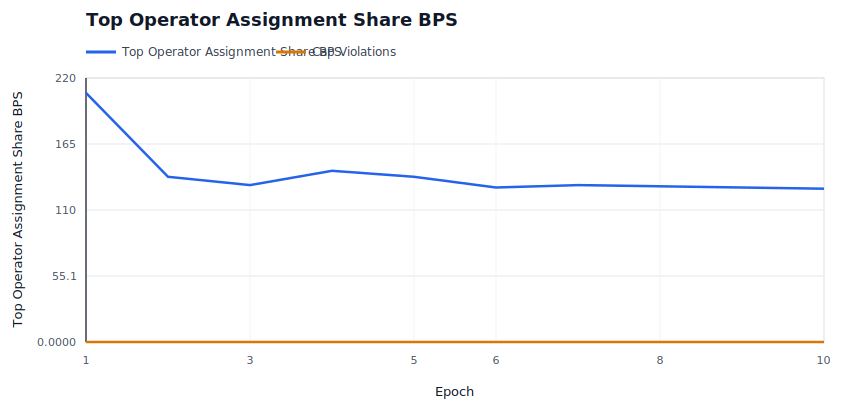

### Evidence Pressure

Shows soft liveness evidence and hard invalid-proof evidence by epoch.

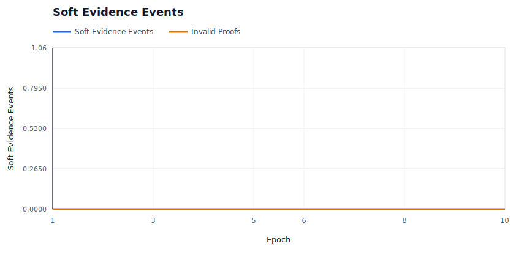

### Evidence Spam Economics

Shows bond burn and bounty payout for low-quality deputy evidence claims.

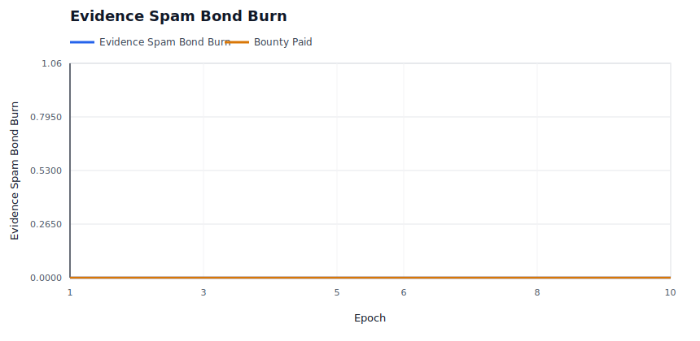

### Audit Budget

Shows whether miss-driven audit demand is spending budget or accumulating carryover.

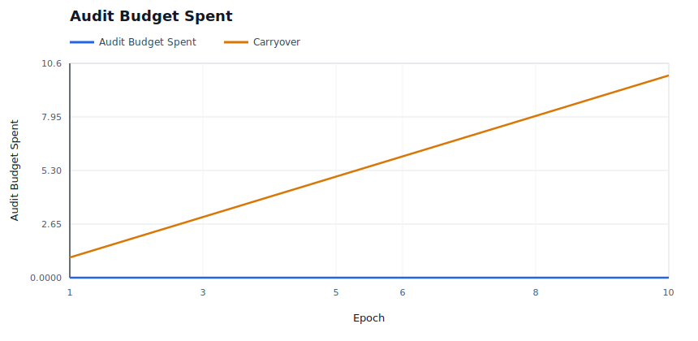

### Audit Backlog

Shows unmet audit demand and exhausted-budget epochs when evidence exceeds available enforcement budget.

### Elasticity Spend

Shows demand-funded elasticity spend and rejected expansion attempts.

## Raw Artifacts

- `summary.json`: compact machine-readable run summary.
- `epochs.csv`: per-epoch availability, liveness, reward, repair, and economics metrics.
- `providers.csv`: final provider-level economics, fault counters, and capability tier.
- `operators.csv`: final operator-level provider count, assignment share, success, and P&L metrics.
- `slots.csv`: per-slot epoch ledger, including health state and reason.
- `evidence.csv`: policy evidence events.
- `repairs.csv`: repair start, pending-provider readiness, completion, attempt-count, cooldown, candidate-exclusion, attempt-cap, and backoff events.
- `economy.csv`: per-epoch market and accounting ledger.
- `signals.json`: derived availability, saturation, repair, capacity, economic, regional, concentration, and provider bottleneck signals.
