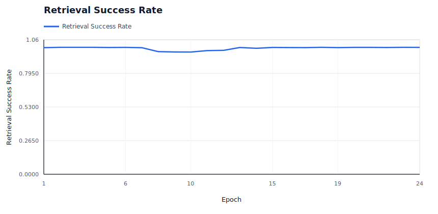
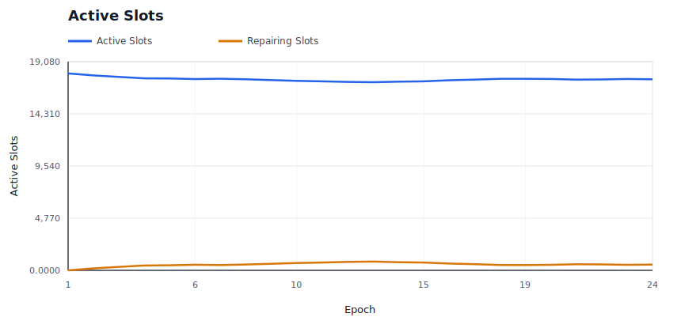
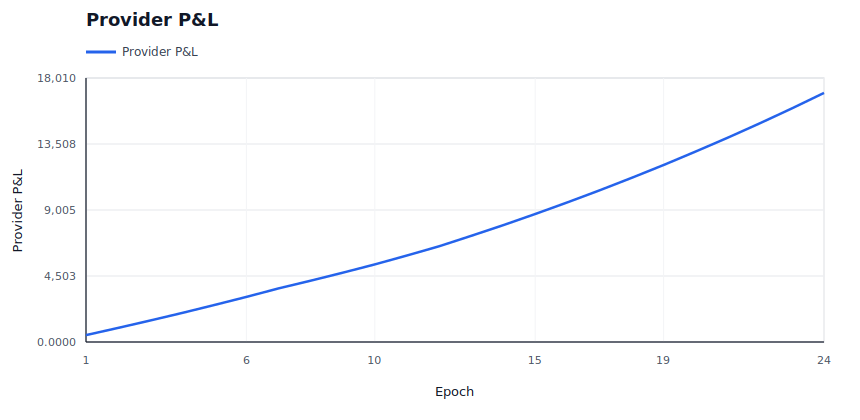
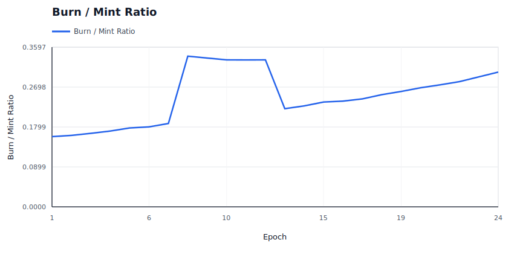
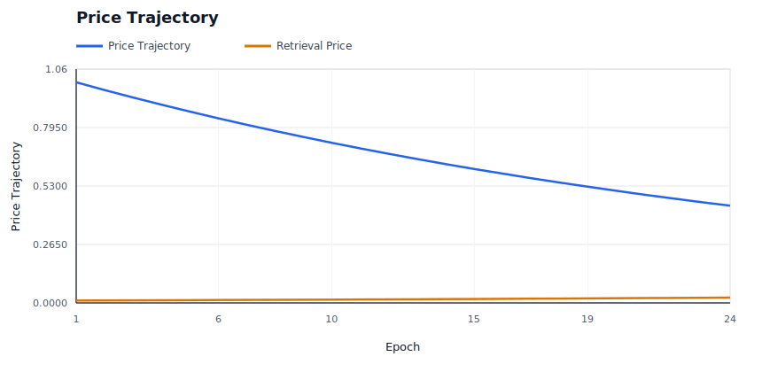
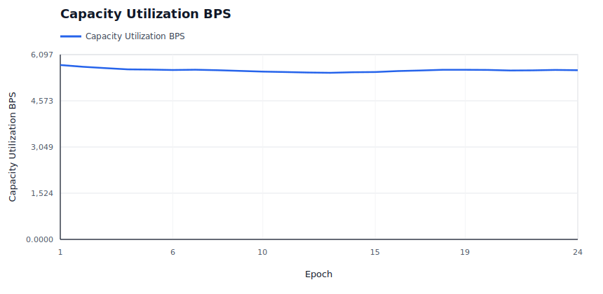
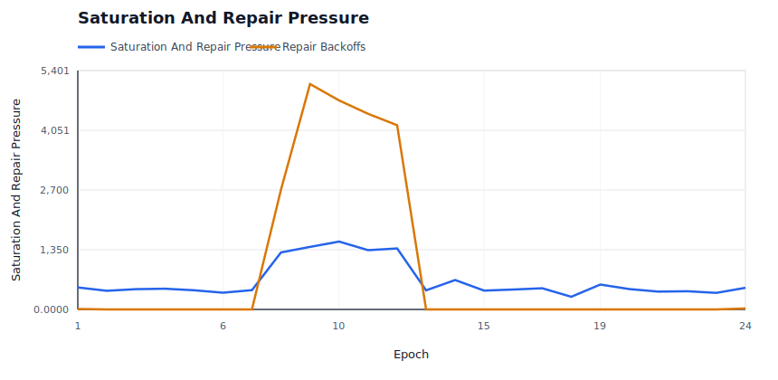
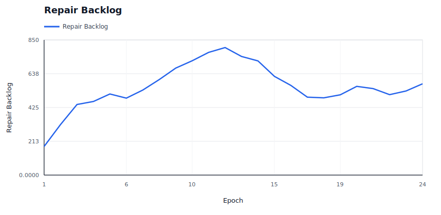

# Policy Simulation Report: Large-Scale Regional Stress

## Executive Summary

**Verdict:** `PASS`. This run simulates `large-scale-regional-stress` with `1200` providers, `3000` data users, `1500` deals, and an RS `8+4` layout for `24` epochs. Enforcement is configured as `REWARD_EXCLUSION`.

Model a population-scale network with more than one thousand storage providers and thousands of users. Providers have heterogeneous capacity, bandwidth, reliability, cost, region, and repair coordination probability. A correlated regional outage and dynamic pricing test whether network state, price, retrieval success, and healing remain stable under scale.

Expected policy behavior: Availability should stay above the configured floor, price should remain bounded, saturation and repair backoffs should be visible, and no provider should be assigned above modeled capacity.

Observed result: retrieval success was `99.26%`, reward coverage was `96.12%`, repairs started/completed were `3624` / `3050`, and `4` providers ended with negative modeled P&L. The run recorded `1065` unavailable reads, `0` modeled data-loss events, `15482` bandwidth saturation responses and `21150` repair backoffs.

## Review Focus

Use this report to inspect aggregate network state rather than a single bad actor: utilization, price trajectory, bandwidth saturation, repair throughput, and provider P&L distribution.

A human reviewer should focus less on the pass/fail label and more on whether the scenario, assertions, and threshold values encode the policy we actually want to enforce on-chain.

## Run Configuration

| Field | Value |
|---|---:|
| Seed | `29` |
| Providers | `1200` |
| Data users | `3000` |
| Deals | `1500` |
| Epochs | `24` |
| Erasure coding | `K=8`, `M=4`, `N=12` |
| User MDUs per deal | `16` |
| Retrievals/user/epoch | `2` |
| Liveness quota | `2`-`8` blobs/slot/epoch |
| Repair delay | `3` epochs |
| Dynamic pricing | `true` |
| Storage price | `1.0000` |
| Retrieval price/slot | `0.0110` |
| Provider capacity range | `16`-`36` slots |
| Provider bandwidth range | `35`-`140` serves/epoch (`0` means unlimited) |
| Provider regions | `na, eu, apac, sa, af, oc` |

## Economic Assumptions

The economic model is intentionally simple and deterministic. It is useful for comparing policy directions, not for setting final token economics without external market data.

| Assumption | Value | Interpretation |
|---|---:|---|
| Storage price | `1.0000` | Unitless price applied by the controller; current simulator does not yet model user demand elasticity against this quote. |
| Storage target utilization | `65.00%` | If dynamic pricing is enabled, utilization above this target steps storage price up, otherwise down. |
| Retrieval price per slot | `0.0110` | Paid per successful provider slot served, before the configured variable burn. |
| Retrieval target per epoch | `5000` | If dynamic pricing is enabled, retrieval attempts above this target step retrieval price up, otherwise down. |
| Dynamic pricing max step | `3.50%` | Per-epoch controller movement cap. Lower values are safer but slower to equilibrate. |
| Base reward per slot | `0.0180` | Modeled issuance/subsidy paid only to reward-eligible active slots. |
| Provider storage cost/slot/epoch | `0.0120` | Simplified provider cost basis; jitter may create marginal-provider distress. |
| Provider bandwidth cost/retrieval | `0.0015` | Simplified egress cost basis for retrieval-heavy scenarios. |
| Audit budget per epoch | `25.0000` | Minted audit budget; spending is capped by available budget and miss-driven demand. |
| Retrieval burn | `7.50%` | Fraction of variable retrieval fees burned before provider payout. |

## What Happened

Availability was degraded: the run succeeded on `99.26%` of retrievals and recorded `1065` unavailable reads.

The policy layer recorded `31338` evidence events: `31338` soft events and `0` hard events. Soft evidence is suitable for repair and reward exclusion; hard evidence is the category that can later justify slashing or stronger sanctions.

Repair was exercised: `3624` repair operations started and `3050` completed. The simulator models this as make-before-break reassignment, so the old assignment remains visible while replacement work catches up.

Reward exclusion was active: `292.9860` modeled reward units were burned instead of paid to non-compliant slots.

Provider bandwidth constraints mattered: the run recorded `15482` saturated provider responses. That is a scale signal, not necessarily malicious behavior.

Repair coordination was constrained: `21150` repair attempts backed off because no candidate or repair-start budget was available.

The directly implicated provider set begins with: `sp-001, sp-007, sp-008, sp-012, sp-013`.

## Diagnostic Signals

These are derived from the raw CSV/JSON outputs and are intended to make scale behavior reviewable without manually scanning ledgers.

| Signal | Value | Why It Matters |
|---|---:|---|
| Worst epoch success | `96.33%` at epoch `10` | Identifies the availability cliff instead of hiding it in aggregate success. |
| Unavailable reads | `1065` | Temporary read failures are a scale/reliability signal; they are not automatically permanent data loss. |
| Modeled data-loss events | `0` | Durability-loss signal. This should remain zero for current scale fixtures. |
| Degraded epochs | `19` | Counts epochs with unavailable reads or success below 99.9%. |
| Recovery epoch after worst | `18` | Shows whether the network returned to clean steady state after the worst point. |
| Saturation rate | `10.75%` | Provider bandwidth saturation per retrieval attempt. |
| Peak saturation | `1534` at epoch `10` | Reveals when bandwidth, not storage correctness, became the bottleneck. |
| Repair completion ratio | `84.16%` | Measures whether healing catches up with detection. |
| Repair backoff pressure | `5.8361` backoffs per started repair | Shows whether repair coordination is saturated. |
| Final repair backlog | `574` slots | Started repairs minus completed repairs at run end. |
| Final storage utilization | `55.69%` | Active slots versus modeled provider capacity. |
| Provider utilization p50 / p90 / max | `61.11%` / `94.44%` / `100.00%` | Detects assignment concentration and capacity cliffs. |
| Provider P&L p10 / p50 / p90 | `8.4821` / `15.7663` / `18.1663` | Shows whether aggregate P&L hides marginal-provider distress. |
| Storage price start/end/range | `1.0000` -> `0.4407` (`0.4407`-`1.0000`) | Shows dynamic pricing movement and bounds. |
| Retrieval price start/end/range | `0.0110` -> `0.0243` (`0.0110`-`0.0243`) | Shows whether demand pressure moved retrieval pricing. |

### Regional Signals

| Region | Providers | Utilization | Offline Responses | Saturated Responses | Negative P&L Providers | Avg P&L |
|---|---:|---:|---:|---:|---:|---:|
| `af` | 200 | 59.14% | 1781 | 3293 | 1 | 15.3142 |
| `apac` | 200 | 58.26% | 2116 | 3128 | 0 | 14.8904 |
| `eu` | 200 | 47.16% | 42126 | 585 | 3 | 8.9747 |
| `na` | 200 | 59.70% | 1434 | 3422 | 0 | 15.2489 |
| `oc` | 200 | 59.67% | 1701 | 2392 | 0 | 14.9955 |
| `sa` | 200 | 61.27% | 1235 | 2662 | 0 | 15.5311 |

### Top Bottleneck Providers

| Provider | Region | Slots/Capacity | Utilization | Bandwidth Cap | Attempts | Offline | Saturated | P&L |
|---|---|---:|---:|---:|---:|---:|---:|---:|
| `sp-127` | `eu` | 3/35 | 8.57% | 125 | 776 | 299 | 0 | 3.8598 |
| `sp-439` | `eu` | 14/31 | 45.16% | 39 | 962 | 242 | 47 | 9.4818 |
| `sp-901` | `eu` | 15/26 | 57.69% | 94 | 1083 | 287 | 0 | 10.5070 |
| `sp-595` | `eu` | 15/36 | 41.66% | 60 | 1085 | 286 | 0 | 10.7843 |
| `sp-109` | `eu` | 13/18 | 72.22% | 40 | 985 | 266 | 20 | 9.0032 |
| `sp-751` | `eu` | 22/26 | 84.61% | 110 | 1280 | 284 | 0 | 13.6805 |
| `sp-997` | `eu` | 14/31 | 45.16% | 38 | 944 | 206 | 70 | 9.0333 |
| `sp-949` | `eu` | 17/20 | 85.00% | 121 | 1129 | 272 | 0 | 12.2693 |

### Timeline

| Epoch | Retrieval Success | Evidence | Repairs Started | Repairs Completed | Reward Burned | Provider P&L | Notes |
|---:|---:|---:|---:|---:|---:|---:|---|
| 1 | 99.78% | 1379 | 180 | 0 | 3.6900 | 472.3180 | 511 offline responses, 497 saturated, 180 quota misses, 11 repair backoffs |
| 2 | 100.00% | 1085 | 138 | 0 | 2.6640 | 960.5062 | 391 offline responses, 421 saturated, 135 quota misses, 180 slots repairing |
| 3 | 100.00% | 1009 | 126 | 0 | 2.3940 | 1464.1662 | 316 offline responses, 459 saturated, 108 quota misses, 318 slots repairing |
| 4 | 100.00% | 958 | 121 | 102 | 2.3220 | 1984.0406 | 267 offline responses, 468 saturated, 102 quota misses, 444 slots repairing |
| 5 | 99.90% | 1204 | 168 | 121 | 3.1500 | 2521.0771 | 452 offline responses, 434 saturated, 150 quota misses, 463 slots repairing |
| 6 | 99.97% | 907 | 113 | 139 | 2.1960 | 3078.0323 | 306 offline responses, 378 saturated, 110 quota misses, 510 slots repairing |
| 7 | 99.75% | 1230 | 168 | 117 | 3.3120 | 3653.4452 | 461 offline responses, 436 saturated, 165 quota misses, 484 slots repairing |
| 8 | 96.65% | 16790 | 180 | 114 | 54.4680 | 4178.8892 | 9595 offline responses, 1288 saturated, 3025 quota misses, 2708 repair backoffs, 535 slots repairing |
| 9 | 96.35% | 16131 | 180 | 108 | 51.1200 | 4725.6918 | 9148 offline responses, 1413 saturated, 2836 quota misses, 5095 repair backoffs, 601 slots repairing |
| 10 | 96.33% | 15270 | 180 | 134 | 47.5380 | 5296.2514 | 8585 offline responses, 1534 saturated, 2635 quota misses, 4725 repair backoffs, 673 slots repairing |
| 11 | 97.47% | 14159 | 180 | 127 | 44.7660 | 5898.8889 | 7982 offline responses, 1340 saturated, 2475 quota misses, 4423 repair backoffs, 719 slots repairing |
| 12 | 97.65% | 13782 | 180 | 150 | 42.4800 | 6527.5540 | 7827 offline responses, 1378 saturated, 2342 quota misses, 4166 repair backoffs, 772 slots repairing |
| 13 | 99.92% | 950 | 119 | 175 | 2.2140 | 7236.6308 | 296 offline responses, 432 saturated, 105 quota misses, 802 slots repairing |
| 14 | 99.25% | 1385 | 152 | 180 | 2.8620 | 7966.9712 | 434 offline responses, 664 saturated, 135 quota misses, 746 slots repairing |
| 15 | 99.93% | 1186 | 170 | 267 | 3.2760 | 8729.3283 | 434 offline responses, 425 saturated, 157 quota misses, 718 slots repairing |
| 16 | 99.87% | 952 | 111 | 168 | 2.2140 | 9521.5242 | 283 offline responses, 451 saturated, 107 quota misses, 621 slots repairing |
| 17 | 99.83% | 917 | 99 | 173 | 1.8540 | 10343.2408 | 256 offline responses, 479 saturated, 83 quota misses, 564 slots repairing |
| 18 | 100.00% | 971 | 153 | 157 | 2.8980 | 11196.4035 | 388 offline responses, 287 saturated, 143 quota misses, 490 slots repairing |
| 19 | 99.82% | 1285 | 157 | 138 | 3.0420 | 12078.5717 | 420 offline responses, 562 saturated, 146 quota misses, 486 slots repairing |
| 20 | 99.97% | 1239 | 164 | 111 | 3.0960 | 12993.3706 | 455 offline responses, 461 saturated, 159 quota misses, 505 slots repairing |
| 21 | 99.97% | 965 | 123 | 137 | 2.3760 | 13940.7664 | 323 offline responses, 402 saturated, 117 quota misses, 558 slots repairing |
| 22 | 99.88% | 893 | 118 | 156 | 2.1960 | 14921.7138 | 268 offline responses, 411 saturated, 96 quota misses, 544 slots repairing |
| 23 | 100.00% | 1137 | 164 | 141 | 3.1140 | 15938.7664 | 445 offline responses, 374 saturated, 154 quota misses, 506 slots repairing |
| 24 | 99.97% | 1429 | 180 | 135 | 3.7440 | 16990.9558 | 550 offline responses, 488 saturated, 189 quota misses, 22 repair backoffs, 529 slots repairing |

## Enforcement Interpretation

The simulator recorded `31338` evidence events and `27824` repair ledger events. The first evidence epoch was `1` and the first repair-start epoch was `1`.

Evidence by reason:

- `quota_shortfall`: `15854`
- `deputy_served_zero_direct`: `15484`

Evidence by provider:

- `sp-847`: `166`
- `sp-127`: `165`
- `sp-1015`: `158`
- `sp-289`: `156`
- `sp-751`: `155`
- `sp-769`: `154`
- `sp-667`: `153`
- `sp-1069`: `153`

Repair summary:

- Repairs started: `3624`
- Repairs completed: `3050`
- Repair backoffs: `21150`
- Final active slots in last epoch: `17426`

### Repair Ledger Excerpt

| Epoch | Event | Deal | Slot | Old Provider | New Provider | Reason |
|---:|---|---:|---:|---|---|---|
| 1 | `repair_started` | 2 | 0 | `sp-012` | `sp-973` | `deputy_served_zero_direct` |
| 1 | `repair_started` | 11 | 2 | `sp-122` | `sp-970` | `deputy_served_zero_direct` |
| 1 | `repair_started` | 14 | 7 | `sp-163` | `sp-1176` | `deputy_served_zero_direct` |
| 1 | `repair_started` | 27 | 11 | `sp-323` | `sp-984` | `deputy_served_zero_direct` |
| 1 | `repair_started` | 31 | 6 | `sp-366` | `sp-151` | `deputy_served_zero_direct` |
| 1 | `repair_started` | 54 | 2 | `sp-638` | `sp-1195` | `deputy_served_zero_direct` |
| 1 | `repair_started` | 62 | 8 | `sp-740` | `sp-1125` | `deputy_served_zero_direct` |
| 1 | `repair_started` | 70 | 0 | `sp-828` | `sp-744` | `deputy_served_zero_direct` |
| 1 | `repair_started` | 77 | 6 | `sp-918` | `sp-738` | `deputy_served_zero_direct` |
| 1 | `repair_started` | 91 | 6 | `sp-1086` | `sp-000` | `deputy_served_zero_direct` |
| 1 | `repair_started` | 96 | 7 | `sp-1147` | `sp-587` | `deputy_served_zero_direct` |
| 1 | `repair_started` | 96 | 11 | `sp-1151` | `sp-372` | `deputy_served_zero_direct` |
| ... | ... | ... | ... | ... | ... | `27812` more events omitted |

## Economic Interpretation

The run minted `8146.1760` reward/audit units and burned `2023.2973` units, for a burn-to-mint ratio of `24.84%`.

Providers earned `25041.6965` in modeled revenue against `8050.7407` in modeled cost, ending with aggregate P&L `16990.9558`.

Retrieval accounting paid providers `17788.5065`, burned `288.0000` in base fees, and burned `1442.3113` in variable retrieval fees.

`4` providers ended with negative P&L and `4` were marked as churn risk. That is economically important even when retrieval success is perfect.

Final modeled storage price was `0.4407` and retrieval price per slot was `0.0243`.

### Provider P&L Extremes

| Provider | Assigned Slots | Revenue | Cost | Slashed | P&L | Churn Risk |
|---|---:|---:|---:|---:|---:|---:|
| `sp-037` | 0 | 0.2700 + 0.2951 | 1.7698 | 0.0000 | -1.2047 | yes |
| `sp-1147` | 3 | 0.4500 + 1.5442 | 2.6191 | 0.0000 | -0.6249 | yes |
| `sp-163` | 3 | 0.4140 + 1.4410 | 2.3094 | 0.0000 | -0.4544 | yes |
| `sp-382` | 1 | 0.9360 + 1.6196 | 2.5611 | 0.0000 | -0.0056 | yes |
| `sp-1154` | 3 | 0.7020 + 2.0264 | 2.6792 | 0.0000 | 0.0493 | no |

## Assertion Contract

Assertions are the machine-readable policy contract for this fixture. Passing means this simulator run satisfied the current contract; it does not mean the policy is production-ready.

| Assertion | Status | Meaning | Detail |
|---|---|---|---|
| `min_success_rate` | `PASS` | Availability floor: user-facing reads must stay above this success rate. | success_rate=0.992604166667, required>=0.985 |
| `min_saturated_responses` | `PASS` | Scale fixture must expose provider bandwidth saturation. | saturated_responses=15482, required>=1 |
| `min_repairs_started` | `PASS` | Repair liveness: policy must start reassignment when evidence warrants it. | repairs_started=3624, required>=1 |
| `min_repairs_completed` | `PASS` | Repair completion: make-before-break reassignment must finish within the run. | repairs_completed=3050, required>=1 |
| `min_repair_backoffs` | `PASS` | Scale fixture must expose healing coordination pressure. | repair_backoffs=21150, required>=1 |
| `max_providers_over_capacity` | `PASS` | Assignment must respect modeled provider capacity. | providers_over_capacity=0, required<=0 |
| `min_final_storage_utilization_bps` | `PASS` | Network utilization should be high enough to make pricing/healing meaningful. | final_storage_utilization_bps=5569, required>=4500 |
| `max_final_storage_utilization_bps` | `PASS` | Network utilization should remain below the capacity cliff. | final_storage_utilization_bps=5569, required<=8500 |
| `max_data_loss_events` | `PASS` | Durability invariant: stress may allow unavailable reads, but modeled data loss must stay at zero. | data_loss_events=0, required<=0 |
| `max_paid_corrupt_bytes` | `PASS` | Corrupt data must not earn payment. | paid_corrupt_bytes=0, required<=0 |

## Evidence Ledger Excerpt

These rows are representative raw evidence events. Use `evidence.csv` for the complete ledger.

| Epoch | Deal | Slot | Provider | Class | Reason | Consequence |
|---:|---:|---:|---|---|---|---|
| 1 | 2 | 0 | `sp-012` | `soft` | `deputy_served_zero_direct` | `repair_candidate` |
| 1 | 2 | 0 | `sp-012` | `soft` | `quota_shortfall` | `repair_candidate` |
| 1 | 11 | 2 | `sp-122` | `soft` | `deputy_served_zero_direct` | `repair_candidate` |
| 1 | 14 | 7 | `sp-163` | `soft` | `deputy_served_zero_direct` | `repair_candidate` |
| 1 | 14 | 7 | `sp-163` | `soft` | `quota_shortfall` | `repair_candidate` |
| 1 | 27 | 11 | `sp-323` | `soft` | `deputy_served_zero_direct` | `repair_candidate` |
| 1 | 27 | 11 | `sp-323` | `soft` | `quota_shortfall` | `repair_candidate` |
| 1 | 31 | 6 | `sp-366` | `soft` | `deputy_served_zero_direct` | `repair_candidate` |
| 1 | 31 | 6 | `sp-366` | `soft` | `quota_shortfall` | `repair_candidate` |
| 1 | 54 | 2 | `sp-638` | `soft` | `deputy_served_zero_direct` | `repair_candidate` |
| 1 | 54 | 2 | `sp-638` | `soft` | `quota_shortfall` | `repair_candidate` |
| 1 | 62 | 8 | `sp-740` | `soft` | `deputy_served_zero_direct` | `repair_candidate` |
| ... | ... | ... | ... | ... | ... | `31326` more events omitted |

## Generated Graphs

The following SVG graphs are generated beside this report and embedded here with relative Markdown links so the report is readable as a self-contained artifact in GitHub or a local Markdown viewer.

### Retrieval Success Rate

Should stay near 1.0 unless availability is actually lost.

### Slot State Transitions

Shows active slots and repair slots; spikes indicate reassignment churn.

### Provider P&L

Shows aggregate provider economics over time.

### Burn / Mint Ratio

Shows whether burns are material relative to minted rewards and audit budget.

### Price Trajectory

Shows storage price and retrieval price movement under dynamic pricing.

### Capacity Utilization

Shows active storage responsibility against modeled provider capacity.

### Saturation And Repair Pressure

Shows provider bandwidth saturation and repair backoffs, which are scale-specific stress signals.

### Repair Backlog

Shows whether started repairs are accumulating faster than they complete.

## Raw Artifacts

- `summary.json`: compact machine-readable run summary.
- `epochs.csv`: per-epoch availability, liveness, reward, repair, and economics metrics.
- `providers.csv`: final provider-level economics and fault counters.
- `slots.csv`: per-slot epoch ledger.
- `evidence.csv`: policy evidence events.
- `repairs.csv`: repair start/completion events.
- `economy.csv`: per-epoch market and accounting ledger.
- `signals.json`: derived availability, saturation, repair, capacity, economic, regional, and provider bottleneck signals.
