# Policy Simulation Report: Performance Market Latency Tiers

## Executive Summary

**Verdict:** `PASS`. This run simulates `performance-market-latency` with `96` providers, `260` data users, `48` deals, and an RS `8+4` layout for `8` epochs. Enforcement is configured as `REWARD_EXCLUSION`.

Model Hot-service retrieval demand across providers with heterogeneous latency. The policy question is whether the simulator can separate correctness from QoS by recording Platinum/Gold/Silver/Fail service tiers and paying tiered performance rewards without treating slow-but-correct service as corrupt data.

Expected policy behavior: Retrievals remain available, all latency tiers appear, Fail-tier serves earn no performance reward, and provider economics expose the tiered reward effect.

Observed result: retrieval success was `100.00%`, reward coverage was `100.00%`, repairs started/ready/completed were `0` / `0` / `0`, and `0` providers ended with negative modeled P&L. The run recorded `0` unavailable reads, `0` modeled data-loss events, `0` bandwidth saturation responses and `0` repair backoffs across `0` repair attempts. Slot health recorded `0` suspect slot-epochs and `0` delinquent slot-epochs. High-bandwidth promotions were `64` and final high-bandwidth providers were `64`. Performance tiers recorded `10077` Platinum, `14584` Gold, `17480` Silver, and `7779` Fail serves.

## Review Focus

Use this before implementing latency-tier keeper params, provider telemetry, service-class reward multipliers, or hot-service placement priority.

A human reviewer should focus less on the pass/fail label and more on whether the scenario, assertions, and threshold values encode the policy we actually want to enforce on-chain.

## Run Configuration

| Field | Value |
|---|---:|
| Seed | `47` |
| Providers | `96` |
| Data users | `260` |
| Deals | `48` |
| Epochs | `8` |
| Erasure coding | `K=8`, `M=4`, `N=12` |
| User MDUs per deal | `16` |
| Retrievals/user/epoch | `3` |
| Liveness quota | `2`-`8` blobs/slot/epoch |
| Repair delay | `2` epochs |
| Repair attempt cap/slot | `0` (`0` means unlimited) |
| Repair backoff window | `0` epochs |
| Dynamic pricing | `false` |
| Storage price | `1.0000` |
| New deal requests/epoch | `0` |
| Storage demand price ceiling | `0.0000` (`0` means disabled) |
| Storage demand reference price | `0.0000` (`0` disables elasticity) |
| Storage demand elasticity | `0.00%` |
| Retrieval price/slot | `0.0140` |
| Provider capacity range | `16`-`16` slots |
| Provider bandwidth range | `80`-`220` serves/epoch (`0` means unlimited) |
| Service class | `Hot` |
| Performance market | `true` |
| Provider latency range | `20`-`360` ms |
| Latency tier windows | Platinum <= `80` ms, Gold <= `170` ms, Silver <= `300` ms |
| High-bandwidth promotion | `true` |
| High-bandwidth capacity threshold | `120` serves/epoch |
| Hot retrieval share | `100.00%` |
| Operators | `96` |
| Dominant operator provider share | `0.00%` |
| Operator assignment cap/deal | `0` (`0` means disabled) |
| Provider regions | `global` |

## Economic Assumptions

The economic model is intentionally simple and deterministic. It is useful for comparing policy directions, not for setting final token economics without external market data.

| Assumption | Value | Interpretation |
|---|---:|---|
| Storage price | `1.0000` | Unitless price applied by the controller, demand-elasticity curve, and optional affordability gate. |
| New deal requests/epoch | `0` | Latent modeled write demand before optional price elasticity suppression. Effective requests are accepted only when price and capacity gates pass. |
| Storage demand price ceiling | `0.0000` | If non-zero, new deal demand above this storage price is rejected as unaffordable. |
| Storage demand reference price | `0.0000` | If non-zero with elasticity enabled, demand scales around this price before hard affordability rejection. |
| Storage demand elasticity | `0.00%` | Demand multiplier change for a 100% price move relative to the reference price, clamped by configured min/max demand bps. |
| Storage target utilization | `70.00%` | If dynamic pricing is enabled, utilization above this target steps storage price up, otherwise down. |
| Retrieval price per slot | `0.0140` | Paid per successful provider slot served, before the configured variable burn. |
| Retrieval target per epoch | `80` | If dynamic pricing is enabled, retrieval attempts above this target step retrieval price up, otherwise down. |
| Dynamic pricing max step | `5.00%` | Per-epoch controller movement cap. Lower values are safer but slower to equilibrate. |
| Base reward per slot | `0.0200` | Modeled issuance/subsidy paid only to reward-eligible active slots. |
| Provider storage cost/slot/epoch | `0.0100` | Simplified provider cost basis; jitter may create marginal-provider distress. |
| Provider bandwidth cost/retrieval | `0.0010` | Simplified egress cost basis for retrieval-heavy scenarios. |
| Performance reward per serve | `0.0020` | Optional tiered QoS reward. Multipliers are applied by latency tier and Fail tier receives the configured fail multiplier. |
| Audit budget per epoch | `1.0000` | Minted audit budget; spending is capped by available budget and unmet miss-driven demand carries forward as backlog. |
| Evidence spam claims/epoch | `0` | Synthetic low-quality deputy claims used to test bond burn and bounty gating economics. |
| Evidence bond / bounty | `0.0000` / `0.0000` | Spam claims burn bond unless convicted; bounty is paid only on convicted evidence. |
| Retrieval burn | `5.00%` | Fraction of variable retrieval fees burned before provider payout. |

## What Happened

User-facing retrieval availability stayed intact and no operational enforcement evidence was recorded. For this run, the main question is the scenario-specific control or economic result rather than recovery from a provider fault.

The policy layer recorded no evidence events, which is expected only for cooperative or pure-market control scenarios.

No repair events occurred. For healthy or economic-only scenarios this is correct; for fault scenarios it may mean the policy is too passive.

High-bandwidth capability policy was exercised: `64` providers were promoted, `0` were demoted, and hot retrievals received `41088` serves from high-bandwidth providers.

Performance-market tiering was exercised: average modeled latency was `178.3479` ms, with `10077` Platinum, `14584` Gold, `17480` Silver, and `7779` Fail serves. Tiered performance rewards paid `76.8790`.

## Diagnostic Signals

These are derived from the raw CSV/JSON outputs and are intended to make scale behavior reviewable without manually scanning ledgers.

| Signal | Value | Why It Matters |
|---|---:|---|
| Worst epoch success | `100.00%` at epoch `1` | Identifies the availability cliff instead of hiding it in aggregate success. |
| Unavailable reads | `0` | Temporary read failures are a scale/reliability signal; they are not automatically permanent data loss. |
| Modeled data-loss events | `0` | Durability-loss signal. This should remain zero for current scale fixtures. |
| Degraded epochs | `0` | Counts epochs with unavailable reads or success below 99.9%. |
| Recovery epoch after worst | `2` | Shows whether the network returned to clean steady state after the worst point. |
| Saturation rate | `0.00%` | Provider bandwidth saturation per retrieval attempt. |
| Peak saturation | `0` at epoch `1` | Reveals when bandwidth, not storage correctness, became the bottleneck. |
| Repair readiness ratio | `100.00%` | Measures whether pending providers catch up before promotion. |
| Repair completion ratio | `100.00%` | Measures whether healing catches up with detection. |
| Repair attempts | `0` | Counts bounded attempts to open a repair or discover replacement pressure. |
| Repair backoff pressure | `0` backoffs per started repair | Shows whether repair coordination is saturated. |
| Repair backoffs per attempt | `0` | Distinguishes capacity/cooldown pressure from successful repair starts. |
| Repair cooldowns / attempt caps | `0` / `0` | Shows whether throttling, rather than candidate selection alone, is bounding repair churn. |
| Suspect / delinquent slot-epochs | `0` / `0` | Separates early warning state from threshold-crossed delinquency. |
| Final repair backlog | `0` slots | Started repairs minus completed repairs at run end. |
| High-bandwidth providers | `64` | Providers currently eligible for hot/high-bandwidth routing. |
| High-bandwidth promotions/demotions | `64` / `0` | Shows capability changes under measured demand. |
| Hot high-bandwidth serves/retrieval | `6.5846` | Measures whether hot retrievals actually use promoted providers. |
| Avg latency / Fail tier rate | `178.3479` ms / `15.58%` | Separates correctness from QoS: slow-but-valid service can be available while still earning lower or no performance rewards. |
| Platinum / Gold / Silver / Fail serves | `10077` / `14584` / `17480` / `7779` | Shows the latency-tier distribution for performance-market policy. |
| Performance reward paid | `76.8790` | Quantifies the tiered QoS reward stream separately from baseline storage and retrieval settlement. |
| Provider latency p10 / p50 / p90 | `64.7568` / `146.3192` / `322.4413` ms | Shows whether aggregate averages hide slow provider tails. |
| New deal latent/effective demand | `0` / `0` | Shows how much modeled write demand survived the price-elasticity curve. |
| New deal demand accepted/rejected/suppressed | `0` / `0` / `0` | Shows whether modeled write demand is entering the network, blocked by price/capacity, or never arriving because quotes are unattractive. |
| New deal effective/latent acceptance | `0.00%` / `0.00%` | Demand-side market health signal; a technically available network can still fail if users cannot afford storage. |
| Audit demand / spent | `0.0000` / `0.0000` | Shows whether enforcement evidence consumed the available audit budget. |
| Audit backlog / exhausted epochs | `0.0000` / `0` | Makes budget exhaustion explicit instead of hiding unmet audit work behind capped spending. |
| Evidence spam claims / convictions | `0` / `0` | Shows whether the evidence-market spam fixture exercised low-quality claims and any successful convictions. |
| Evidence spam bond / net gain | `0.0000` / `0.0000` | Spam should be negative-EV unless conviction-gated bounties justify the claim volume. |
| Top operator provider share | `1.04%` | Shows whether many SP identities are controlled by one operator. |
| Top operator assignment share | `1.04%` | Shows whether placement caps translate identity concentration into slot concentration. |
| Max operator slots/deal | `1` | Checks per-deal blast-radius limits against operator Sybil concentration. |
| Operator cap violations | `0` | Counts deals where operator slot concentration exceeded the configured cap. |
| Final storage utilization | `37.50%` | Active slots versus modeled provider capacity. |
| Provider utilization p50 / p90 / max | `37.50%` / `37.50%` / `37.50%` | Detects assignment concentration and capacity cliffs. |
| Provider P&L p10 / p50 / p90 | `1.0238` / `9.2435` / `10.8050` | Shows whether aggregate P&L hides marginal-provider distress. |
| Storage price start/end/range | `1.0000` -> `1.0000` (`1.0000`-`1.0000`) | Shows dynamic pricing movement and bounds. |
| Retrieval price start/end/range | `0.0140` -> `0.0140` (`0.0140`-`0.0140`) | Shows whether demand pressure moved retrieval pricing. |

### Regional Signals

| Region | Providers | Utilization | Offline Responses | Saturated Responses | Negative P&L Providers | Avg P&L |
|---|---:|---:|---:|---:|---:|---:|
| `global` | 96 | 37.50% | 0 | 0 | 0 | 7.2768 |

### Top Bottleneck Providers

| Provider | Region | Slots/Capacity | Utilization | Bandwidth Cap | Attempts | Offline | Saturated | P&L |
|---|---|---:|---:|---:|---:|---:|---:|---:|
| `sp-073` | `global` | 6/16 | 37.50% | 121 | 774 | 0 | 0 | 10.3742 |
| `sp-074` | `global` | 6/16 | 37.50% | 195 | 770 | 0 | 0 | 11.8610 |
| `sp-080` | `global` | 6/16 | 37.50% | 185 | 765 | 0 | 0 | 9.5195 |
| `sp-075` | `global` | 6/16 | 37.50% | 219 | 764 | 0 | 0 | 11.7692 |
| `sp-078` | `global` | 6/16 | 37.50% | 206 | 760 | 0 | 0 | 10.1870 |
| `sp-079` | `global` | 6/16 | 37.50% | 178 | 759 | 0 | 0 | 11.6927 |
| `sp-083` | `global` | 6/16 | 37.50% | 140 | 759 | 0 | 0 | 10.9337 |
| `sp-076` | `global` | 6/16 | 37.50% | 176 | 758 | 0 | 0 | 10.1614 |

### Top Operators

| Operator | Providers | Provider Share | Assigned Slots | Assignment Share | Retrieval Attempts | Success | P&L |
|---|---:|---:|---:|---:|---:|---:|---:|
| `op-000` | 1 | 1.04% | 6 | 1.04% | 685 | 100.00% | 9.8755 |
| `op-001` | 1 | 1.04% | 6 | 1.04% | 274 | 100.00% | 3.7622 |
| `op-002` | 1 | 1.04% | 6 | 1.04% | 262 | 100.00% | 3.5646 |
| `op-003` | 1 | 1.04% | 6 | 1.04% | 271 | 100.00% | 3.6843 |
| `op-004` | 1 | 1.04% | 6 | 1.04% | 682 | 100.00% | 9.0356 |
| `op-005` | 1 | 1.04% | 6 | 1.04% | 687 | 100.00% | 10.5911 |
| `op-006` | 1 | 1.04% | 6 | 1.04% | 683 | 100.00% | 10.1119 |
| `op-007` | 1 | 1.04% | 6 | 1.04% | 685 | 100.00% | 9.2765 |

### Timeline

| Epoch | Retrieval Success | Evidence | Repairs Started | Repairs Ready | Repairs Completed | Reward Burned | Provider P&L | Notes |
|---:|---:|---:|---:|---:|---:|---:|---:|---|
| 1 | 100.00% | 0 | 0 | 0 | 0 | 0.0000 | 88.0090 | steady state |
| 2 | 100.00% | 0 | 0 | 0 | 0 | 0.0000 | 87.1920 | steady state |
| 3 | 100.00% | 0 | 0 | 0 | 0 | 0.0000 | 87.3300 | steady state |
| 4 | 100.00% | 0 | 0 | 0 | 0 | 0.0000 | 87.1850 | steady state |
| 5 | 100.00% | 0 | 0 | 0 | 0 | 0.0000 | 87.1780 | steady state |
| 6 | 100.00% | 0 | 0 | 0 | 0 | 0.0000 | 87.2610 | steady state |
| 7 | 100.00% | 0 | 0 | 0 | 0 | 0.0000 | 87.2470 | steady state |
| 8 | 100.00% | 0 | 0 | 0 | 0 | 0.0000 | 87.1730 | steady state |

## Enforcement Interpretation

The simulator recorded `0` evidence events and `0` repair ledger events. The first evidence epoch was `none` and the first repair-start epoch was `none`.

Evidence by reason:

- None recorded.

Evidence by provider:

- None recorded.

Repair summary:

- Repairs started: `0`
- Repairs marked ready: `0`
- Repairs completed: `0`
- Repair attempts: `0`
- Repair backoffs: `0`
- Repair cooldown backoffs: `0`
- Repair attempt-cap backoffs: `0`
- Suspect slot-epochs: `0`
- Delinquent slot-epochs: `0`
- Final active slots in last epoch: `576`

Candidate exclusion summary:

- No no-candidate repair backoffs were recorded.

### Repair Ledger Excerpt

- No repair ledger events were recorded.

## Economic Interpretation

The run minted `177.0390` reward/audit units and burned `53.6640` units, for a burn-to-mint ratio of `30.31%`.

Providers earned `832.9750` in modeled revenue against `134.4000` in modeled cost, ending with aggregate P&L `698.5750`.

Retrieval accounting paid providers `663.9360`, burned `18.7200` in base fees, and burned `34.9440` in variable retrieval fees.

Performance-tier accounting paid `76.8790` in QoS rewards.

Audit accounting saw `0.0000` of demand, spent `0.0000`, and ended with `0.0000` backlog after `0` exhausted epochs.

No provider ended with negative modeled P&L under the current assumptions.

Final modeled storage price was `1.0000` and retrieval price per slot was `0.0140`.

### Provider P&L Extremes

| Provider | Assigned Slots | Revenue | Cost | Slashed | P&L | Churn Risk |
|---|---:|---:|---:|---:|---:|---:|
| `sp-065` | 6 | 0.9600 + 0.7847 | 0.9390 | 0.0000 | 0.8057 | no |
| `sp-071` | 6 | 0.9600 + 0.6783 | 0.9310 | 0.0000 | 0.8093 | no |
| `sp-037` | 6 | 0.9600 + 0.7581 | 0.9370 | 0.0000 | 0.8381 | no |
| `sp-048` | 6 | 0.9600 + 0.7448 | 0.9360 | 0.0000 | 0.8808 | no |
| `sp-043` | 6 | 0.9600 + 0.8113 | 0.9410 | 0.0000 | 0.8913 | no |

## Assertion Contract

Assertions are the machine-readable policy contract for this fixture. Passing means this simulator run satisfied the current contract; it does not mean the policy is production-ready.

| Assertion | Status | Meaning | Detail |
|---|---|---|---|
| `min_success_rate` | `PASS` | Availability floor: user-facing reads must stay above this success rate. | success_rate=1, required>=0.99 |
| `max_data_loss_events` | `PASS` | Durability invariant: stress may allow unavailable reads, but modeled data loss must stay at zero. | data_loss_events=0, required<=0 |
| `min_platinum_serves` | `PASS` | Performance market must exercise the fastest service tier. | platinum_serves=10077, required>=1 |
| `min_gold_serves` | `PASS` | Performance market must exercise the middle positive service tier. | gold_serves=14584, required>=1 |
| `min_silver_serves` | `PASS` | Performance market must exercise the low positive service tier. | silver_serves=17480, required>=1 |
| `min_fail_serves` | `PASS` | Performance market fixture must expose slow or failed service that earns no QoS reward. | fail_serves=7779, required>=1 |
| `min_performance_reward_paid` | `PASS` | Tiered QoS rewards must pay non-zero reward in performance fixtures. | performance_reward_paid=76.879, required>=1 |
| `max_performance_fail_rate` | `PASS` | Fail-tier service share must remain below the chosen service-class threshold. | performance_fail_rate=0.155829327, required<=0.35 |
| `max_providers_over_capacity` | `PASS` | Assignment must respect modeled provider capacity. | providers_over_capacity=0, required<=0 |
| `min_hot_retrieval_attempts` | `PASS` | Hot-service fixture must exercise hot retrieval demand. | hot_retrieval_attempts=6240, required>=1 |
| `min_hot_high_bandwidth_serves` | `PASS` | Hot-service routing must use promoted high-bandwidth providers. | hot_high_bandwidth_serves=41088, required>=1 |

## Evidence Ledger Excerpt

These rows are representative raw evidence events. Use `evidence.csv` for the complete ledger.

| Epoch | Deal | Slot | Provider | Class | Reason | Consequence |
|---:|---:|---:|---|---|---|---|
| n/a | n/a | n/a | n/a | n/a | n/a | No evidence events were recorded. |

## Generated Graphs

The following SVG graphs are generated beside this report and embedded here with relative Markdown links so the report is readable as a self-contained artifact in GitHub or a local Markdown viewer.

### Retrieval Success Rate

Should stay near 1.0 unless availability is actually lost.

### Slot State Transitions

Shows active slots and repair slots; spikes indicate reassignment churn.

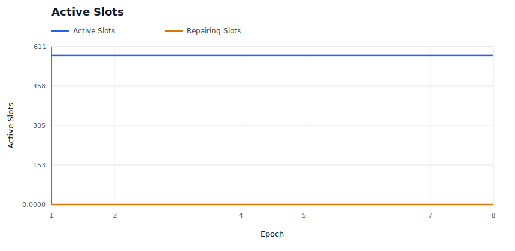

### Provider P&L

Shows aggregate provider economics over time.

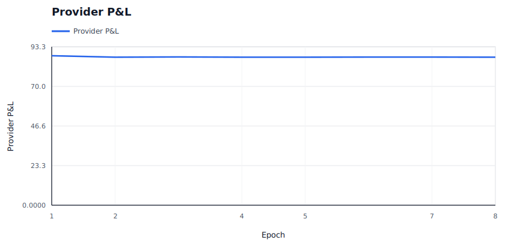

### Burn / Mint Ratio

Shows whether burns are material relative to minted rewards and audit budget.

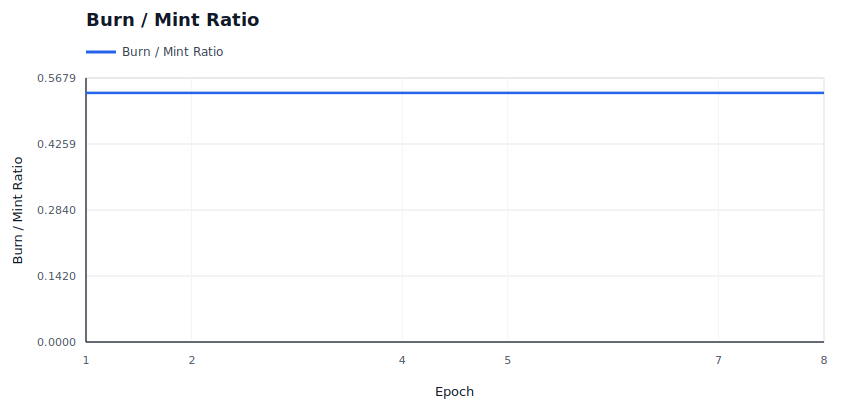

### Price Trajectory

Shows storage price and retrieval price movement under dynamic pricing.

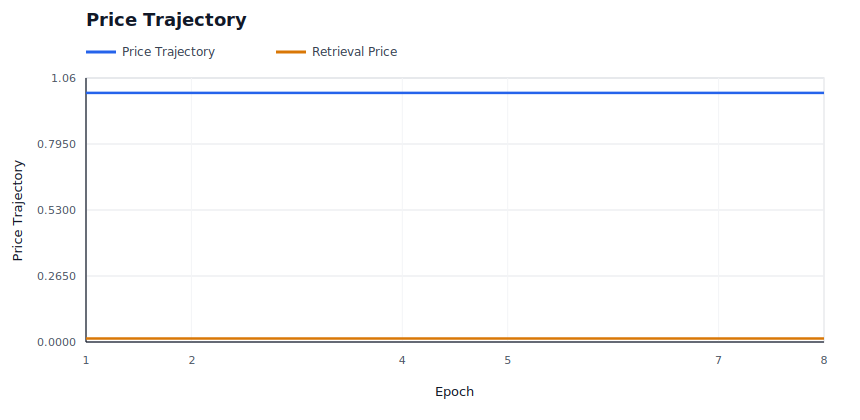

### Storage Demand

Shows modeled new deal demand accepted versus rejected by price.

### Capacity Utilization

Shows active storage responsibility against modeled provider capacity.

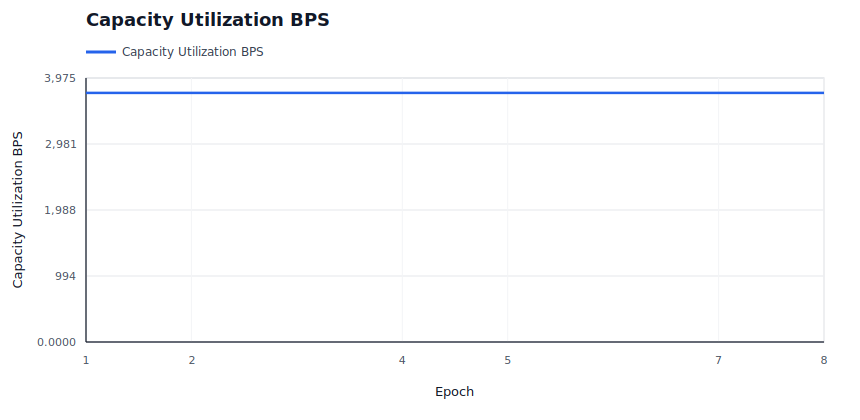

### Saturation And Repair Pressure

Shows provider bandwidth saturation and repair backoffs, which are scale-specific stress signals.

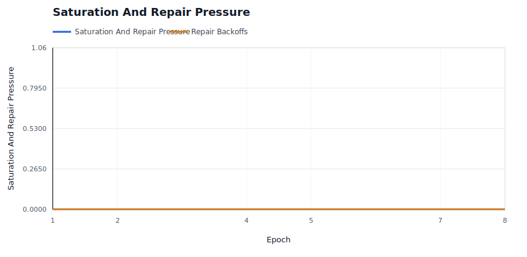

### Repair Backlog

Shows whether started repairs are accumulating faster than they complete.

### High-Bandwidth Promotion

Shows capability promotion/demotion state over time for hot-path eligibility.

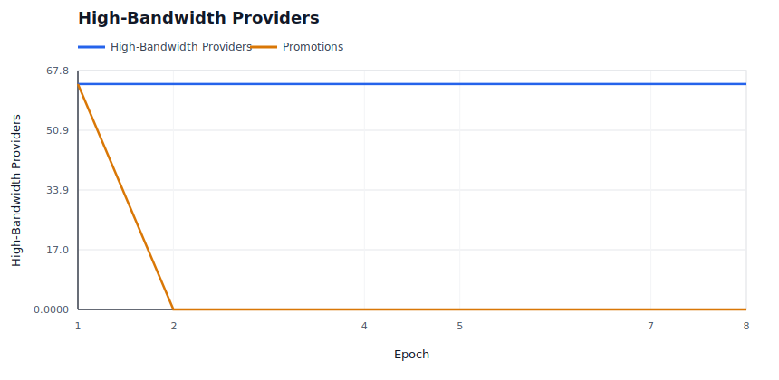

### Hot Retrieval Routing

Shows whether hot retrieval attempts are being served by promoted high-bandwidth providers.

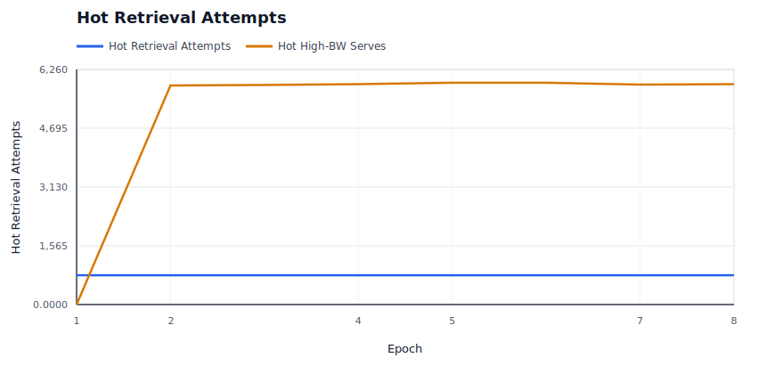

### Performance Tiers

Shows the fast positive tier and Fail-tier service counts under the performance market.

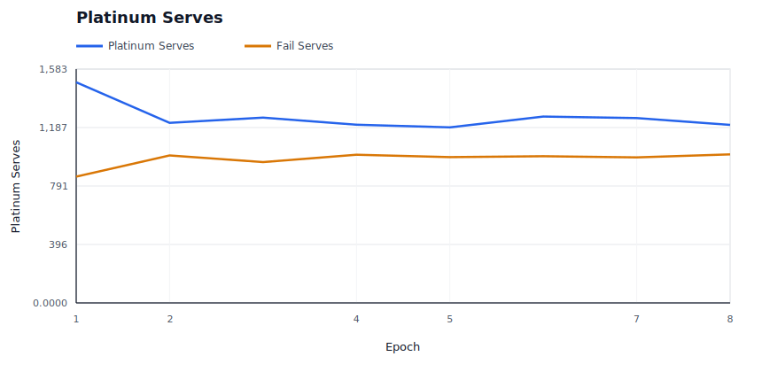

### Operator Concentration

Shows whether operator assignment share is bounded despite provider identity concentration.

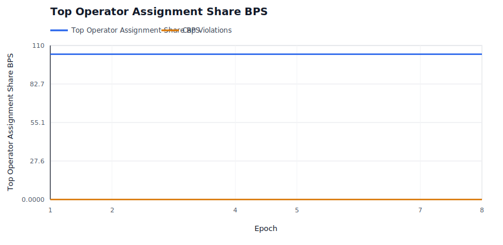

### Evidence Pressure

Shows soft liveness evidence and hard invalid-proof evidence by epoch.

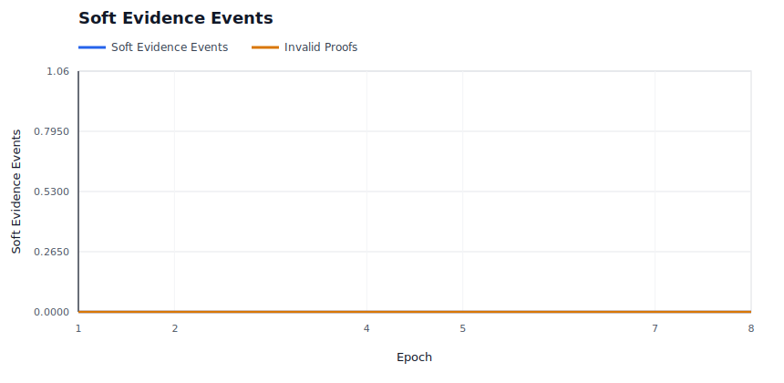

### Evidence Spam Economics

Shows bond burn and bounty payout for low-quality deputy evidence claims.

### Audit Budget

Shows whether miss-driven audit demand is spending budget or accumulating carryover.

### Audit Backlog

Shows unmet audit demand and exhausted-budget epochs when evidence exceeds available enforcement budget.

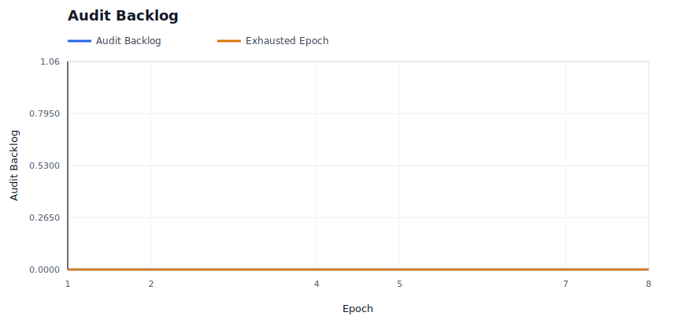

### Elasticity Spend

Shows demand-funded elasticity spend and rejected expansion attempts.

## Raw Artifacts

- `summary.json`: compact machine-readable run summary.
- `epochs.csv`: per-epoch availability, liveness, reward, repair, and economics metrics.
- `providers.csv`: final provider-level economics, fault counters, and capability tier.
- `operators.csv`: final operator-level provider count, assignment share, success, and P&L metrics.
- `slots.csv`: per-slot epoch ledger, including health state and reason.
- `evidence.csv`: policy evidence events.
- `repairs.csv`: repair start, pending-provider readiness, completion, attempt-count, cooldown, candidate-exclusion, attempt-cap, and backoff events.
- `economy.csv`: per-epoch market and accounting ledger.
- `signals.json`: derived availability, saturation, repair, capacity, economic, regional, concentration, and provider bottleneck signals.
