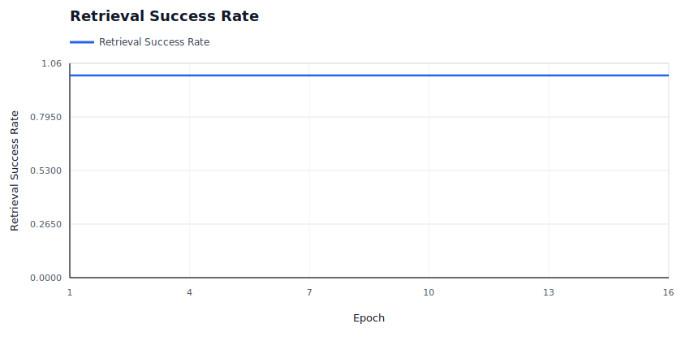
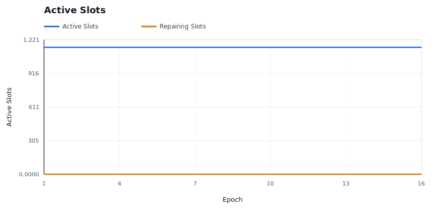
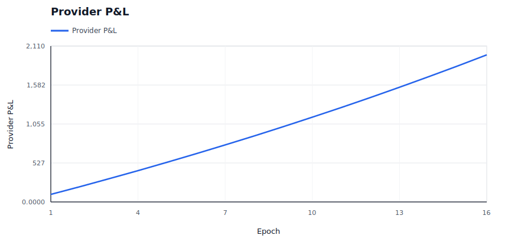
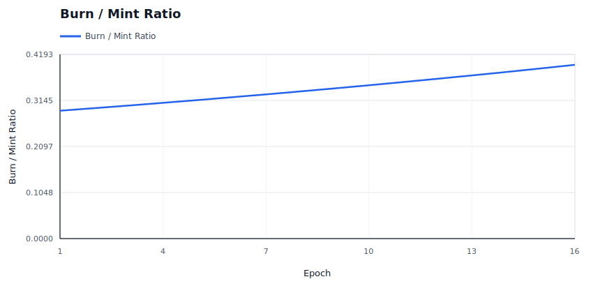
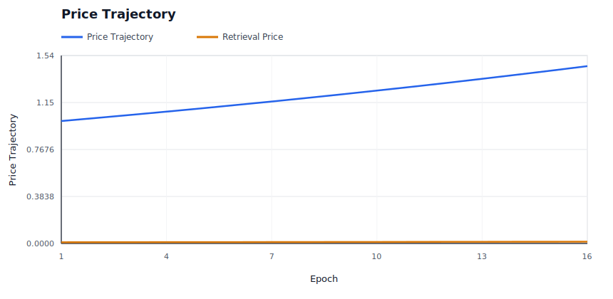
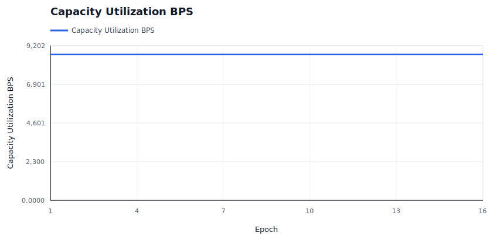
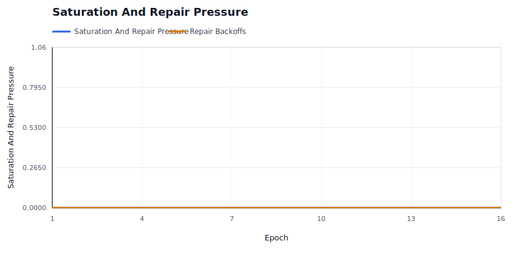
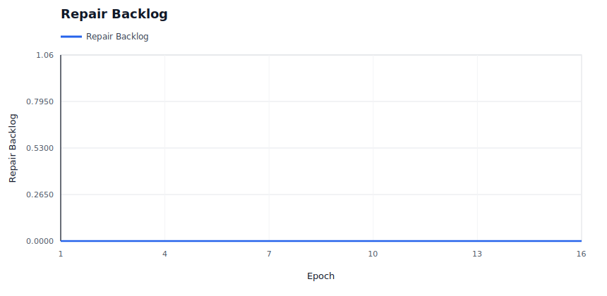

# Policy Simulation Report: Price Controller Bounds

## Executive Summary

**Verdict:** `PASS`. This run simulates `price-controller-bounds` with `96` providers, `700` data users, `96` deals, and an RS `8+4` layout for `16` epochs. Enforcement is configured as `REWARD_EXCLUSION`.

Model dynamic storage and retrieval price movement under sustained demand. This is a controller-safety fixture, not a claim that the current parameters are economically optimal.

Expected policy behavior: Prices move in the expected direction, remain within configured bounds, preserve availability, and do not hide provider distress.

Observed result: retrieval success was `100.00%`, reward coverage was `100.00%`, repairs started/completed were `0` / `0`, and `0` providers ended with negative modeled P&L. The run recorded `0` unavailable reads, `0` modeled data-loss events, `0` bandwidth saturation responses and `0` repair backoffs.

## Review Focus

Inspect the economic assumptions and decide whether the step size, floors, ceilings, and target utilization are credible.

A human reviewer should focus less on the pass/fail label and more on whether the scenario, assertions, and threshold values encode the policy we actually want to enforce on-chain.

## Run Configuration

| Field | Value |
|---|---:|
| Seed | `34` |
| Providers | `96` |
| Data users | `700` |
| Deals | `96` |
| Epochs | `16` |
| Erasure coding | `K=8`, `M=4`, `N=12` |
| User MDUs per deal | `16` |
| Retrievals/user/epoch | `2` |
| Liveness quota | `2`-`8` blobs/slot/epoch |
| Repair delay | `2` epochs |
| Dynamic pricing | `true` |
| Storage price | `1.0000` |
| Retrieval price/slot | `0.0100` |
| Provider capacity range | `12`-`16` slots |
| Provider bandwidth range | `0`-`0` serves/epoch (`0` means unlimited) |
| Provider regions | `global` |

## Economic Assumptions

The economic model is intentionally simple and deterministic. It is useful for comparing policy directions, not for setting final token economics without external market data.

| Assumption | Value | Interpretation |
|---|---:|---|
| Storage price | `1.0000` | Unitless price applied by the controller; current simulator does not yet model user demand elasticity against this quote. |
| Storage target utilization | `65.00%` | If dynamic pricing is enabled, utilization above this target steps storage price up, otherwise down. |
| Retrieval price per slot | `0.0100` | Paid per successful provider slot served, before the configured variable burn. |
| Retrieval target per epoch | `900` | If dynamic pricing is enabled, retrieval attempts above this target step retrieval price up, otherwise down. |
| Dynamic pricing max step | `2.50%` | Per-epoch controller movement cap. Lower values are safer but slower to equilibrate. |
| Base reward per slot | `0.0200` | Modeled issuance/subsidy paid only to reward-eligible active slots. |
| Provider storage cost/slot/epoch | `0.0100` | Simplified provider cost basis; jitter may create marginal-provider distress. |
| Provider bandwidth cost/retrieval | `0.0010` | Simplified egress cost basis for retrieval-heavy scenarios. |
| Audit budget per epoch | `1.0000` | Minted audit budget; spending is capped by available budget and miss-driven demand. |
| Retrieval burn | `5.00%` | Fraction of variable retrieval fees burned before provider payout. |

## What Happened

User-facing retrieval availability stayed intact and no operational enforcement evidence was recorded. For this run, the main question is the scenario-specific control or economic result rather than recovery from a provider fault.

The policy layer recorded no evidence events, which is expected only for cooperative or pure-market control scenarios.

No repair events occurred. For healthy or economic-only scenarios this is correct; for fault scenarios it may mean the policy is too passive.

## Diagnostic Signals

These are derived from the raw CSV/JSON outputs and are intended to make scale behavior reviewable without manually scanning ledgers.

| Signal | Value | Why It Matters |
|---|---:|---|
| Worst epoch success | `100.00%` at epoch `1` | Identifies the availability cliff instead of hiding it in aggregate success. |
| Unavailable reads | `0` | Temporary read failures are a scale/reliability signal; they are not automatically permanent data loss. |
| Modeled data-loss events | `0` | Durability-loss signal. This should remain zero for current scale fixtures. |
| Degraded epochs | `0` | Counts epochs with unavailable reads or success below 99.9%. |
| Recovery epoch after worst | `2` | Shows whether the network returned to clean steady state after the worst point. |
| Saturation rate | `0.00%` | Provider bandwidth saturation per retrieval attempt. |
| Peak saturation | `0` at epoch `1` | Reveals when bandwidth, not storage correctness, became the bottleneck. |
| Repair completion ratio | `100.00%` | Measures whether healing catches up with detection. |
| Repair backoff pressure | `0` backoffs per started repair | Shows whether repair coordination is saturated. |
| Final repair backlog | `0` slots | Started repairs minus completed repairs at run end. |
| Final storage utilization | `86.81%` | Active slots versus modeled provider capacity. |
| Provider utilization p50 / p90 / max | `85.71%` / `100.00%` / `100.00%` | Detects assignment concentration and capacity cliffs. |
| Provider P&L p10 / p50 / p90 | `20.2061` / `20.7607` / `21.2422` | Shows whether aggregate P&L hides marginal-provider distress. |
| Storage price start/end/range | `1.0000` -> `1.4483` (`1.0000`-`1.4483`) | Shows dynamic pricing movement and bounds. |
| Retrieval price start/end/range | `0.0100` -> `0.0145` (`0.0100`-`0.0145`) | Shows whether demand pressure moved retrieval pricing. |

### Regional Signals

| Region | Providers | Utilization | Offline Responses | Saturated Responses | Negative P&L Providers | Avg P&L |
|---|---:|---:|---:|---:|---:|---:|
| `global` | 96 | 86.81% | 0 | 0 | 0 | 20.7331 |

### Top Bottleneck Providers

| Provider | Region | Slots/Capacity | Utilization | Bandwidth Cap | Attempts | Offline | Saturated | P&L |
|---|---|---:|---:|---:|---:|---:|---:|---:|
| `sp-017` | `global` | 12/12 | 100.00% | 0 | 1961 | 0 | 0 | 21.7467 |
| `sp-043` | `global` | 12/13 | 92.30% | 0 | 1960 | 0 | 0 | 21.6430 |
| `sp-014` | `global` | 12/12 | 100.00% | 0 | 1955 | 0 | 0 | 21.5769 |
| `sp-023` | `global` | 12/14 | 85.71% | 0 | 1937 | 0 | 0 | 21.4642 |
| `sp-050` | `global` | 12/14 | 85.71% | 0 | 1936 | 0 | 0 | 21.4788 |
| `sp-016` | `global` | 12/14 | 85.71% | 0 | 1934 | 0 | 0 | 21.4189 |
| `sp-020` | `global` | 12/14 | 85.71% | 0 | 1934 | 0 | 0 | 21.4589 |
| `sp-089` | `global` | 12/15 | 80.00% | 0 | 1931 | 0 | 0 | 21.4145 |

### Timeline

| Epoch | Retrieval Success | Evidence | Repairs Started | Repairs Completed | Reward Burned | Provider P&L | Notes |
|---:|---:|---:|---:|---:|---:|---:|---|
| 1 | 100.00% | 0 | 0 | 0 | 0.0000 | 101.9200 | steady state |
| 2 | 100.00% | 0 | 0 | 0 | 0.0000 | 206.5000 | steady state |
| 3 | 100.00% | 0 | 0 | 0 | 0.0000 | 313.8065 | steady state |
| 4 | 100.00% | 0 | 0 | 0 | 0.0000 | 423.9077 | steady state |
| 5 | 100.00% | 0 | 0 | 0 | 0.0000 | 536.8734 | steady state |
| 6 | 100.00% | 0 | 0 | 0 | 0.0000 | 652.7752 | steady state |
| 7 | 100.00% | 0 | 0 | 0 | 0.0000 | 771.6866 | steady state |
| 8 | 100.00% | 0 | 0 | 0 | 0.0000 | 893.6827 | steady state |
| 9 | 100.00% | 0 | 0 | 0 | 0.0000 | 1018.8408 | steady state |
| 10 | 100.00% | 0 | 0 | 0 | 0.0000 | 1147.2398 | steady state |
| 11 | 100.00% | 0 | 0 | 0 | 0.0000 | 1278.9608 | steady state |
| 12 | 100.00% | 0 | 0 | 0 | 0.0000 | 1414.0868 | steady state |
| 13 | 100.00% | 0 | 0 | 0 | 0.0000 | 1552.7030 | steady state |
| 14 | 100.00% | 0 | 0 | 0 | 0.0000 | 1694.8966 | steady state |
| 15 | 100.00% | 0 | 0 | 0 | 0.0000 | 1840.7570 | steady state |
| 16 | 100.00% | 0 | 0 | 0 | 0.0000 | 1990.3759 | steady state |

## Enforcement Interpretation

The simulator recorded `0` evidence events and `0` repair ledger events. The first evidence epoch was `none` and the first repair-start epoch was `none`.

Evidence by reason:

- None recorded.

Evidence by provider:

- None recorded.

Repair summary:

- Repairs started: `0`
- Repairs completed: `0`
- Repair backoffs: `0`
- Final active slots in last epoch: `1152`

### Repair Ledger Excerpt

- No repair ledger events were recorded.

## Economic Interpretation

The run minted `384.6400` reward/audit units and burned `130.9293` units, for a burn-to-mint ratio of `34.04%`.

Providers earned `2430.6959` in modeled revenue against `440.3200` in modeled cost, ending with aggregate P&L `1990.3759`.

Retrieval accounting paid providers `2062.0559`, burned `22.4000` in base fees, and burned `108.5293` in variable retrieval fees.

No provider ended with negative modeled P&L under the current assumptions.

Final modeled storage price was `1.4483` and retrieval price per slot was `0.0145`.

### Provider P&L Extremes

| Provider | Assigned Slots | Revenue | Cost | Slashed | P&L | Churn Risk |
|---|---:|---:|---:|---:|---:|---:|
| `sp-000` | 12 | 3.8400 + 20.1591 | 4.4710 | 0.0000 | 19.5281 | no |
| `sp-065` | 12 | 3.8400 + 20.3245 | 4.4910 | 0.0000 | 19.6735 | no |
| `sp-009` | 12 | 3.8400 + 20.3898 | 4.4860 | 0.0000 | 19.7438 | no |
| `sp-001` | 12 | 3.8400 + 20.5298 | 4.5010 | 0.0000 | 19.8688 | no |
| `sp-068` | 12 | 3.8400 + 20.5844 | 4.5120 | 0.0000 | 19.9124 | no |

## Assertion Contract

Assertions are the machine-readable policy contract for this fixture. Passing means this simulator run satisfied the current contract; it does not mean the policy is production-ready.

| Assertion | Status | Meaning | Detail |
|---|---|---|---|
| `min_success_rate` | `PASS` | Availability floor: user-facing reads must stay above this success rate. | success_rate=1, required>=0.99 |
| `min_final_storage_price` | `PASS` | Dynamic pricing should move storage price to or above this value by run end. | final_storage_price=1.4482981665, required>=1 |
| `max_final_storage_price` | `PASS` | Dynamic pricing should keep storage price at or below this value by run end. | final_storage_price=1.4482981665, required<=2 |
| `min_final_retrieval_price` | `PASS` | Dynamic pricing should move retrieval price to or above this value by run end. | final_retrieval_price=0.014482981665, required>=0.01 |
| `max_final_retrieval_price` | `PASS` | Dynamic pricing should keep retrieval price at or below this value by run end. | final_retrieval_price=0.014482981665, required<=0.05 |
| `max_data_loss_events` | `PASS` | Durability invariant: stress may allow unavailable reads, but modeled data loss must stay at zero. | data_loss_events=0, required<=0 |
| `max_paid_corrupt_bytes` | `PASS` | Corrupt data must not earn payment. | paid_corrupt_bytes=0, required<=0 |

## Evidence Ledger Excerpt

These rows are representative raw evidence events. Use `evidence.csv` for the complete ledger.

| Epoch | Deal | Slot | Provider | Class | Reason | Consequence |
|---:|---:|---:|---|---|---|---|
| n/a | n/a | n/a | n/a | n/a | n/a | No evidence events were recorded. |

## Generated Graphs

The following SVG graphs are generated beside this report and embedded here with relative Markdown links so the report is readable as a self-contained artifact in GitHub or a local Markdown viewer.

### Retrieval Success Rate

Should stay near 1.0 unless availability is actually lost.

### Slot State Transitions

Shows active slots and repair slots; spikes indicate reassignment churn.

### Provider P&L

Shows aggregate provider economics over time.

### Burn / Mint Ratio

Shows whether burns are material relative to minted rewards and audit budget.

### Price Trajectory

Shows storage price and retrieval price movement under dynamic pricing.

### Capacity Utilization

Shows active storage responsibility against modeled provider capacity.

### Saturation And Repair Pressure

Shows provider bandwidth saturation and repair backoffs, which are scale-specific stress signals.

### Repair Backlog

Shows whether started repairs are accumulating faster than they complete.

## Raw Artifacts

- `summary.json`: compact machine-readable run summary.
- `epochs.csv`: per-epoch availability, liveness, reward, repair, and economics metrics.
- `providers.csv`: final provider-level economics and fault counters.
- `slots.csv`: per-slot epoch ledger.
- `evidence.csv`: policy evidence events.
- `repairs.csv`: repair start/completion events.
- `economy.csv`: per-epoch market and accounting ledger.
- `signals.json`: derived availability, saturation, repair, capacity, economic, regional, and provider bottleneck signals.
