# Policy Simulation Report: Provider Bond Headroom

## Executive Summary

**Verdict:** `PASS`. This run simulates `provider-bond-headroom` with `48` providers, `80` data users, `24` deals, and an RS `8+4` layout for `10` epochs. Enforcement is configured as `SLASH_SIMULATED`.

Model provider assignment collateral as a first-class placement constraint. The policy question is whether a provider that falls below required bond is visible, excluded from new responsibility, and repaired away without treating every economic fault as slashable fraud.

Expected policy behavior: A slashed provider becomes underbonded, underbonded slots trigger repair, new assignments exclude insufficient-bond providers, and durability remains intact.

Observed result: retrieval success was `100.00%`, reward coverage was `100.00%`, repairs started/ready/completed were `6` / `6` / `6`, and `1` providers ended with negative modeled P&L. The run recorded `0` unavailable reads, `0` modeled data-loss events, `0` bandwidth saturation responses and `0` repair backoffs across `6` repair attempts, with `0` pending-repair readiness timeouts. Slot health recorded `0` suspect slot-epochs and `0` delinquent slot-epochs. High-bandwidth promotions were `0` and final high-bandwidth providers were `0`.

## Review Focus

Use this fixture to tune minimum bond, per-slot collateral, slash sizing, and whether underbonding should create repair, throttling, or only placement exclusion.

A human reviewer should focus less on the pass/fail label and more on whether the scenario, assertions, and threshold values encode the policy we actually want to enforce on-chain.

## Run Configuration

| Field | Value |
|---|---:|
| Seed | `103` |
| Providers | `48` |
| Data users | `80` |
| Deals | `24` |
| Epochs | `10` |
| Erasure coding | `K=8`, `M=4`, `N=12` |
| User MDUs per deal | `16` |
| Retrievals/user/epoch | `1` |
| Liveness quota | `2`-`8` blobs/slot/epoch |
| Repair delay | `1` epochs |
| Repair attempt cap/slot | `0` (`0` means unlimited) |
| Repair backoff window | `0` epochs |
| Repair pending timeout | `0` epochs (`0` means disabled) |
| Dynamic pricing | `false` |
| Storage price | `1.0000` |
| Storage lock-in | `false`; duration `0` epochs |
| Deal expiry | `false` |
| Deal close policy | epoch `0`; count `0`; share `0.00%` |
| New deal requests/epoch | `0` |
| Storage demand price ceiling | `0.0000` (`0` means disabled) |
| Storage demand reference price | `0.0000` (`0` disables elasticity) |
| Storage demand elasticity | `0.00%` |
| Elasticity trigger | `0` retrievals/epoch (`0` disables) |
| Elasticity spend cap | `0.0000` total |
| Elasticity overlay | `false`; `0` providers/epoch; max `0`/deal |
| Elasticity overlay timing | ready delay `1` epochs; TTL `0` epochs (`0` means no expiry) |
| Staged uploads/epoch | `0` provisional attempts |
| Staged upload retention | `0` epochs (`0` disables age cleanup) |
| Staged upload pending cap | `0` generations (`0` means unlimited) |
| Retrieval price/slot | `0.0100` |
| Sponsored retrieval share | `0.00%` |
| Owner retrieval debit share | `0.00%` |
| Provider capacity range | `16`-`16` slots |
| Provider bandwidth range | `0`-`0` serves/epoch (`0` means unlimited) |
| Service class | `General` |
| Performance market | `false` |
| Provider latency range | `0`-`0` ms |
| Latency tier windows | Platinum <= `100` ms, Gold <= `250` ms, Silver <= `500` ms |
| High-bandwidth promotion | `false` |
| High-bandwidth capacity threshold | `0` serves/epoch |
| Hot retrieval share | `0.00%` |
| Operators | `48` |
| Dominant operator provider share | `0.00%` |
| Operator assignment cap/deal | `0` (`0` means disabled) |
| Provider regions | `global` |

## Economic Assumptions

The economic model is intentionally simple and deterministic. It is useful for comparing policy directions, not for setting final token economics without external market data.

| Assumption | Value | Interpretation |
|---|---:|---|
| Storage price | `1.0000` | Unitless price applied by the controller, demand-elasticity curve, and optional affordability gate. |
| Storage lock-in | enabled `False`, duration `0` epochs | If enabled, committed deals lock storage escrow upfront at the quoted storage price and earn it over the modeled duration. |
| Deal expiry | enabled `False` | If enabled, deals auto-expire once their modeled duration has fully earned. |
| Deal close/refund | epoch `0`, count `0`, share `0.00%` | Optional early close refunds unearned storage escrow and removes closed deals from active responsibility. |
| New deal requests/epoch | `0` | Latent modeled write demand before optional price elasticity suppression. Effective requests are accepted only when price and capacity gates pass. |
| Storage demand price ceiling | `0.0000` | If non-zero, new deal demand above this storage price is rejected as unaffordable. |
| Storage demand reference price | `0.0000` | If non-zero with elasticity enabled, demand scales around this price before hard affordability rejection. |
| Storage demand elasticity | `0.00%` | Demand multiplier change for a 100% price move relative to the reference price, clamped by configured min/max demand bps. |
| Storage target utilization | `70.00%` | If dynamic pricing is enabled, utilization above this target steps storage price up, otherwise down. |
| Retrieval price per slot | `0.0100` | Paid per successful provider slot served, before the configured variable burn. |
| Retrieval target per epoch | `80` | If dynamic pricing is enabled, retrieval attempts above this target step retrieval price up, otherwise down. |
| Retrieval demand shocks | `[]` | Optional epoch-scoped retrieval demand multipliers used to test price shock response and oscillation. |
| Sponsored retrieval share | `0.00%` | Share of retrieval attempts paid by requester/sponsor session funds instead of owner deal escrow. |
| Owner retrieval escrow debit | `0.00%` | Share of non-sponsored retrieval base and variable cost debited to owner escrow in scenarios that explicitly model owner-paid reads. |
| Dynamic pricing max step | `5.00%` | Per-epoch controller movement cap. Lower values are safer but slower to equilibrate. |
| Base reward per slot | `0.0200` | Modeled issuance/subsidy paid only to reward-eligible active slots. |
| Provider storage cost/slot/epoch | `0.0100` | Simplified provider cost basis; jitter may create marginal-provider distress. |
| Provider bandwidth cost/retrieval | `0.0010` | Simplified egress cost basis for retrieval-heavy scenarios. |
| Provider initial/min bond | `2.0000` / `1.5000` | Simplified collateral model. Providers below the required bond are excluded from new responsibility and can trigger repair. |
| Provider bond per assigned slot | `0.0500` | Additional modeled collateral required for each assigned storage slot. |
| Provider cost shocks | `[]` | Optional epoch-scoped fixed/storage/bandwidth cost multipliers used to model sudden operator cost pressure. |
| Provider churn policy | enabled `False`, threshold `0.0000`, after `1` epochs, cap `0`/epoch | Converts sustained negative economics into draining exits; cap `0` means unbounded by this policy. |
| Provider churn floor | `0` providers | Prevents an economic shock fixture from exiting the entire active set unless intentionally configured. |
| Provider supply entry | enabled `False`, reserve `0`, cap `1`/epoch, probation `1` epochs | Moves reserve providers through probation before they become assignment-eligible active supply. |
| Supply entry triggers | utilization >= `0.00%` or storage price >= `disabled` | If both are zero, configured reserve supply enters as soon as the epoch window opens. |
| Performance reward per serve | `0.0000` | Optional tiered QoS reward. Multipliers are applied by latency tier and Fail tier receives the configured fail multiplier. |
| Elasticity trigger/spend | `0` retrievals/epoch / `0.0000` cap | User-funded overflow spending starts only after the configured demand trigger and must stay inside the spend cap. |
| Elasticity overlay policy | enabled `False`, `0` providers/epoch, max `0`/deal | Temporary overlay routes expand retrieval options without becoming durable base slots. |
| Elasticity overlay timing | ready delay `1` epochs, TTL `0` epochs | Models catch-up/readiness delay and scale-down expiration for overflow routes. |
| Staged upload attempts/epoch | `0` | Provisional generations that consume local provider-daemon staging space before content commit. |
| Staged upload commit rate | `100.00%` | Share of provisional uploads that become committed content instead of remaining abandoned local state. |
| Staged upload retention/cap | `0` epochs / `0` generations | Local cleanup and preflight limits used to bound abandoned provisional-generation storage pressure. |
| Audit budget per epoch | `1.0000` | Minted audit budget; spending is capped by available budget and unmet miss-driven demand carries forward as backlog. |
| Evidence spam claims/epoch | `0` | Synthetic low-quality deputy claims used to test bond burn and bounty gating economics. |
| Evidence bond / bounty | `0.0000` / `0.0000` | Spam claims burn bond unless convicted; bounty is paid only on convicted evidence. |
| Retrieval burn | `5.00%` | Fraction of variable retrieval fees burned before provider payout. |

## What Happened

User-facing retrieval availability stayed intact: every modeled retrieval completed successfully. That does not mean every provider behaved correctly; it means redundancy, routing, or deputy service absorbed the fault.

The policy layer recorded `11` evidence events: `0` soft, `0` threshold, `5` hard, `6` economic, `0` market, `0` spam, and `0` operational events. Soft and economic evidence are suitable for repair and reward exclusion; hard or convicted threshold evidence is the category that can later justify slashing or stronger sanctions.

Repair was exercised: `6` repair operations started, `6` produced pending-provider readiness evidence, and `6` completed. The simulator models this as make-before-break reassignment, so the old assignment remains visible until replacement work catches up and the readiness gate is satisfied.

Simulated slashing was active: providers lost `2.0000` bond units in aggregate.

The directly implicated provider set begins with: `sp-000`.

## Diagnostic Signals

These are derived from the raw CSV/JSON outputs and are intended to make scale behavior reviewable without manually scanning ledgers.

| Signal | Value | Why It Matters |
|---|---:|---|
| Worst epoch success | `100.00%` at epoch `1` | Identifies the availability cliff instead of hiding it in aggregate success. |
| Unavailable reads | `0` | Temporary read failures are a scale/reliability signal; they are not automatically permanent data loss. |
| Modeled data-loss events | `0` | Durability-loss signal. This should remain zero for current scale fixtures. |
| Degraded epochs | `0` | Counts epochs with unavailable reads or success below 99.9%. |
| Recovery epoch after worst | `2` | Shows whether the network returned to clean steady state after the worst point. |
| Saturation rate | `0.00%` | Provider bandwidth saturation per retrieval attempt. |
| Peak saturation | `0` at epoch `1` | Reveals when bandwidth, not storage correctness, became the bottleneck. |
| Repair readiness ratio | `100.00%` | Measures whether pending providers catch up before promotion. |
| Repair completion ratio | `100.00%` | Measures whether healing catches up with detection. |
| Repair attempts | `6` | Counts bounded attempts to open a repair or discover replacement pressure. |
| Repair backoff pressure | `0` backoffs per started repair | Shows whether repair coordination is saturated. |
| Repair backoffs per attempt | `0` | Distinguishes capacity/cooldown pressure from successful repair starts. |
| Repair cooldowns / attempt caps / readiness timeouts | `0` / `0` / `0` | Shows whether throttling, rather than candidate selection alone, is bounding repair churn. |
| Suspect / delinquent slot-epochs | `0` / `0` | Separates early warning state from threshold-crossed delinquency. |
| Final repair backlog | `0` slots | Started repairs minus completed or timed-out repairs at run end. |
| High-bandwidth providers | `0` | Providers currently eligible for hot/high-bandwidth routing. |
| High-bandwidth promotions/demotions | `0` / `0` | Shows capability changes under measured demand. |
| Hot high-bandwidth serves/retrieval | `0` | Measures whether hot retrievals actually use promoted providers. |
| Avg latency / Fail tier rate | `0` ms / `0.00%` | Separates correctness from QoS: slow-but-valid service can be available while still earning lower or no performance rewards. |
| Platinum / Gold / Silver / Fail serves | `0` / `0` / `0` / `0` | Shows the latency-tier distribution for performance-market policy. |
| Performance reward paid | `0.0000` | Quantifies the tiered QoS reward stream separately from baseline storage and retrieval settlement. |
| Provider latency p10 / p50 / p90 | `0` / `0` / `0` ms | Shows whether aggregate averages hide slow provider tails. |
| New deal latent/effective demand | `0` / `0` | Shows how much modeled write demand survived the price-elasticity curve. |
| New deal demand accepted/rejected/suppressed | `0` / `0` / `0` | Shows whether modeled write demand is entering the network, blocked by price/capacity, or never arriving because quotes are unattractive. |
| New deal effective/latent acceptance | `0.00%` / `0.00%` | Demand-side market health signal; a technically available network can still fail if users cannot afford storage. |
| Staged upload attempts/accepted/committed | `0` / `0` / `0` | Shows provisional upload pressure separately from committed storage demand. |
| Staged upload rejections/cleaned | `0` / `0` | Preflight rejection and retention cleanup should bound abandoned provisional generations. |
| Staged pending generations/MDUs peak | `0` / `0` | Detects whether local staged storage pressure exceeded configured caps. |
| Elasticity spend / rejections | `0.0000` / `0` | Shows whether user-funded overflow expansion stayed inside the spend window. |
| Elasticity overlays activated/served/expired | `0` / `0` / `0` | Confirms temporary overflow routes are created, actually used, and later removed. |
| Elasticity overlay ready/active peak | `0` / `0` | Shows catch-up/readiness lag and total temporary routing footprint. |
| Sponsored retrieval attempts/spend | `0` / `0.0000` | Shows public or requester-funded demand separately from owner-funded deal escrow. |
| Owner-funded attempts / owner escrow debit | `800` / `0.0000` | Detects whether public demand is unexpectedly draining the deal owner's escrow. |
| Storage escrow locked/earned/refunded | `0.0000` / `0.0000` / `0.0000` | Shows quote-to-lock, provider earning, and close/refund accounting for committed storage. |
| Storage escrow outstanding | `0.0000` final; peak `0.0000` | Detects funds left locked after close/expiry semantics should have released them. |
| Storage fee provider payout/burned | `0.0000` / `0.0000` | Separates earned storage fees paid to eligible providers from fees withheld from non-compliant responsibility. |
| Deals open/closed/expired | `24` / `0` / `0` | Confirms close/refund/expiry semantics remove deals from active responsibility instead of continuing to accrue rewards. |
| Audit demand / spent | `0.0000` / `0.0000` | Shows whether enforcement evidence consumed the available audit budget. |
| Audit backlog / exhausted epochs | `0.0000` / `0` | Makes budget exhaustion explicit instead of hiding unmet audit work behind capped spending. |
| Evidence spam claims / convictions | `0` / `0` | Shows whether the evidence-market spam fixture exercised low-quality claims and any successful convictions. |
| Evidence spam bond / net gain | `0.0000` / `0.0000` | Spam should be negative-EV unless conviction-gated bounties justify the claim volume. |
| Top operator provider share | `2.08%` | Shows whether many SP identities are controlled by one operator. |
| Top operator assignment share | `2.43%` | Shows whether placement caps translate identity concentration into slot concentration. |
| Max operator slots/deal | `1` | Checks per-deal blast-radius limits against operator Sybil concentration. |
| Operator cap violations | `0` | Counts deals where operator slot concentration exceeded the configured cap. |
| Final storage utilization | `37.50%` | Active slots versus modeled provider capacity. |
| Provider utilization p50 / p90 / max | `37.50%` / `43.75%` / `43.75%` | Detects assignment concentration and capacity cliffs. |
| Provider P&L p10 / p50 / p90 | `1.1285` / `1.2220` / `1.4635` | Shows whether aggregate P&L hides marginal-provider distress. |
| Provider cost shock epochs/providers | `0` / `0` | Shows when external cost pressure was active and how much of the provider population it affected. |
| Max cost shock fixed/storage/bandwidth | `100.00%` / `100.00%` / `100.00%` | Distinguishes fixed-cost, storage-cost, and egress-cost shocks. |
| Provider churn events / final churned | `0` / `0` | Shows whether sustained economic distress became modeled provider exits rather than only a warning label. |
| Provider entries / probation promotions | `0` / `0` | Shows whether reserve supply entered and cleared readiness gating before receiving normal placement. |
| Reserve / probationary / entered-active providers | `0` / `0` / `0` | Separates unused reserve supply, in-flight onboarding, and newly promoted active supply. |
| Underbonded repairs / peak underbonded providers | `1` / `1` | Shows whether insufficient provider collateral became placement/repair pressure. |
| Final underbonded assigned slots / bond deficit | `0` / `1.5000` | Checks whether repair removed responsibility from undercollateralized providers by run end. |
| Churn pressure provider-epochs / peak | `10` / `1` | Shows the breadth and duration of providers below the configured churn threshold. |
| Active / exited / reserve provider capacity | `768` / `0` / `0` slots | Measures supply remaining, removed, and still waiting outside normal placement. |
| Peak assigned slots on churned providers | `0` | Shows the maximum repair burden created by economic exits. |
| Storage price start/end/range | `1.0000` -> `1.0000` (`1.0000`-`1.0000`) | Shows dynamic pricing movement and bounds. |
| Retrieval price start/end/range | `0.0100` -> `0.0100` (`0.0100`-`0.0100`) | Shows whether demand pressure moved retrieval pricing. |
| Retrieval latent/effective attempts | `800` / `800` | Shows how much retrieval load was added by demand-shock multipliers. |
| Retrieval demand shock epochs/multiplier | `0` / `100.00%` | Shows the size and duration of the modeled read-demand shock. |
| Price direction changes storage/retrieval | `0` / `0` | Detects controller oscillation rather than relying on visual inspection. |

### Regional Signals

| Region | Providers | Utilization | Offline Responses | Saturated Responses | Negative P&L Providers | Avg P&L |
|---|---:|---:|---:|---:|---:|---:|
| `global` | 48 | 37.50% | 0 | 0 | 1 | 1.1892 |

### Top Bottleneck Providers

| Provider | Region | Slots/Capacity | Utilization | Bandwidth Cap | Attempts | Offline | Saturated | P&L |
|---|---|---:|---:|---:|---:|---:|---:|---:|
| `sp-011` | `global` | 6/16 | 37.50% | 0 | 161 | 0 | 0 | 1.4685 |
| `sp-044` | `global` | 7/16 | 43.75% | 0 | 161 | 0 | 0 | 1.5485 |
| `sp-040` | `global` | 7/16 | 43.75% | 0 | 160 | 0 | 0 | 1.5400 |
| `sp-028` | `global` | 7/16 | 43.75% | 0 | 159 | 0 | 0 | 1.5215 |
| `sp-041` | `global` | 7/16 | 43.75% | 0 | 156 | 0 | 0 | 1.5060 |
| `sp-007` | `global` | 6/16 | 37.50% | 0 | 153 | 0 | 0 | 1.4005 |
| `sp-004` | `global` | 6/16 | 37.50% | 0 | 151 | 0 | 0 | 1.3835 |
| `sp-023` | `global` | 7/16 | 43.75% | 0 | 151 | 0 | 0 | 1.4635 |

### Top Operators

| Operator | Providers | Provider Share | Assigned Slots | Assignment Share | Retrieval Attempts | Success | P&L |
|---|---:|---:|---:|---:|---:|---:|---:|
| `op-023` | 1 | 2.08% | 7 | 2.43% | 151 | 100.00% | 1.4635 |
| `op-024` | 1 | 2.08% | 7 | 2.43% | 148 | 100.00% | 1.4380 |
| `op-028` | 1 | 2.08% | 7 | 2.43% | 159 | 100.00% | 1.5215 |
| `op-040` | 1 | 2.08% | 7 | 2.43% | 160 | 100.00% | 1.5400 |
| `op-041` | 1 | 2.08% | 7 | 2.43% | 156 | 100.00% | 1.5060 |
| `op-044` | 1 | 2.08% | 7 | 2.43% | 161 | 100.00% | 1.5485 |
| `op-001` | 1 | 2.08% | 6 | 2.08% | 141 | 100.00% | 1.2985 |
| `op-002` | 1 | 2.08% | 6 | 2.08% | 147 | 100.00% | 1.3495 |

### Timeline

| Epoch | Retrieval Success | Evidence | Repairs Started | Repairs Ready | Repairs Completed | Reward Burned | Provider P&L | Notes |
|---:|---:|---:|---:|---:|---:|---:|---:|---|
| 1 | 100.00% | 10 | 6 | 5 | 5 | 0.0000 | 3.8200 | 5 invalid proofs, 5 slots repairing |
| 2 | 100.00% | 0 | 0 | 1 | 1 | 0.0000 | 5.9000 | 1 slots repairing |
| 3 | 100.00% | 0 | 0 | 0 | 0 | 0.0000 | 5.9200 | steady state |
| 4 | 100.00% | 0 | 0 | 0 | 0 | 0.0000 | 5.9200 | steady state |
| 5 | 100.00% | 0 | 0 | 0 | 0 | 0.0000 | 5.9200 | steady state |
| 6 | 100.00% | 0 | 0 | 0 | 0 | 0.0000 | 5.9200 | steady state |
| 7 | 100.00% | 0 | 0 | 0 | 0 | 0.0000 | 5.9200 | steady state |
| 8 | 100.00% | 0 | 0 | 0 | 0 | 0.0000 | 5.9200 | steady state |
| 9 | 100.00% | 0 | 0 | 0 | 0 | 0.0000 | 5.9200 | steady state |
| 10 | 100.00% | 0 | 0 | 0 | 0 | 0.0000 | 5.9200 | steady state |

## Enforcement Interpretation

The simulator recorded `11` evidence events and `18` repair ledger events. The first evidence epoch was `1` and the first repair-start epoch was `1`.

Evidence by reason:

- `corrupt_retrieval`: `5`
- `slash:corrupt_retrieval`: `5`
- `provider_underbonded`: `1`

Evidence by provider:

- `sp-000`: `11`

Repair summary:

- Repairs started: `6`
- Repairs marked ready: `6`
- Repairs completed: `6`
- Repair attempts: `6`
- Repair backoffs: `0`
- Repair cooldown backoffs: `0`
- Repair attempt-cap backoffs: `0`
- Repair readiness timeouts: `0`
- Suspect slot-epochs: `0`
- Delinquent slot-epochs: `0`
- Final active slots in last epoch: `288`

Candidate exclusion summary:

- No no-candidate repair backoffs were recorded.

### Repair Ledger Excerpt

| Epoch | Event | Deal | Slot | Old Provider | New Provider | Reason | Attempt | Cooldown Until |
|---:|---|---:|---:|---|---|---|---:|---:|
| 1 | `repair_started` | 13 | 0 | `sp-000` | `sp-041` | `corrupt_retrieval` | 1 | 0 |
| 1 | `repair_started` | 21 | 0 | `sp-000` | `sp-040` | `corrupt_retrieval` | 1 | 0 |
| 1 | `repair_started` | 5 | 0 | `sp-000` | `sp-044` | `corrupt_retrieval` | 1 | 0 |
| 1 | `repair_started` | 9 | 0 | `sp-000` | `sp-023` | `corrupt_retrieval` | 1 | 0 |
| 1 | `repair_started` | 17 | 0 | `sp-000` | `sp-024` | `corrupt_retrieval` | 1 | 0 |
| 1 | `repair_ready` | 5 | 0 | `sp-000` | `sp-044` | `catchup_ready` | 1 | 0 |
| 1 | `repair_completed` | 5 | 0 | `sp-000` | `sp-044` | `catchup_complete` | 1 | 0 |
| 1 | `repair_ready` | 9 | 0 | `sp-000` | `sp-023` | `catchup_ready` | 1 | 0 |
| 1 | `repair_completed` | 9 | 0 | `sp-000` | `sp-023` | `catchup_complete` | 1 | 0 |
| 1 | `repair_ready` | 13 | 0 | `sp-000` | `sp-041` | `catchup_ready` | 1 | 0 |
| 1 | `repair_completed` | 13 | 0 | `sp-000` | `sp-041` | `catchup_complete` | 1 | 0 |
| 1 | `repair_ready` | 17 | 0 | `sp-000` | `sp-024` | `catchup_ready` | 1 | 0 |
| ... | ... | ... | ... | ... | ... | `6` more events omitted | ... | ... |

## Economic Interpretation

The run minted `67.4800` reward/audit units and burned `4.0000` units, for a burn-to-mint ratio of `5.93%`.

Providers earned `118.2800` in modeled revenue against `59.2000` in modeled cost, ending with aggregate P&L `57.0800`.

Retrieval accounting paid providers `60.8000`, burned `0.8000` in base fees, and burned `3.2000` in variable retrieval fees.

Sponsored retrieval accounting spent `0.0000` across `0` sponsor-funded attempts; owner retrieval escrow debit was `0.0000`.

Storage escrow accounting locked `0.0000`, earned `0.0000`, refunded `0.0000`, paid providers `0.0000`, burned `0.0000`, and ended with outstanding escrow `0.0000`.

Performance-tier accounting paid `0.0000` in QoS rewards.

Audit accounting saw `0.0000` of demand, spent `0.0000`, and ended with `0.0000` backlog after `0` exhausted epochs.

Bond-headroom accounting observed up to `1` underbonded providers and `1` assigned slots on underbonded providers. The policy triggered `1` underbonded-slot repairs and ended with `0` assigned slots still underbonded.

`1` providers ended with negative P&L and `1` were marked as churn risk. That is economically important even when retrieval success is perfect.

Final modeled storage price was `1.0000` and retrieval price per slot was `0.0100`.

### Provider P&L Extremes

| Provider | Assigned Slots | Revenue | Cost | Slashed | P&L | Churn Risk |
|---|---:|---:|---:|---:|---:|---:|
| `sp-000` | 0 | 0.0200 + 0.0000 | 0.5100 | 2.0000 | -2.4900 | yes |
| `sp-022` | 6 | 1.2000 + 0.9975 | 1.2050 | 0.0000 | 0.9925 | no |
| `sp-020` | 6 | 1.2000 + 1.1020 | 1.2160 | 0.0000 | 1.0860 | no |
| `sp-016` | 6 | 1.2000 + 1.1115 | 1.2170 | 0.0000 | 1.0945 | no |
| `sp-017` | 6 | 1.2000 + 1.1495 | 1.2210 | 0.0000 | 1.1285 | no |

## Assertion Contract

Assertions are the machine-readable policy contract for this fixture. Passing means this simulator run satisfied the current contract; it does not mean the policy is production-ready.

| Assertion | Status | Meaning | Detail |
|---|---|---|---|
| `min_success_rate` | `PASS` | Availability floor: user-facing reads must stay above this success rate. | success_rate=1, required>=0.95 |
| `min_provider_slashed` | `PASS` | Simulated slashing must affect hard-fault providers. | provider_slashed=2, required>=1 |
| `min_invalid_proofs` | `PASS` | Hard-fault fixture must generate invalid-proof evidence. | invalid_proofs=5, required>=1 |
| `min_provider_underbonded_repairs` | `PASS` | Bond-headroom fixture must trigger repair away from undercollateralized providers. | provider_underbonded_repairs=1, required>=1 |
| `min_max_underbonded_providers` | `PASS` | Bond-headroom fixture must expose at least this many underbonded providers. | max_underbonded_providers=1, required>=1 |
| `min_max_underbonded_assigned_slots` | `PASS` | Bond-headroom fixture must expose assigned responsibility on underbonded providers. | max_underbonded_assigned_slots=1, required>=1 |
| `min_max_provider_bond_deficit` | `PASS` | Bond-headroom fixture must expose non-zero collateral deficit. | max_provider_bond_deficit=1.55, required>=0.1 |
| `max_final_underbonded_assigned_slots` | `PASS` | Bond-headroom fixture should repair away all underbonded active responsibility by run end. | final_underbonded_assigned_slots=0, required<=0 |
| `max_data_loss_events` | `PASS` | Durability invariant: stress may allow unavailable reads, but modeled data loss must stay at zero. | data_loss_events=0, required<=0 |
| `max_paid_corrupt_bytes` | `PASS` | Corrupt data must not earn payment. | paid_corrupt_bytes=0, required<=0 |

## Evidence Ledger Excerpt

These rows are representative raw evidence events. Use `evidence.csv` for the complete ledger.

| Epoch | Deal | Slot | Provider | Class | Reason | Consequence |
|---:|---:|---:|---|---|---|---|
| 1 | 13 | 0 | `sp-000` | `hard` | `corrupt_retrieval` | `slash_simulated` |
| 1 |  |  | `sp-000` | `economic` | `slash:corrupt_retrieval` | `slash_simulated` |
| 1 | 21 | 0 | `sp-000` | `hard` | `corrupt_retrieval` | `slash_simulated` |
| 1 |  |  | `sp-000` | `economic` | `slash:corrupt_retrieval` | `slash_simulated` |
| 1 | 5 | 0 | `sp-000` | `hard` | `corrupt_retrieval` | `slash_simulated` |
| 1 |  |  | `sp-000` | `economic` | `slash:corrupt_retrieval` | `slash_simulated` |
| 1 | 9 | 0 | `sp-000` | `hard` | `corrupt_retrieval` | `slash_simulated` |
| 1 |  |  | `sp-000` | `economic` | `slash:corrupt_retrieval` | `slash_simulated` |
| 1 | 17 | 0 | `sp-000` | `hard` | `corrupt_retrieval` | `slash_simulated` |
| 1 |  |  | `sp-000` | `economic` | `slash:corrupt_retrieval` | `slash_simulated` |
| 1 | 1 | 0 | `sp-000` | `economic` | `provider_underbonded` | `repair_candidate` |

## Generated Graphs

The following SVG graphs are generated beside this report and embedded here with relative Markdown links so the report is readable as a self-contained artifact in GitHub or a local Markdown viewer.

### Retrieval Success Rate

Should stay near 1.0 unless availability is actually lost.

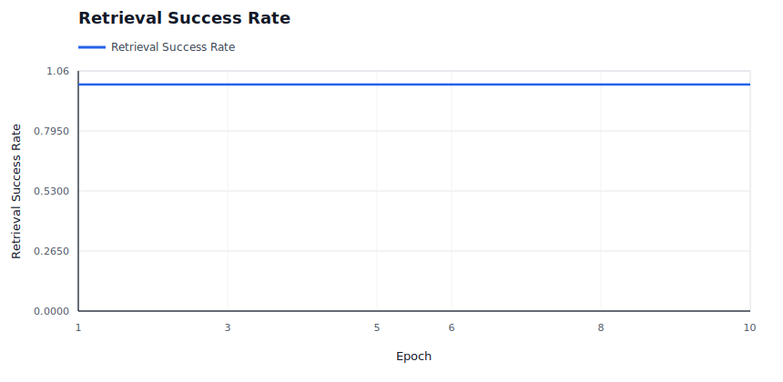

### Slot State Transitions

Shows active slots and repair slots; spikes indicate reassignment churn.

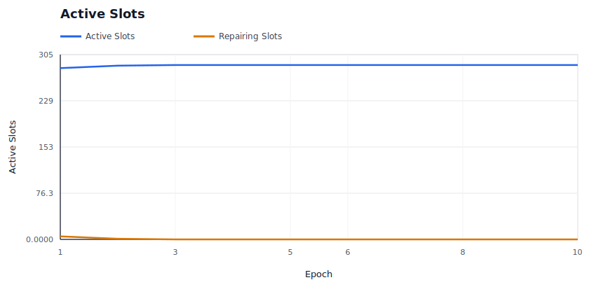

### Provider P&L

Shows aggregate provider economics over time.

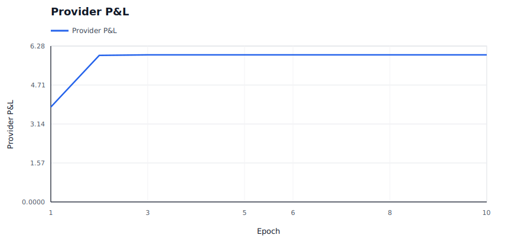

### Provider Cost Shock

Shows modeled provider cost pressure against provider revenue.

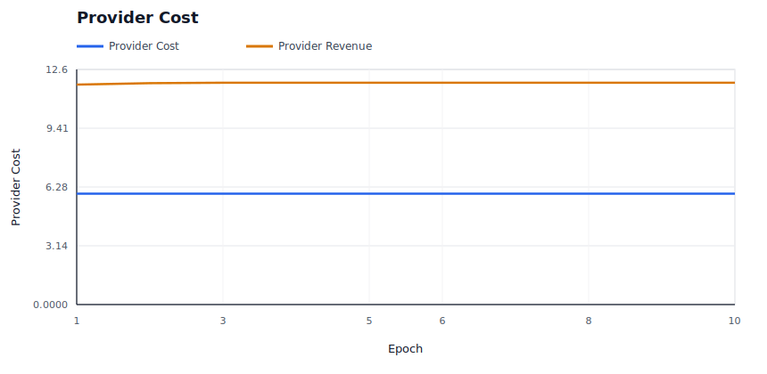

### Provider Churn

Shows modeled provider exits and per-epoch churn events.

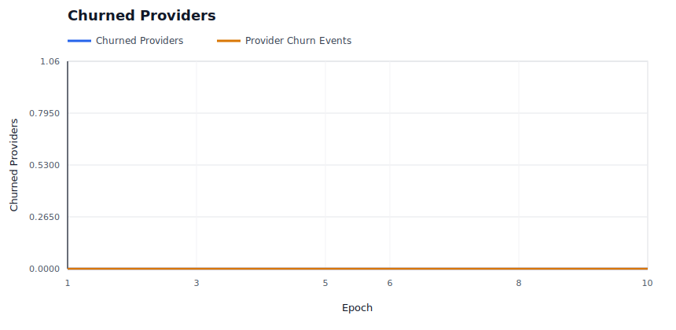

### Provider Supply Entry

Shows reserve provider entry and probationary promotion into active supply.

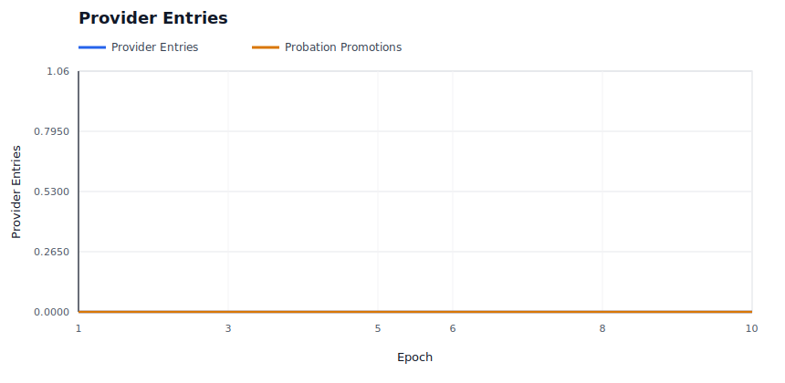

### Provider Bond Headroom

Shows underbonded providers and repairs triggered by insufficient assignment collateral.

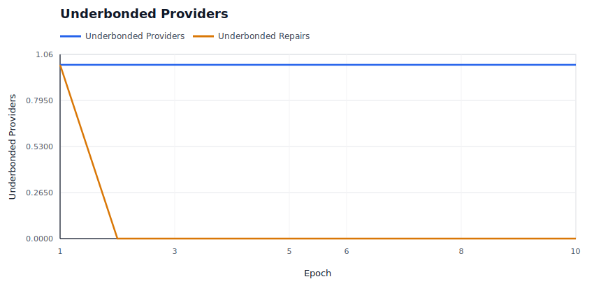

### Burn / Mint Ratio

Shows whether burns are material relative to minted rewards and audit budget.

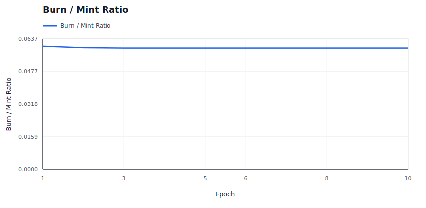

### Storage Escrow Lifecycle

Shows storage escrow locked, earned, refunded, and still outstanding after close/refund semantics.

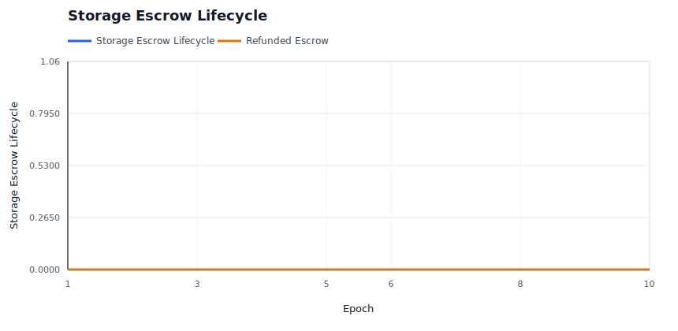

### Price Trajectory

Shows storage price and retrieval price movement under dynamic pricing.

### Retrieval Demand

Shows effective retrieval attempts against latent baseline demand.

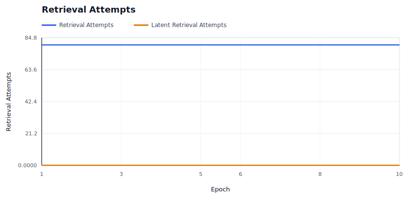

### Storage Demand

Shows modeled new deal demand accepted versus rejected by price.

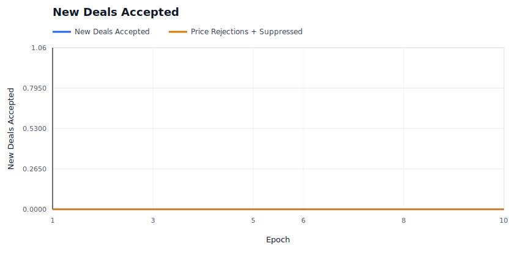

### Capacity Utilization

Shows active storage responsibility against modeled provider capacity.

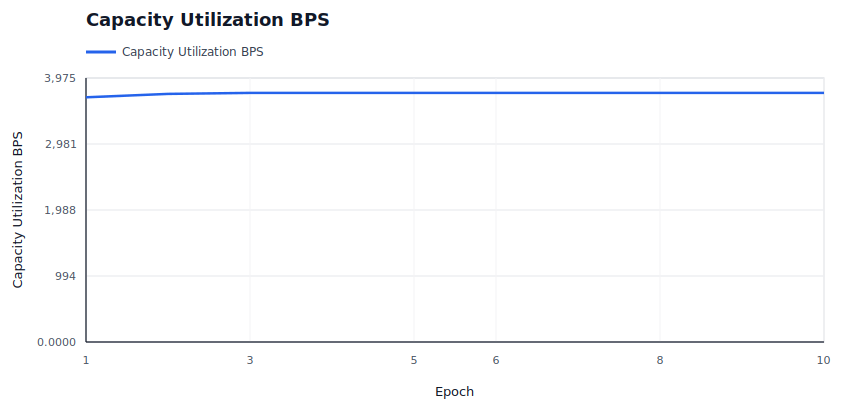

### Saturation And Repair Pressure

Shows provider bandwidth saturation and repair backoffs, which are scale-specific stress signals.

### Repair Backlog

Shows whether started repairs are accumulating faster than they complete.

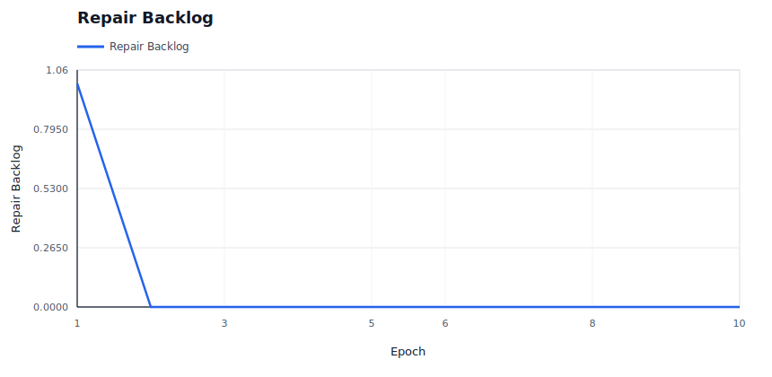

### Repair Readiness

Shows pending-provider readiness timeouts against successful readiness events.

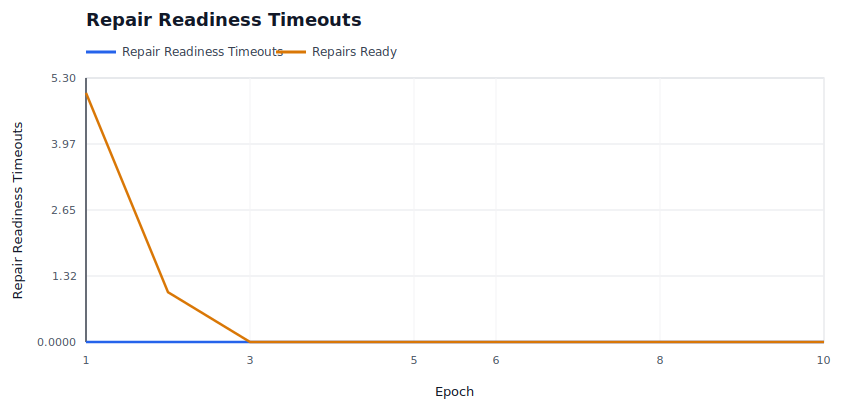

### High-Bandwidth Promotion

Shows capability promotion/demotion state over time for hot-path eligibility.

### Hot Retrieval Routing

Shows whether hot retrieval attempts are being served by promoted high-bandwidth providers.

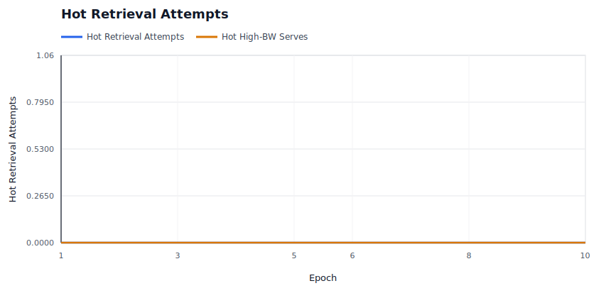

### Performance Tiers

Shows the fast positive tier and Fail-tier service counts under the performance market.

### Operator Concentration

Shows whether operator assignment share is bounded despite provider identity concentration.

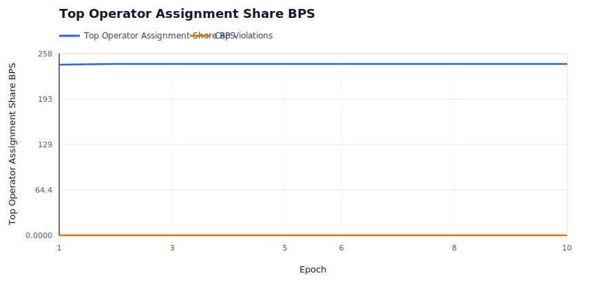

### Evidence Pressure

Shows soft liveness evidence and hard invalid-proof evidence by epoch.

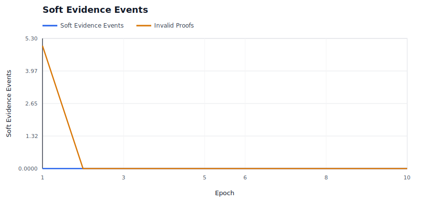

### Evidence Spam Economics

Shows bond burn and bounty payout for low-quality deputy evidence claims.

### Audit Budget

Shows whether miss-driven audit demand is spending budget or accumulating carryover.

### Audit Backlog

Shows unmet audit demand and exhausted-budget epochs when evidence exceeds available enforcement budget.

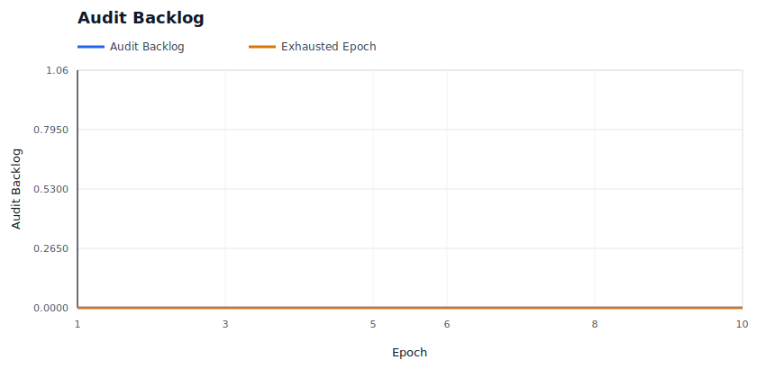

### Sponsored Retrieval Accounting

Shows sponsor-funded public retrieval spend against any owner deal-escrow debit.

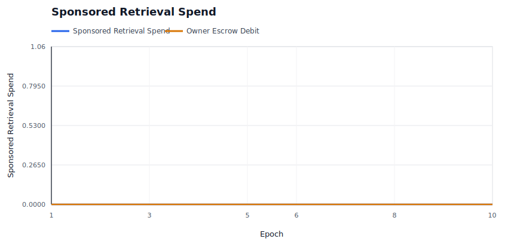

### Elasticity Spend

Shows demand-funded elasticity spend and rejected expansion attempts.

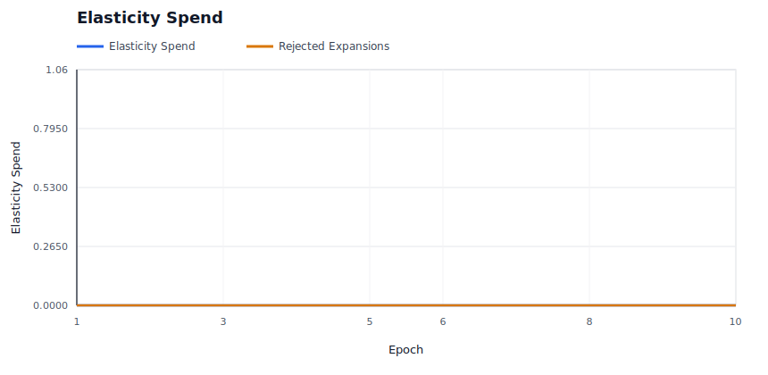

### Elasticity Overlay Routes

Shows temporary overflow routes that are active or serving reads after user-funded elasticity scale-up.

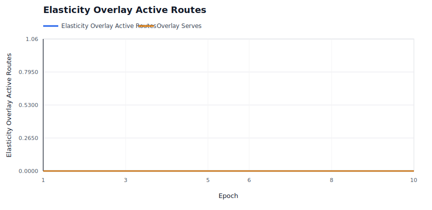

### Staged Upload Pressure

Shows provisional-generation preflight rejections and retention cleanup for abandoned staged uploads.

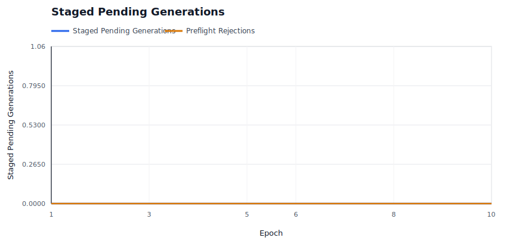

## Raw Artifacts

- `summary.json`: compact machine-readable run summary.
- `epochs.csv`: per-epoch availability, liveness, reward, repair, and economics metrics.
- `providers.csv`: final provider-level economics, fault counters, and capability tier.
- `operators.csv`: final operator-level provider count, assignment share, success, and P&L metrics.
- `slots.csv`: per-slot epoch ledger, including health state and reason.
- `evidence.csv`: policy evidence events.
- `repairs.csv`: repair start, pending-provider readiness, readiness timeout, completion, attempt-count, cooldown, candidate-exclusion, attempt-cap, and backoff events.
- `economy.csv`: per-epoch market, elasticity overlay, staged upload, and accounting ledger.
- `signals.json`: derived availability, saturation, repair, capacity, economic, elasticity overlay, staged upload, regional, concentration, and provider bottleneck signals.
