# Policy Simulation Report: Provider Economic Churn

## Executive Summary

**Verdict:** `PASS`. This run simulates `provider-economic-churn` with `80` providers, `100` data users, `36` deals, and an RS `8+4` layout for `12` epochs. Enforcement is configured as `REWARD_EXCLUSION`.

Model rational provider exit after sustained negative P&L. The policy question is whether bounded churn converts economic distress into visible capacity exit and repair pressure without causing durability loss.

Expected policy behavior: Cost-shocked providers become churn candidates, exits are capped per epoch, affected slots are repaired, and reads remain available.

Observed result: retrieval success was `100.00%`, reward coverage was `99.07%`, repairs started/ready/completed were `48` / `48` / `48`, and `8` providers ended with negative modeled P&L. The run recorded `0` unavailable reads, `0` modeled data-loss events, `0` bandwidth saturation responses and `0` repair backoffs across `48` repair attempts. Slot health recorded `0` suspect slot-epochs and `48` delinquent slot-epochs. High-bandwidth promotions were `0` and final high-bandwidth providers were `0`.

## Review Focus

Use this fixture to tune churn caps, replacement capacity, price floors, and how much economic distress should remain monitoring-only.

A human reviewer should focus less on the pass/fail label and more on whether the scenario, assertions, and threshold values encode the policy we actually want to enforce on-chain.

## Run Configuration

| Field | Value |
|---|---:|
| Seed | `91` |
| Providers | `80` |
| Data users | `100` |
| Deals | `36` |
| Epochs | `12` |
| Erasure coding | `K=8`, `M=4`, `N=12` |
| User MDUs per deal | `16` |
| Retrievals/user/epoch | `1` |
| Liveness quota | `2`-`8` blobs/slot/epoch |
| Repair delay | `1` epochs |
| Repair attempt cap/slot | `4` (`0` means unlimited) |
| Repair backoff window | `1` epochs |
| Dynamic pricing | `true` |
| Storage price | `1.0000` |
| New deal requests/epoch | `0` |
| Storage demand price ceiling | `0.0000` (`0` means disabled) |
| Storage demand reference price | `0.0000` (`0` disables elasticity) |
| Storage demand elasticity | `0.00%` |
| Retrieval price/slot | `0.0100` |
| Provider capacity range | `10`-`14` slots |
| Provider bandwidth range | `120`-`220` serves/epoch (`0` means unlimited) |
| Service class | `General` |
| Performance market | `false` |
| Provider latency range | `0`-`0` ms |
| Latency tier windows | Platinum <= `100` ms, Gold <= `250` ms, Silver <= `500` ms |
| High-bandwidth promotion | `false` |
| High-bandwidth capacity threshold | `0` serves/epoch |
| Hot retrieval share | `0.00%` |
| Operators | `80` |
| Dominant operator provider share | `0.00%` |
| Operator assignment cap/deal | `0` (`0` means disabled) |
| Provider regions | `global` |

## Economic Assumptions

The economic model is intentionally simple and deterministic. It is useful for comparing policy directions, not for setting final token economics without external market data.

| Assumption | Value | Interpretation |
|---|---:|---|
| Storage price | `1.0000` | Unitless price applied by the controller, demand-elasticity curve, and optional affordability gate. |
| New deal requests/epoch | `0` | Latent modeled write demand before optional price elasticity suppression. Effective requests are accepted only when price and capacity gates pass. |
| Storage demand price ceiling | `0.0000` | If non-zero, new deal demand above this storage price is rejected as unaffordable. |
| Storage demand reference price | `0.0000` | If non-zero with elasticity enabled, demand scales around this price before hard affordability rejection. |
| Storage demand elasticity | `0.00%` | Demand multiplier change for a 100% price move relative to the reference price, clamped by configured min/max demand bps. |
| Storage target utilization | `45.00%` | If dynamic pricing is enabled, utilization above this target steps storage price up, otherwise down. |
| Retrieval price per slot | `0.0100` | Paid per successful provider slot served, before the configured variable burn. |
| Retrieval target per epoch | `80` | If dynamic pricing is enabled, retrieval attempts above this target step retrieval price up, otherwise down. |
| Retrieval demand shocks | `[]` | Optional epoch-scoped retrieval demand multipliers used to test price shock response and oscillation. |
| Dynamic pricing max step | `2.50%` | Per-epoch controller movement cap. Lower values are safer but slower to equilibrate. |
| Base reward per slot | `0.0400` | Modeled issuance/subsidy paid only to reward-eligible active slots. |
| Provider storage cost/slot/epoch | `0.0100` | Simplified provider cost basis; jitter may create marginal-provider distress. |
| Provider bandwidth cost/retrieval | `0.0010` | Simplified egress cost basis for retrieval-heavy scenarios. |
| Provider cost shocks | `[{"bandwidth_cost_multiplier_bps": 40000, "end_epoch": 12, "fixed_cost_multiplier_bps": 80000, "provider_ids": ["sp-000", "sp-001", "sp-002", "sp-003", "sp-004", "sp-005", "sp-006", "sp-007"], "start_epoch": 3, "storage_cost_multiplier_bps": 80000}]` | Optional epoch-scoped fixed/storage/bandwidth cost multipliers used to model sudden operator cost pressure. |
| Provider churn policy | enabled `True`, threshold `0.0000`, after `2` epochs, cap `2`/epoch | Converts sustained negative economics into draining exits; cap `0` means unbounded by this policy. |
| Provider churn floor | `72` providers | Prevents an economic shock fixture from exiting the entire active set unless intentionally configured. |
| Performance reward per serve | `0.0000` | Optional tiered QoS reward. Multipliers are applied by latency tier and Fail tier receives the configured fail multiplier. |
| Audit budget per epoch | `1.0000` | Minted audit budget; spending is capped by available budget and unmet miss-driven demand carries forward as backlog. |
| Evidence spam claims/epoch | `0` | Synthetic low-quality deputy claims used to test bond burn and bounty gating economics. |
| Evidence bond / bounty | `0.0000` / `0.0000` | Spam claims burn bond unless convicted; bounty is paid only on convicted evidence. |
| Retrieval burn | `5.00%` | Fraction of variable retrieval fees burned before provider payout. |

## What Happened

User-facing retrieval availability stayed intact: every modeled retrieval completed successfully. That does not mean every provider behaved correctly; it means redundancy, routing, or deputy service absorbed the fault.

The policy layer recorded `97` evidence events: `89` soft, `0` threshold, `0` hard, and `0` spam events. Soft evidence is suitable for repair and reward exclusion; hard or convicted threshold evidence is the category that can later justify slashing or stronger sanctions.

Repair was exercised: `48` repair operations started, `48` produced pending-provider readiness evidence, and `48` completed. The simulator models this as make-before-break reassignment, so the old assignment remains visible until replacement work catches up and the readiness gate is satisfied.

Reward exclusion was active: `1.9200` modeled reward units were burned instead of paid to non-compliant slots.

The directly implicated provider set begins with: `sp-000, sp-001, sp-002, sp-003, sp-004`.

## Diagnostic Signals

These are derived from the raw CSV/JSON outputs and are intended to make scale behavior reviewable without manually scanning ledgers.

| Signal | Value | Why It Matters |
|---|---:|---|
| Worst epoch success | `100.00%` at epoch `1` | Identifies the availability cliff instead of hiding it in aggregate success. |
| Unavailable reads | `0` | Temporary read failures are a scale/reliability signal; they are not automatically permanent data loss. |
| Modeled data-loss events | `0` | Durability-loss signal. This should remain zero for current scale fixtures. |
| Degraded epochs | `0` | Counts epochs with unavailable reads or success below 99.9%. |
| Recovery epoch after worst | `2` | Shows whether the network returned to clean steady state after the worst point. |
| Saturation rate | `0.00%` | Provider bandwidth saturation per retrieval attempt. |
| Peak saturation | `0` at epoch `1` | Reveals when bandwidth, not storage correctness, became the bottleneck. |
| Repair readiness ratio | `100.00%` | Measures whether pending providers catch up before promotion. |
| Repair completion ratio | `100.00%` | Measures whether healing catches up with detection. |
| Repair attempts | `48` | Counts bounded attempts to open a repair or discover replacement pressure. |
| Repair backoff pressure | `0` backoffs per started repair | Shows whether repair coordination is saturated. |
| Repair backoffs per attempt | `0` | Distinguishes capacity/cooldown pressure from successful repair starts. |
| Repair cooldowns / attempt caps | `0` / `0` | Shows whether throttling, rather than candidate selection alone, is bounding repair churn. |
| Suspect / delinquent slot-epochs | `0` / `48` | Separates early warning state from threshold-crossed delinquency. |
| Final repair backlog | `0` slots | Started repairs minus completed repairs at run end. |
| High-bandwidth providers | `0` | Providers currently eligible for hot/high-bandwidth routing. |
| High-bandwidth promotions/demotions | `0` / `0` | Shows capability changes under measured demand. |
| Hot high-bandwidth serves/retrieval | `0` | Measures whether hot retrievals actually use promoted providers. |
| Avg latency / Fail tier rate | `0` ms / `0.00%` | Separates correctness from QoS: slow-but-valid service can be available while still earning lower or no performance rewards. |
| Platinum / Gold / Silver / Fail serves | `0` / `0` / `0` / `0` | Shows the latency-tier distribution for performance-market policy. |
| Performance reward paid | `0.0000` | Quantifies the tiered QoS reward stream separately from baseline storage and retrieval settlement. |
| Provider latency p10 / p50 / p90 | `0` / `0` / `0` ms | Shows whether aggregate averages hide slow provider tails. |
| New deal latent/effective demand | `0` / `0` | Shows how much modeled write demand survived the price-elasticity curve. |
| New deal demand accepted/rejected/suppressed | `0` / `0` / `0` | Shows whether modeled write demand is entering the network, blocked by price/capacity, or never arriving because quotes are unattractive. |
| New deal effective/latent acceptance | `0.00%` / `0.00%` | Demand-side market health signal; a technically available network can still fail if users cannot afford storage. |
| Audit demand / spent | `0.4450` / `0.4450` | Shows whether enforcement evidence consumed the available audit budget. |
| Audit backlog / exhausted epochs | `0.0000` / `0` | Makes budget exhaustion explicit instead of hiding unmet audit work behind capped spending. |
| Evidence spam claims / convictions | `0` / `0` | Shows whether the evidence-market spam fixture exercised low-quality claims and any successful convictions. |
| Evidence spam bond / net gain | `0.0000` / `0.0000` | Spam should be negative-EV unless conviction-gated bounties justify the claim volume. |
| Top operator provider share | `1.25%` | Shows whether many SP identities are controlled by one operator. |
| Top operator assignment share | `1.85%` | Shows whether placement caps translate identity concentration into slot concentration. |
| Max operator slots/deal | `1` | Checks per-deal blast-radius limits against operator Sybil concentration. |
| Operator cap violations | `0` | Counts deals where operator slot concentration exceeded the configured cap. |
| Final storage utilization | `50.58%` | Active slots versus modeled provider capacity. |
| Provider utilization p50 / p90 / max | `50.00%` / `60.00%` / `80.00%` | Detects assignment concentration and capacity cliffs. |
| Provider P&L p10 / p50 / p90 | `2.4922` / `2.9004` / `3.4293` | Shows whether aggregate P&L hides marginal-provider distress. |
| Provider cost shock epochs/providers | `10` / `8` | Shows when external cost pressure was active and how much of the provider population it affected. |
| Max cost shock fixed/storage/bandwidth | `800.00%` / `800.00%` / `400.00%` | Distinguishes fixed-cost, storage-cost, and egress-cost shocks. |
| Provider churn events / final churned | `8` / `8` | Shows whether sustained economic distress became modeled provider exits rather than only a warning label. |
| Churn pressure provider-epochs / peak | `20` / `8` | Shows the breadth and duration of providers below the configured churn threshold. |
| Active / exited provider capacity | `854` / `102` slots | Measures supply actually remaining after modeled exits. |
| Peak assigned slots on churned providers | `24` | Shows the maximum repair burden created by economic exits. |
| Storage price start/end/range | `1.0000` -> `1.3121` (`1.0000`-`1.3121`) | Shows dynamic pricing movement and bounds. |
| Retrieval price start/end/range | `0.0100` -> `0.0131` (`0.0100`-`0.0131`) | Shows whether demand pressure moved retrieval pricing. |
| Retrieval latent/effective attempts | `1200` / `1200` | Shows how much retrieval load was added by demand-shock multipliers. |
| Retrieval demand shock epochs/multiplier | `0` / `100.00%` | Shows the size and duration of the modeled read-demand shock. |
| Price direction changes storage/retrieval | `0` / `0` | Detects controller oscillation rather than relying on visual inspection. |

### Regional Signals

| Region | Providers | Utilization | Offline Responses | Saturated Responses | Negative P&L Providers | Avg P&L |
|---|---:|---:|---:|---:|---:|---:|
| `global` | 80 | 45.18% | 99 | 0 | 8 | 2.4627 |

### Top Bottleneck Providers

| Provider | Region | Slots/Capacity | Utilization | Bandwidth Cap | Attempts | Offline | Saturated | P&L |
|---|---|---:|---:|---:|---:|---:|---:|---:|
| `sp-001` | `global` | 0/13 | 0.00% | 187 | 59 | 17 | 0 | -2.1610 |
| `sp-004` | `global` | 0/13 | 0.00% | 166 | 106 | 14 | 0 | -2.5239 |
| `sp-002` | `global` | 0/14 | 0.00% | 148 | 104 | 12 | 0 | -2.5219 |
| `sp-006` | `global` | 0/12 | 0.00% | 148 | 89 | 12 | 0 | -2.4030 |
| `sp-003` | `global` | 0/10 | 0.00% | 195 | 59 | 12 | 0 | -2.1316 |
| `sp-005` | `global` | 0/13 | 0.00% | 173 | 74 | 11 | 0 | -2.2654 |
| `sp-000` | `global` | 0/13 | 0.00% | 205 | 72 | 11 | 0 | -2.2714 |
| `sp-007` | `global` | 0/14 | 0.00% | 205 | 90 | 10 | 0 | -2.3853 |

### Top Operators

| Operator | Providers | Provider Share | Assigned Slots | Assignment Share | Retrieval Attempts | Success | P&L |
|---|---:|---:|---:|---:|---:|---:|---:|
| `op-029` | 1 | 1.25% | 8 | 1.85% | 164 | 100.00% | 3.8052 |
| `op-030` | 1 | 1.25% | 8 | 1.85% | 142 | 100.00% | 3.5307 |
| `op-065` | 1 | 1.25% | 8 | 1.85% | 134 | 100.00% | 3.1806 |
| `op-009` | 1 | 1.25% | 7 | 1.62% | 148 | 100.00% | 3.5454 |
| `op-011` | 1 | 1.25% | 7 | 1.62% | 131 | 100.00% | 3.2820 |
| `op-012` | 1 | 1.25% | 7 | 1.62% | 138 | 100.00% | 3.4210 |
| `op-013` | 1 | 1.25% | 7 | 1.62% | 139 | 100.00% | 3.3614 |
| `op-015` | 1 | 1.25% | 7 | 1.62% | 146 | 100.00% | 3.4293 |

### Timeline

| Epoch | Retrieval Success | Evidence | Repairs Started | Repairs Ready | Repairs Completed | Reward Burned | Provider P&L | Notes |
|---:|---:|---:|---:|---:|---:|---:|---:|---|
| 1 | 100.00% | 0 | 0 | 0 | 0 | 0.0000 | 18.1600 | steady state |
| 2 | 100.00% | 0 | 0 | 0 | 0 | 0.0000 | 18.3500 | steady state |
| 3 | 100.00% | 0 | 0 | 0 | 0 | 0.0000 | 13.8307 | steady state |
| 4 | 100.00% | 0 | 0 | 0 | 0 | 0.0000 | 14.1024 | steady state |
| 5 | 100.00% | 0 | 0 | 0 | 0 | 0.0000 | 14.2620 | steady state |
| 6 | 100.00% | 52 | 12 | 0 | 0 | 0.4800 | 13.9557 | 29 offline responses, 12 quota misses, 12 delinquent slots |
| 7 | 100.00% | 44 | 12 | 12 | 12 | 0.4800 | 14.6657 | 22 offline responses, 12 quota misses, 12 slots repairing, 12 delinquent slots |
| 8 | 100.00% | 45 | 12 | 12 | 12 | 0.4800 | 15.7590 | 22 offline responses, 12 quota misses, 12 slots repairing, 12 delinquent slots |
| 9 | 100.00% | 47 | 12 | 12 | 12 | 0.4800 | 16.8999 | 26 offline responses, 12 quota misses, 12 slots repairing, 12 delinquent slots |
| 10 | 100.00% | 0 | 0 | 12 | 12 | 0.0000 | 18.4514 | 12 slots repairing |
| 11 | 100.00% | 0 | 0 | 0 | 0 | 0.0000 | 19.1686 | steady state |
| 12 | 100.00% | 0 | 0 | 0 | 0 | 0.0000 | 19.4119 | steady state |

## Enforcement Interpretation

The simulator recorded `97` evidence events and `144` repair ledger events. The first evidence epoch was `5` and the first repair-start epoch was `6`.

Evidence by reason:

- `quota_shortfall`: `48`
- `deputy_served_zero_direct`: `41`
- `provider_economic_churn`: `8`

Evidence by provider:

- `sp-001`: `13`
- `sp-006`: `13`
- `sp-003`: `12`
- `sp-000`: `12`
- `sp-005`: `12`
- `sp-007`: `12`
- `sp-002`: `12`
- `sp-004`: `11`

Repair summary:

- Repairs started: `48`
- Repairs marked ready: `48`
- Repairs completed: `48`
- Repair attempts: `48`
- Repair backoffs: `0`
- Repair cooldown backoffs: `0`
- Repair attempt-cap backoffs: `0`
- Suspect slot-epochs: `0`
- Delinquent slot-epochs: `48`
- Final active slots in last epoch: `432`

Candidate exclusion summary:

- No no-candidate repair backoffs were recorded.

### Repair Ledger Excerpt

| Epoch | Event | Deal | Slot | Old Provider | New Provider | Reason | Attempt | Cooldown Until |
|---:|---|---:|---:|---|---|---|---:|---:|
| 6 | `repair_started` | 1 | 1 | `sp-001` | `sp-062` | `deputy_served_zero_direct` | 1 | 0 |
| 6 | `repair_started` | 1 | 3 | `sp-003` | `sp-066` | `quota_shortfall` | 1 | 0 |
| 6 | `repair_started` | 7 | 9 | `sp-001` | `sp-026` | `deputy_served_zero_direct` | 1 | 0 |
| 6 | `repair_started` | 7 | 11 | `sp-003` | `sp-045` | `deputy_served_zero_direct` | 1 | 0 |
| 6 | `repair_started` | 14 | 5 | `sp-001` | `sp-055` | `deputy_served_zero_direct` | 1 | 0 |
| 6 | `repair_started` | 14 | 7 | `sp-003` | `sp-070` | `deputy_served_zero_direct` | 1 | 0 |
| 6 | `repair_started` | 21 | 1 | `sp-001` | `sp-030` | `deputy_served_zero_direct` | 1 | 0 |
| 6 | `repair_started` | 21 | 3 | `sp-003` | `sp-065` | `deputy_served_zero_direct` | 1 | 0 |
| 6 | `repair_started` | 27 | 9 | `sp-001` | `sp-029` | `deputy_served_zero_direct` | 1 | 0 |
| 6 | `repair_started` | 27 | 11 | `sp-003` | `sp-038` | `deputy_served_zero_direct` | 1 | 0 |
| 6 | `repair_started` | 34 | 5 | `sp-001` | `sp-018` | `deputy_served_zero_direct` | 1 | 0 |
| 6 | `repair_started` | 34 | 7 | `sp-003` | `sp-009` | `deputy_served_zero_direct` | 1 | 0 |
| ... | ... | ... | ... | ... | ... | `132` more events omitted | ... | ... |

## Economic Interpretation

The run minted `217.4400` reward/audit units and burned `8.6382` units, for a burn-to-mint ratio of `3.97%`.

Providers earned `308.3662` in modeled revenue against `111.3490` in modeled cost, ending with aggregate P&L `197.0172`.

Retrieval accounting paid providers `104.8462`, burned `1.2000` in base fees, and burned `5.5182` in variable retrieval fees.

Performance-tier accounting paid `0.0000` in QoS rewards.

Audit accounting saw `0.4450` of demand, spent `0.4450`, and ended with `0.0000` backlog after `0` exhausted epochs.

Provider cost shocks were active for `10` shock-epochs, affecting up to `8` providers. The maximum modeled storage-cost multiplier reached `800.00%`.

Provider churn policy executed `8` exits, leaving `8` churned providers and `854` active capacity slots. At peak, `24` assigned slots sat on churned providers and needed repair/rerouting pressure.

`8` providers ended with negative P&L and `8` were marked as churn risk. That is economically important even when retrieval success is perfect.

Final modeled storage price was `1.3121` and retrieval price per slot was `0.0131`.

### Provider P&L Extremes

| Provider | Assigned Slots | Revenue | Cost | Slashed | P&L | Churn Risk |
|---|---:|---:|---:|---:|---:|---:|
| `sp-004` | 0 | 1.9200 + 0.9481 | 5.3920 | 0.0000 | -2.5239 | yes |
| `sp-002` | 0 | 1.9200 + 0.9531 | 5.3950 | 0.0000 | -2.5219 | yes |
| `sp-006` | 0 | 1.6800 + 0.7870 | 4.8700 | 0.0000 | -2.4030 | yes |
| `sp-007` | 0 | 1.6800 + 0.8167 | 4.8820 | 0.0000 | -2.3853 | yes |
| `sp-000` | 0 | 1.4400 + 0.6146 | 4.3260 | 0.0000 | -2.2714 | yes |

## Assertion Contract

Assertions are the machine-readable policy contract for this fixture. Passing means this simulator run satisfied the current contract; it does not mean the policy is production-ready.

| Assertion | Status | Meaning | Detail |
|---|---|---|---|
| `min_success_rate` | `PASS` | Availability floor: user-facing reads must stay above this success rate. | success_rate=1, required>=1 |
| `max_unavailable_reads` | `PASS` | Custom assertion. Review the detail and fixture threshold. | unavailable_reads=0, required<=0 |
| `max_data_loss_events` | `PASS` | Durability invariant: stress may allow unavailable reads, but modeled data loss must stay at zero. | data_loss_events=0, required<=0 |
| `max_paid_corrupt_bytes` | `PASS` | Corrupt data must not earn payment. | paid_corrupt_bytes=0, required<=0 |
| `min_provider_cost_shock_active` | `PASS` | Cost-shock fixture must activate the configured cost-pressure window. | provider_cost_shock_active=10, required>=10 |
| `min_max_provider_cost_shocked_providers` | `PASS` | Cost-shock fixture must affect at least this many providers. | max_provider_cost_shocked_providers=8, required>=8 |
| `min_provider_churn_events` | `PASS` | Economic churn fixture must execute provider exits after sustained negative P&L. | provider_churn_events=8, required>=8 |
| `min_churned_providers` | `PASS` | Economic churn fixture must end with providers marked as exited. | churned_providers=8, required>=8 |
| `min_churn_pressure_provider_epochs` | `PASS` | Economic churn fixture must expose sustained below-threshold provider pressure. | churn_pressure_provider_epochs=20, required>=20 |
| `min_max_churned_assigned_slots` | `PASS` | Economic churn fixture must create assigned-slot repair pressure after exits. | max_churned_assigned_slots=24, required>=1 |
| `min_final_active_provider_capacity` | `PASS` | Economic churn fixture must retain enough active replacement capacity. | final_active_provider_capacity=854, required>=800 |
| `min_repairs_started` | `PASS` | Repair liveness: policy must start reassignment when evidence warrants it. | repairs_started=48, required>=1 |
| `min_repairs_completed` | `PASS` | Repair completion: make-before-break reassignment must finish within the run. | repairs_completed=48, required>=1 |

## Evidence Ledger Excerpt

These rows are representative raw evidence events. Use `evidence.csv` for the complete ledger.

| Epoch | Deal | Slot | Provider | Class | Reason | Consequence |
|---:|---:|---:|---|---|---|---|
| 5 |  |  | `sp-001` | `market` | `provider_economic_churn` | `draining_exit` |
| 5 |  |  | `sp-003` | `market` | `provider_economic_churn` | `draining_exit` |
| 6 | 1 | 1 | `sp-001` | `soft` | `deputy_served_zero_direct` | `repair_candidate` |
| 6 | 1 | 1 | `sp-001` | `soft` | `quota_shortfall` | `repair_candidate` |
| 6 | 1 | 3 | `sp-003` | `soft` | `quota_shortfall` | `repair_candidate` |
| 6 | 7 | 9 | `sp-001` | `soft` | `deputy_served_zero_direct` | `repair_candidate` |
| 6 | 7 | 9 | `sp-001` | `soft` | `quota_shortfall` | `repair_candidate` |
| 6 | 7 | 11 | `sp-003` | `soft` | `deputy_served_zero_direct` | `repair_candidate` |
| 6 | 7 | 11 | `sp-003` | `soft` | `quota_shortfall` | `repair_candidate` |
| 6 | 14 | 5 | `sp-001` | `soft` | `deputy_served_zero_direct` | `repair_candidate` |
| 6 | 14 | 5 | `sp-001` | `soft` | `quota_shortfall` | `repair_candidate` |
| 6 | 14 | 7 | `sp-003` | `soft` | `deputy_served_zero_direct` | `repair_candidate` |
| ... | ... | ... | ... | ... | ... | `85` more events omitted |

## Generated Graphs

The following SVG graphs are generated beside this report and embedded here with relative Markdown links so the report is readable as a self-contained artifact in GitHub or a local Markdown viewer.

### Retrieval Success Rate

Should stay near 1.0 unless availability is actually lost.

### Slot State Transitions

Shows active slots and repair slots; spikes indicate reassignment churn.

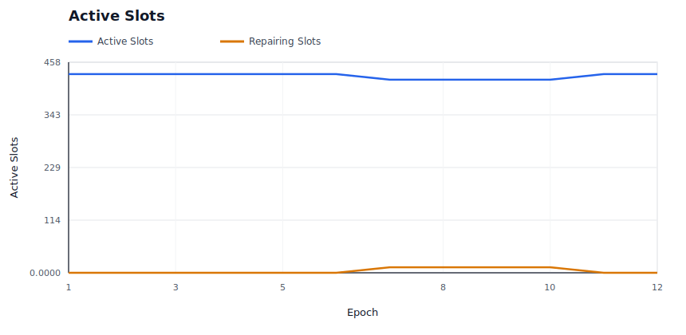

### Provider P&L

Shows aggregate provider economics over time.

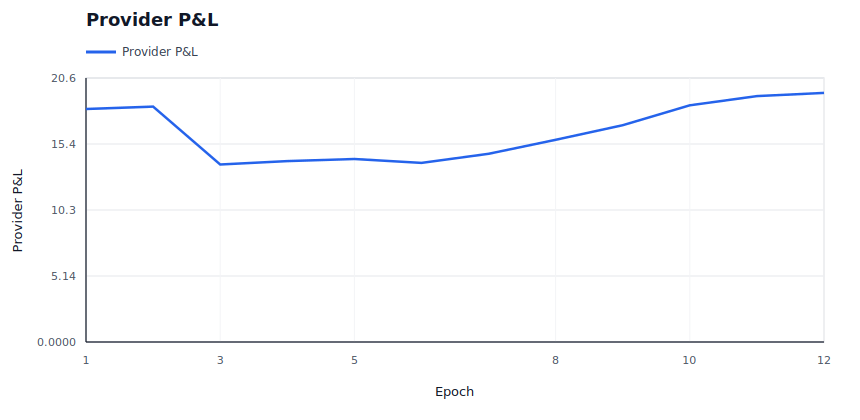

### Provider Cost Shock

Shows modeled provider cost pressure against provider revenue.

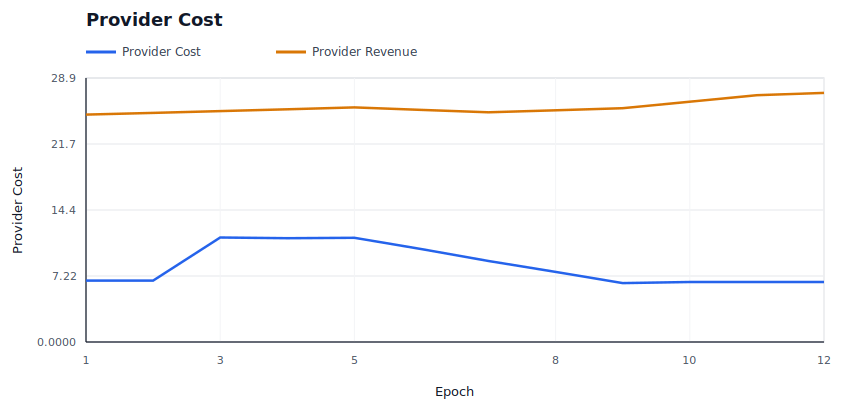

### Provider Churn

Shows modeled provider exits and per-epoch churn events.

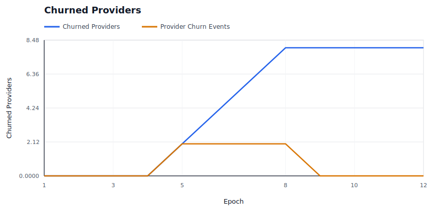

### Burn / Mint Ratio

Shows whether burns are material relative to minted rewards and audit budget.

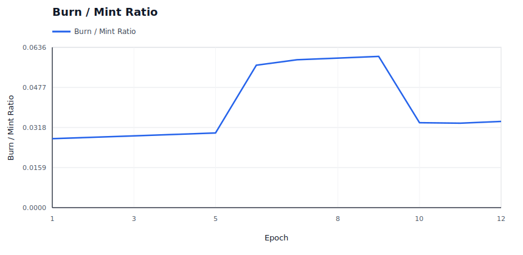

### Price Trajectory

Shows storage price and retrieval price movement under dynamic pricing.

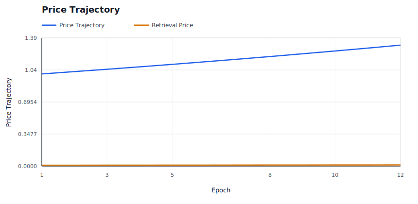

### Retrieval Demand

Shows effective retrieval attempts against latent baseline demand.

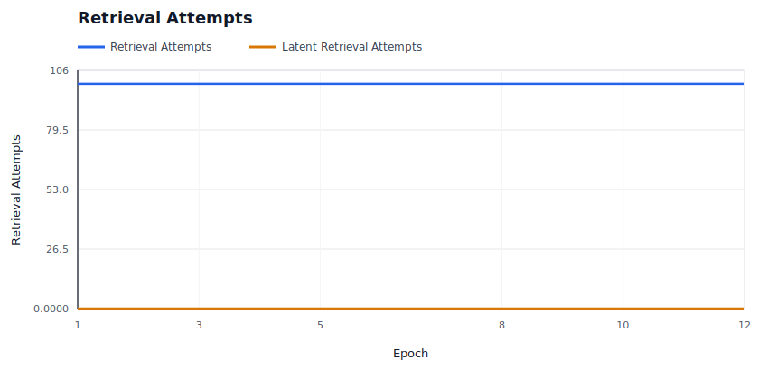

### Storage Demand

Shows modeled new deal demand accepted versus rejected by price.

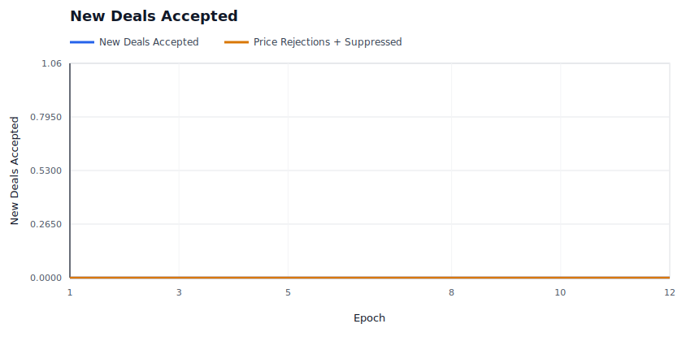

### Capacity Utilization

Shows active storage responsibility against modeled provider capacity.

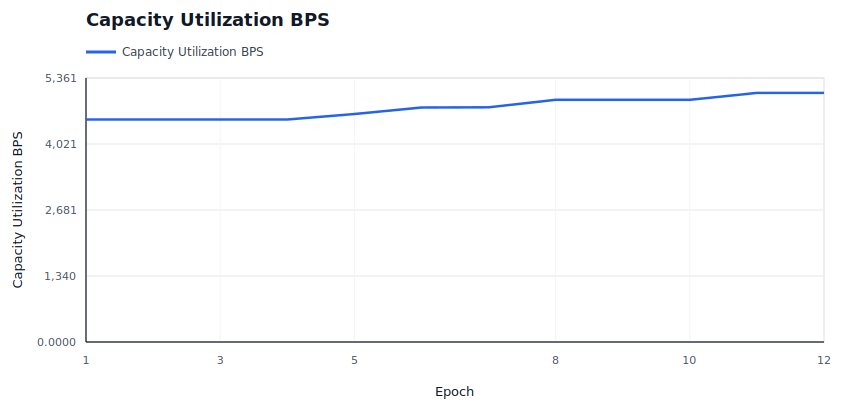

### Saturation And Repair Pressure

Shows provider bandwidth saturation and repair backoffs, which are scale-specific stress signals.

### Repair Backlog

Shows whether started repairs are accumulating faster than they complete.

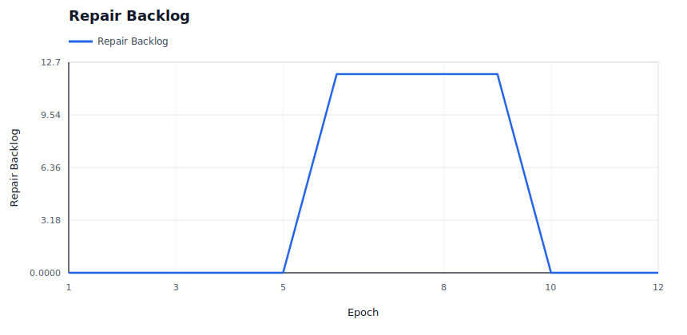

### High-Bandwidth Promotion

Shows capability promotion/demotion state over time for hot-path eligibility.

### Hot Retrieval Routing

Shows whether hot retrieval attempts are being served by promoted high-bandwidth providers.

### Performance Tiers

Shows the fast positive tier and Fail-tier service counts under the performance market.

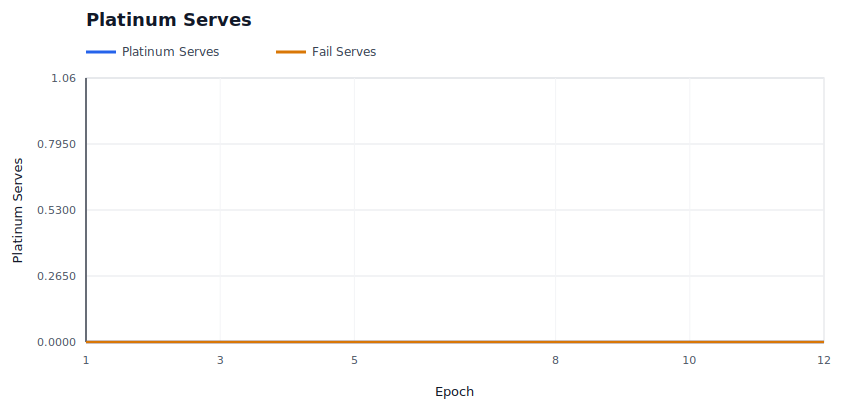

### Operator Concentration

Shows whether operator assignment share is bounded despite provider identity concentration.

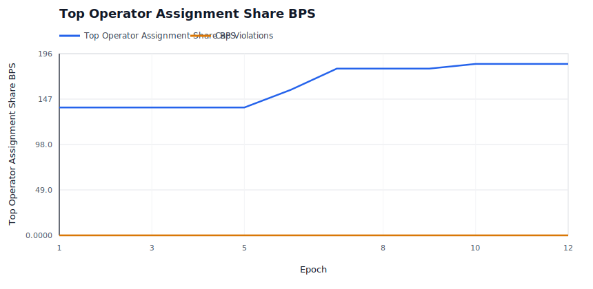

### Evidence Pressure

Shows soft liveness evidence and hard invalid-proof evidence by epoch.

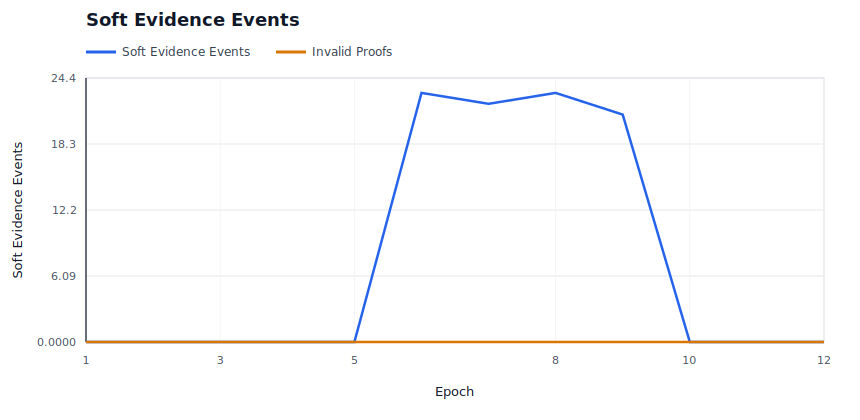

### Evidence Spam Economics

Shows bond burn and bounty payout for low-quality deputy evidence claims.

### Audit Budget

Shows whether miss-driven audit demand is spending budget or accumulating carryover.

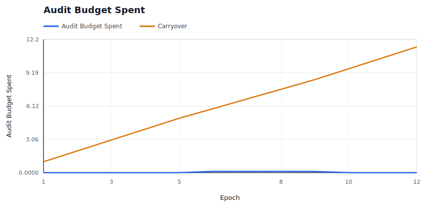

### Audit Backlog

Shows unmet audit demand and exhausted-budget epochs when evidence exceeds available enforcement budget.

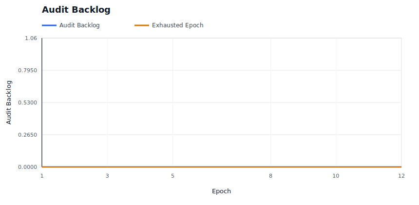

### Elasticity Spend

Shows demand-funded elasticity spend and rejected expansion attempts.

## Raw Artifacts

- `summary.json`: compact machine-readable run summary.
- `epochs.csv`: per-epoch availability, liveness, reward, repair, and economics metrics.
- `providers.csv`: final provider-level economics, fault counters, and capability tier.
- `operators.csv`: final operator-level provider count, assignment share, success, and P&L metrics.
- `slots.csv`: per-slot epoch ledger, including health state and reason.
- `evidence.csv`: policy evidence events.
- `repairs.csv`: repair start, pending-provider readiness, completion, attempt-count, cooldown, candidate-exclusion, attempt-cap, and backoff events.
- `economy.csv`: per-epoch market and accounting ledger.
- `signals.json`: derived availability, saturation, repair, capacity, economic, regional, concentration, and provider bottleneck signals.
