# Policy Simulation Report: Provider Supply Entry

## Executive Summary

**Verdict:** `PASS`. This run simulates `provider-supply-entry` with `88` providers, `110` data users, `36` deals, and an RS `8+4` layout for `14` epochs. Enforcement is configured as `REWARD_EXCLUSION`.

Model reserve providers entering the active set after churn reduces supply. The policy question is whether supply recovery has explicit admission, probation, and promotion telemetry instead of silently assuming infinite replacement capacity.

Expected policy behavior: Cost-shocked providers churn, reserve providers enter probation, probationary providers promote to active supply, repair completes, and durability remains intact.

Observed result: retrieval success was `100.00%`, reward coverage was `99.00%`, repairs started/ready/completed were `60` / `60` / `60`, and `8` providers ended with negative modeled P&L. The run recorded `0` unavailable reads, `0` modeled data-loss events, `0` bandwidth saturation responses and `0` repair backoffs across `60` repair attempts. Slot health recorded `0` suspect slot-epochs and `60` delinquent slot-epochs. High-bandwidth promotions were `0` and final high-bandwidth providers were `0`.

## Review Focus

Use this fixture to tune onboarding caps, probation length, utilization or price triggers, and whether new SPs should receive normal placement immediately or only after readiness evidence.

A human reviewer should focus less on the pass/fail label and more on whether the scenario, assertions, and threshold values encode the policy we actually want to enforce on-chain.

## Run Configuration

| Field | Value |
|---|---:|
| Seed | `97` |
| Providers | `88` |
| Data users | `110` |
| Deals | `36` |
| Epochs | `14` |
| Erasure coding | `K=8`, `M=4`, `N=12` |
| User MDUs per deal | `16` |
| Retrievals/user/epoch | `1` |
| Liveness quota | `2`-`8` blobs/slot/epoch |
| Repair delay | `1` epochs |
| Repair attempt cap/slot | `4` (`0` means unlimited) |
| Repair backoff window | `1` epochs |
| Dynamic pricing | `true` |
| Storage price | `1.0000` |
| New deal requests/epoch | `0` |
| Storage demand price ceiling | `0.0000` (`0` means disabled) |
| Storage demand reference price | `0.0000` (`0` disables elasticity) |
| Storage demand elasticity | `0.00%` |
| Retrieval price/slot | `0.0100` |
| Provider capacity range | `10`-`14` slots |
| Provider bandwidth range | `120`-`220` serves/epoch (`0` means unlimited) |
| Service class | `General` |
| Performance market | `false` |
| Provider latency range | `0`-`0` ms |
| Latency tier windows | Platinum <= `100` ms, Gold <= `250` ms, Silver <= `500` ms |
| High-bandwidth promotion | `false` |
| High-bandwidth capacity threshold | `0` serves/epoch |
| Hot retrieval share | `0.00%` |
| Operators | `88` |
| Dominant operator provider share | `0.00%` |
| Operator assignment cap/deal | `0` (`0` means disabled) |
| Provider regions | `global` |

## Economic Assumptions

The economic model is intentionally simple and deterministic. It is useful for comparing policy directions, not for setting final token economics without external market data.

| Assumption | Value | Interpretation |
|---|---:|---|
| Storage price | `1.0000` | Unitless price applied by the controller, demand-elasticity curve, and optional affordability gate. |
| New deal requests/epoch | `0` | Latent modeled write demand before optional price elasticity suppression. Effective requests are accepted only when price and capacity gates pass. |
| Storage demand price ceiling | `0.0000` | If non-zero, new deal demand above this storage price is rejected as unaffordable. |
| Storage demand reference price | `0.0000` | If non-zero with elasticity enabled, demand scales around this price before hard affordability rejection. |
| Storage demand elasticity | `0.00%` | Demand multiplier change for a 100% price move relative to the reference price, clamped by configured min/max demand bps. |
| Storage target utilization | `45.00%` | If dynamic pricing is enabled, utilization above this target steps storage price up, otherwise down. |
| Retrieval price per slot | `0.0100` | Paid per successful provider slot served, before the configured variable burn. |
| Retrieval target per epoch | `80` | If dynamic pricing is enabled, retrieval attempts above this target step retrieval price up, otherwise down. |
| Retrieval demand shocks | `[]` | Optional epoch-scoped retrieval demand multipliers used to test price shock response and oscillation. |
| Dynamic pricing max step | `2.50%` | Per-epoch controller movement cap. Lower values are safer but slower to equilibrate. |
| Base reward per slot | `0.0400` | Modeled issuance/subsidy paid only to reward-eligible active slots. |
| Provider storage cost/slot/epoch | `0.0100` | Simplified provider cost basis; jitter may create marginal-provider distress. |
| Provider bandwidth cost/retrieval | `0.0010` | Simplified egress cost basis for retrieval-heavy scenarios. |
| Provider cost shocks | `[{"bandwidth_cost_multiplier_bps": 40000, "end_epoch": 14, "fixed_cost_multiplier_bps": 80000, "provider_ids": ["sp-000", "sp-001", "sp-002", "sp-003", "sp-004", "sp-005", "sp-006", "sp-007"], "start_epoch": 3, "storage_cost_multiplier_bps": 80000}]` | Optional epoch-scoped fixed/storage/bandwidth cost multipliers used to model sudden operator cost pressure. |
| Provider churn policy | enabled `True`, threshold `0.0000`, after `2` epochs, cap `2`/epoch | Converts sustained negative economics into draining exits; cap `0` means unbounded by this policy. |
| Provider churn floor | `72` providers | Prevents an economic shock fixture from exiting the entire active set unless intentionally configured. |
| Provider supply entry | enabled `True`, reserve `8`, cap `2`/epoch, probation `1` epochs | Moves reserve providers through probation before they become assignment-eligible active supply. |
| Supply entry triggers | utilization >= `40.00%` or storage price >= `disabled` | If both are zero, configured reserve supply enters as soon as the epoch window opens. |
| Performance reward per serve | `0.0000` | Optional tiered QoS reward. Multipliers are applied by latency tier and Fail tier receives the configured fail multiplier. |
| Audit budget per epoch | `1.0000` | Minted audit budget; spending is capped by available budget and unmet miss-driven demand carries forward as backlog. |
| Evidence spam claims/epoch | `0` | Synthetic low-quality deputy claims used to test bond burn and bounty gating economics. |
| Evidence bond / bounty | `0.0000` / `0.0000` | Spam claims burn bond unless convicted; bounty is paid only on convicted evidence. |
| Retrieval burn | `5.00%` | Fraction of variable retrieval fees burned before provider payout. |

## What Happened

User-facing retrieval availability stayed intact: every modeled retrieval completed successfully. That does not mean every provider behaved correctly; it means redundancy, routing, or deputy service absorbed the fault.

The policy layer recorded `137` evidence events: `113` soft, `0` threshold, `0` hard, and `0` spam events. Soft evidence is suitable for repair and reward exclusion; hard or convicted threshold evidence is the category that can later justify slashing or stronger sanctions.

Repair was exercised: `60` repair operations started, `60` produced pending-provider readiness evidence, and `60` completed. The simulator models this as make-before-break reassignment, so the old assignment remains visible until replacement work catches up and the readiness gate is satisfied.

Reward exclusion was active: `2.4000` modeled reward units were burned instead of paid to non-compliant slots.

The directly implicated provider set begins with: `sp-000, sp-001, sp-002, sp-003, sp-004`.

## Diagnostic Signals

These are derived from the raw CSV/JSON outputs and are intended to make scale behavior reviewable without manually scanning ledgers.

| Signal | Value | Why It Matters |
|---|---:|---|
| Worst epoch success | `100.00%` at epoch `1` | Identifies the availability cliff instead of hiding it in aggregate success. |
| Unavailable reads | `0` | Temporary read failures are a scale/reliability signal; they are not automatically permanent data loss. |
| Modeled data-loss events | `0` | Durability-loss signal. This should remain zero for current scale fixtures. |
| Degraded epochs | `0` | Counts epochs with unavailable reads or success below 99.9%. |
| Recovery epoch after worst | `2` | Shows whether the network returned to clean steady state after the worst point. |
| Saturation rate | `0.00%` | Provider bandwidth saturation per retrieval attempt. |
| Peak saturation | `0` at epoch `1` | Reveals when bandwidth, not storage correctness, became the bottleneck. |
| Repair readiness ratio | `100.00%` | Measures whether pending providers catch up before promotion. |
| Repair completion ratio | `100.00%` | Measures whether healing catches up with detection. |
| Repair attempts | `60` | Counts bounded attempts to open a repair or discover replacement pressure. |
| Repair backoff pressure | `0` backoffs per started repair | Shows whether repair coordination is saturated. |
| Repair backoffs per attempt | `0` | Distinguishes capacity/cooldown pressure from successful repair starts. |
| Repair cooldowns / attempt caps | `0` / `0` | Shows whether throttling, rather than candidate selection alone, is bounding repair churn. |
| Suspect / delinquent slot-epochs | `0` / `60` | Separates early warning state from threshold-crossed delinquency. |
| Final repair backlog | `0` slots | Started repairs minus completed repairs at run end. |
| High-bandwidth providers | `0` | Providers currently eligible for hot/high-bandwidth routing. |
| High-bandwidth promotions/demotions | `0` / `0` | Shows capability changes under measured demand. |
| Hot high-bandwidth serves/retrieval | `0` | Measures whether hot retrievals actually use promoted providers. |
| Avg latency / Fail tier rate | `0` ms / `0.00%` | Separates correctness from QoS: slow-but-valid service can be available while still earning lower or no performance rewards. |
| Platinum / Gold / Silver / Fail serves | `0` / `0` / `0` / `0` | Shows the latency-tier distribution for performance-market policy. |
| Performance reward paid | `0.0000` | Quantifies the tiered QoS reward stream separately from baseline storage and retrieval settlement. |
| Provider latency p10 / p50 / p90 | `0` / `0` / `0` ms | Shows whether aggregate averages hide slow provider tails. |
| New deal latent/effective demand | `0` / `0` | Shows how much modeled write demand survived the price-elasticity curve. |
| New deal demand accepted/rejected/suppressed | `0` / `0` / `0` | Shows whether modeled write demand is entering the network, blocked by price/capacity, or never arriving because quotes are unattractive. |
| New deal effective/latent acceptance | `0.00%` / `0.00%` | Demand-side market health signal; a technically available network can still fail if users cannot afford storage. |
| Audit demand / spent | `0.5650` / `0.5650` | Shows whether enforcement evidence consumed the available audit budget. |
| Audit backlog / exhausted epochs | `0.0000` / `0` | Makes budget exhaustion explicit instead of hiding unmet audit work behind capped spending. |
| Evidence spam claims / convictions | `0` / `0` | Shows whether the evidence-market spam fixture exercised low-quality claims and any successful convictions. |
| Evidence spam bond / net gain | `0.0000` / `0.0000` | Spam should be negative-EV unless conviction-gated bounties justify the claim volume. |
| Top operator provider share | `1.13%` | Shows whether many SP identities are controlled by one operator. |
| Top operator assignment share | `1.85%` | Shows whether placement caps translate identity concentration into slot concentration. |
| Max operator slots/deal | `1` | Checks per-deal blast-radius limits against operator Sybil concentration. |
| Operator cap violations | `0` | Counts deals where operator slot concentration exceeded the configured cap. |
| Final storage utilization | `43.94%` | Active slots versus modeled provider capacity. |
| Provider utilization p50 / p90 / max | `46.15%` / `60.00%` / `70.00%` | Detects assignment concentration and capacity cliffs. |
| Provider P&L p10 / p50 / p90 | `0.0000` / `3.6646` / `4.0895` | Shows whether aggregate P&L hides marginal-provider distress. |
| Provider cost shock epochs/providers | `12` / `8` | Shows when external cost pressure was active and how much of the provider population it affected. |
| Max cost shock fixed/storage/bandwidth | `800.00%` / `800.00%` / `400.00%` | Distinguishes fixed-cost, storage-cost, and egress-cost shocks. |
| Provider churn events / final churned | `8` / `8` | Shows whether sustained economic distress became modeled provider exits rather than only a warning label. |
| Provider entries / probation promotions | `8` / `8` | Shows whether reserve supply entered and cleared readiness gating before receiving normal placement. |
| Reserve / probationary / entered-active providers | `0` / `0` / `8` | Separates unused reserve supply, in-flight onboarding, and newly promoted active supply. |
| Churn pressure provider-epochs / peak | `20` / `8` | Shows the breadth and duration of providers below the configured churn threshold. |
| Active / exited / reserve provider capacity | `983` / `96` / `0` slots | Measures supply remaining, removed, and still waiting outside normal placement. |
| Peak assigned slots on churned providers | `32` | Shows the maximum repair burden created by economic exits. |
| Storage price start/end/range | `1.0000` -> `0.7195` (`0.7195`-`1.0000`) | Shows dynamic pricing movement and bounds. |
| Retrieval price start/end/range | `0.0100` -> `0.0138` (`0.0100`-`0.0138`) | Shows whether demand pressure moved retrieval pricing. |
| Retrieval latent/effective attempts | `1540` / `1540` | Shows how much retrieval load was added by demand-shock multipliers. |
| Retrieval demand shock epochs/multiplier | `0` / `100.00%` | Shows the size and duration of the modeled read-demand shock. |
| Price direction changes storage/retrieval | `0` / `0` | Detects controller oscillation rather than relying on visual inspection. |

### Regional Signals

| Region | Providers | Utilization | Offline Responses | Saturated Responses | Negative P&L Providers | Avg P&L |
|---|---:|---:|---:|---:|---:|---:|
| `global` | 88 | 40.03% | 123 | 0 | 8 | 3.1108 |

### Top Bottleneck Providers

| Provider | Region | Slots/Capacity | Utilization | Bandwidth Cap | Attempts | Offline | Saturated | P&L |
|---|---|---:|---:|---:|---:|---:|---:|---:|
| `sp-003` | `global` | 0/13 | 0.00% | 186 | 139 | 19 | 0 | -0.5645 |
| `sp-000` | `global` | 0/11 | 0.00% | 190 | 149 | 16 | 0 | -0.4932 |
| `sp-004` | `global` | 0/14 | 0.00% | 142 | 140 | 16 | 0 | -0.6432 |
| `sp-002` | `global` | 0/10 | 0.00% | 193 | 121 | 16 | 0 | -0.3630 |
| `sp-001` | `global` | 0/13 | 0.00% | 199 | 120 | 16 | 0 | -0.3873 |
| `sp-007` | `global` | 0/14 | 0.00% | 189 | 159 | 14 | 0 | -0.7583 |
| `sp-006` | `global` | 0/11 | 0.00% | 122 | 138 | 14 | 0 | -0.6482 |
| `sp-005` | `global` | 0/10 | 0.00% | 164 | 157 | 12 | 0 | -0.7569 |

### Top Operators

| Operator | Providers | Provider Share | Assigned Slots | Assignment Share | Retrieval Attempts | Success | P&L |
|---|---:|---:|---:|---:|---:|---:|---:|
| `op-008` | 1 | 1.13% | 8 | 1.85% | 236 | 100.00% | 5.7692 |
| `op-009` | 1 | 1.13% | 8 | 1.85% | 225 | 100.00% | 5.6452 |
| `op-010` | 1 | 1.13% | 8 | 1.85% | 246 | 100.00% | 5.8654 |
| `op-011` | 1 | 1.13% | 8 | 1.85% | 230 | 100.00% | 5.6992 |
| `op-023` | 1 | 1.13% | 8 | 1.85% | 162 | 100.00% | 4.1006 |
| `op-056` | 1 | 1.13% | 8 | 1.85% | 179 | 100.00% | 4.2202 |
| `op-022` | 1 | 1.13% | 7 | 1.62% | 162 | 100.00% | 3.9718 |
| `op-024` | 1 | 1.13% | 7 | 1.62% | 151 | 100.00% | 3.8824 |

### Timeline

| Epoch | Retrieval Success | Evidence | Repairs Started | Repairs Ready | Repairs Completed | Reward Burned | Provider P&L | Notes |
|---:|---:|---:|---:|---:|---:|---:|---:|---|
| 1 | 100.00% | 0 | 0 | 0 | 0 | 0.0000 | 20.4400 | steady state |
| 2 | 100.00% | 0 | 0 | 0 | 0 | 0.0000 | 20.6490 | steady state |
| 3 | 100.00% | 0 | 0 | 0 | 0 | 0.0000 | 16.3812 | steady state |
| 4 | 100.00% | 0 | 0 | 0 | 0 | 0.0000 | 16.4658 | steady state |
| 5 | 100.00% | 0 | 0 | 0 | 0 | 0.0000 | 16.8319 | steady state |
| 6 | 100.00% | 0 | 0 | 0 | 0 | 0.0000 | 16.9876 | steady state |
| 7 | 100.00% | 0 | 0 | 0 | 0 | 0.0000 | 17.2420 | steady state |
| 8 | 100.00% | 62 | 16 | 0 | 0 | 0.6400 | 18.1694 | 32 offline responses, 16 quota misses, 16 delinquent slots |
| 9 | 100.00% | 65 | 16 | 16 | 16 | 0.6400 | 18.9938 | 35 offline responses, 16 quota misses, 16 slots repairing, 16 delinquent slots |
| 10 | 100.00% | 58 | 14 | 16 | 16 | 0.5600 | 20.3695 | 30 offline responses, 14 quota misses, 16 slots repairing, 14 delinquent slots |
| 11 | 100.00% | 51 | 14 | 14 | 14 | 0.5600 | 21.8015 | 26 offline responses, 14 quota misses, 14 slots repairing, 14 delinquent slots |
| 12 | 100.00% | 0 | 0 | 14 | 14 | 0.0000 | 22.4890 | 14 slots repairing |
| 13 | 100.00% | 0 | 0 | 0 | 0 | 0.0000 | 23.3233 | steady state |
| 14 | 100.00% | 0 | 0 | 0 | 0 | 0.0000 | 23.6044 | steady state |

## Enforcement Interpretation

The simulator recorded `137` evidence events and `180` repair ledger events. The first evidence epoch was `5` and the first repair-start epoch was `8`.

Evidence by reason:

- `quota_shortfall`: `60`
- `deputy_served_zero_direct`: `53`
- `provider_supply_entry`: `8`
- `provider_probation_promoted`: `8`
- `provider_economic_churn`: `8`

Evidence by provider:

- `sp-001`: `17`
- `sp-003`: `16`
- `sp-000`: `16`
- `sp-002`: `15`
- `sp-006`: `15`
- `sp-004`: `15`
- `sp-007`: `14`
- `sp-005`: `13`

Repair summary:

- Repairs started: `60`
- Repairs marked ready: `60`
- Repairs completed: `60`
- Repair attempts: `60`
- Repair backoffs: `0`
- Repair cooldown backoffs: `0`
- Repair attempt-cap backoffs: `0`
- Suspect slot-epochs: `0`
- Delinquent slot-epochs: `60`
- Final active slots in last epoch: `432`

Candidate exclusion summary:

- No no-candidate repair backoffs were recorded.

### Repair Ledger Excerpt

| Epoch | Event | Deal | Slot | Old Provider | New Provider | Reason | Attempt | Cooldown Until |
|---:|---|---:|---:|---|---|---|---:|---:|
| 8 | `repair_started` | 1 | 1 | `sp-001` | `sp-023` | `deputy_served_zero_direct` | 1 | 0 |
| 8 | `repair_started` | 1 | 2 | `sp-002` | `sp-079` | `deputy_served_zero_direct` | 1 | 0 |
| 8 | `repair_started` | 7 | 9 | `sp-001` | `sp-048` | `deputy_served_zero_direct` | 1 | 0 |
| 8 | `repair_started` | 7 | 10 | `sp-002` | `sp-024` | `deputy_served_zero_direct` | 1 | 0 |
| 8 | `repair_started` | 8 | 1 | `sp-001` | `sp-023` | `deputy_served_zero_direct` | 1 | 0 |
| 8 | `repair_started` | 8 | 2 | `sp-002` | `sp-060` | `deputy_served_zero_direct` | 1 | 0 |
| 8 | `repair_started` | 15 | 1 | `sp-001` | `sp-040` | `deputy_served_zero_direct` | 1 | 0 |
| 8 | `repair_started` | 15 | 2 | `sp-002` | `sp-018` | `deputy_served_zero_direct` | 1 | 0 |
| 8 | `repair_started` | 22 | 5 | `sp-001` | `sp-045` | `deputy_served_zero_direct` | 1 | 0 |
| 8 | `repair_started` | 22 | 6 | `sp-002` | `sp-032` | `quota_shortfall` | 1 | 0 |
| 8 | `repair_started` | 23 | 1 | `sp-001` | `sp-041` | `deputy_served_zero_direct` | 1 | 0 |
| 8 | `repair_started` | 23 | 2 | `sp-002` | `sp-051` | `deputy_served_zero_direct` | 1 | 0 |
| ... | ... | ... | ... | ... | ... | `168` more events omitted | ... | ... |

## Economic Interpretation

The run minted `253.5200` reward/audit units and burned `11.2083` units, for a burn-to-mint ratio of `4.42%`.

Providers earned `375.2184` in modeled revenue against `101.4700` in modeled cost, ending with aggregate P&L `273.7484`.

Retrieval accounting paid providers `138.0984`, burned `1.5400` in base fees, and burned `7.2683` in variable retrieval fees.

Performance-tier accounting paid `0.0000` in QoS rewards.

Audit accounting saw `0.5650` of demand, spent `0.5650`, and ended with `0.0000` backlog after `0` exhausted epochs.

Provider cost shocks were active for `12` shock-epochs, affecting up to `8` providers. The maximum modeled storage-cost multiplier reached `800.00%`.

Provider churn policy executed `8` exits, leaving `8` churned providers and `983` active capacity slots. At peak, `32` assigned slots sat on churned providers and needed repair/rerouting pressure.

Supply entry moved `8` reserve providers into probation and promoted `8` providers into active supply. The run ended with `8` newly entered active providers, `0` reserve providers, and `0` probationary providers.

`8` providers ended with negative P&L and `8` were marked as churn risk. That is economically important even when retrieval success is perfect.

Final modeled storage price was `0.7195` and retrieval price per slot was `0.0138`.

### Provider P&L Extremes

| Provider | Assigned Slots | Revenue | Cost | Slashed | P&L | Churn Risk |
|---|---:|---:|---:|---:|---:|---:|
| `sp-007` | 0 | 2.8000 + 1.5577 | 5.1160 | 0.0000 | -0.7583 | yes |
| `sp-005` | 0 | 2.8000 + 1.5531 | 5.1100 | 0.0000 | -0.7569 | yes |
| `sp-006` | 0 | 2.5200 + 1.3068 | 4.4750 | 0.0000 | -0.6482 | yes |
| `sp-004` | 0 | 2.5200 + 1.3028 | 4.4660 | 0.0000 | -0.6432 | yes |
| `sp-003` | 0 | 2.5600 + 1.2385 | 4.3630 | 0.0000 | -0.5645 | yes |

## Assertion Contract

Assertions are the machine-readable policy contract for this fixture. Passing means this simulator run satisfied the current contract; it does not mean the policy is production-ready.

| Assertion | Status | Meaning | Detail |
|---|---|---|---|
| `min_success_rate` | `PASS` | Availability floor: user-facing reads must stay above this success rate. | success_rate=1, required>=1 |
| `max_unavailable_reads` | `PASS` | Custom assertion. Review the detail and fixture threshold. | unavailable_reads=0, required<=0 |
| `max_data_loss_events` | `PASS` | Durability invariant: stress may allow unavailable reads, but modeled data loss must stay at zero. | data_loss_events=0, required<=0 |
| `max_paid_corrupt_bytes` | `PASS` | Corrupt data must not earn payment. | paid_corrupt_bytes=0, required<=0 |
| `min_provider_cost_shock_active` | `PASS` | Cost-shock fixture must activate the configured cost-pressure window. | provider_cost_shock_active=12, required>=12 |
| `min_max_provider_cost_shocked_providers` | `PASS` | Cost-shock fixture must affect at least this many providers. | max_provider_cost_shocked_providers=8, required>=8 |
| `min_provider_churn_events` | `PASS` | Economic churn fixture must execute provider exits after sustained negative P&L. | provider_churn_events=8, required>=8 |
| `min_churned_providers` | `PASS` | Economic churn fixture must end with providers marked as exited. | churned_providers=8, required>=8 |
| `min_provider_entries` | `PASS` | Provider supply fixture must move reserve providers into onboarding. | provider_entries=8, required>=8 |
| `min_provider_probation_promotions` | `PASS` | Provider supply fixture must promote onboarded providers into active supply. | provider_probation_promotions=8, required>=8 |
| `min_entered_active_providers` | `PASS` | Provider supply fixture must end with newly entered providers in the active set. | entered_active_providers=8, required>=8 |
| `exact_reserve_providers` | `PASS` | Provider supply fixture should consume the configured reserve by run end. | reserve_providers=0, required=0 |
| `exact_probationary_providers` | `PASS` | Provider supply fixture should not leave providers stuck in probation by run end. | probationary_providers=0, required=0 |
| `max_max_probationary_providers` | `PASS` | Provider supply fixture should bound simultaneous probationary onboarding. | max_probationary_providers=2, required<=2 |
| `min_final_active_provider_capacity` | `PASS` | Economic churn fixture must retain enough active replacement capacity. | final_active_provider_capacity=983, required>=850 |
| `min_repairs_started` | `PASS` | Repair liveness: policy must start reassignment when evidence warrants it. | repairs_started=60, required>=1 |
| `min_repairs_completed` | `PASS` | Repair completion: make-before-break reassignment must finish within the run. | repairs_completed=60, required>=1 |

## Evidence Ledger Excerpt

These rows are representative raw evidence events. Use `evidence.csv` for the complete ledger.

| Epoch | Deal | Slot | Provider | Class | Reason | Consequence |
|---:|---:|---:|---|---|---|---|
| 5 |  |  | `sp-080` | `market` | `provider_supply_entry` | `probation` |
| 5 |  |  | `sp-081` | `market` | `provider_supply_entry` | `probation` |
| 6 |  |  | `sp-080` | `market` | `provider_probation_promoted` | `active_supply` |
| 6 |  |  | `sp-081` | `market` | `provider_probation_promoted` | `active_supply` |
| 6 |  |  | `sp-082` | `market` | `provider_supply_entry` | `probation` |
| 6 |  |  | `sp-083` | `market` | `provider_supply_entry` | `probation` |
| 7 |  |  | `sp-082` | `market` | `provider_probation_promoted` | `active_supply` |
| 7 |  |  | `sp-083` | `market` | `provider_probation_promoted` | `active_supply` |
| 7 |  |  | `sp-001` | `market` | `provider_economic_churn` | `draining_exit` |
| 7 |  |  | `sp-002` | `market` | `provider_economic_churn` | `draining_exit` |
| 7 |  |  | `sp-084` | `market` | `provider_supply_entry` | `probation` |
| 7 |  |  | `sp-085` | `market` | `provider_supply_entry` | `probation` |
| ... | ... | ... | ... | ... | ... | `125` more events omitted |

## Generated Graphs

The following SVG graphs are generated beside this report and embedded here with relative Markdown links so the report is readable as a self-contained artifact in GitHub or a local Markdown viewer.

### Retrieval Success Rate

Should stay near 1.0 unless availability is actually lost.

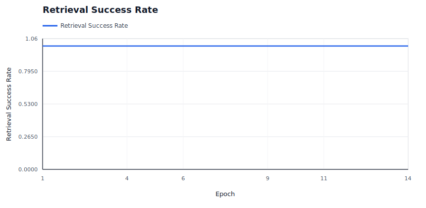

### Slot State Transitions

Shows active slots and repair slots; spikes indicate reassignment churn.

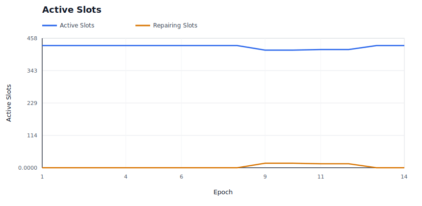

### Provider P&L

Shows aggregate provider economics over time.

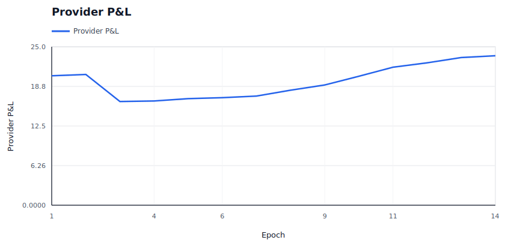

### Provider Cost Shock

Shows modeled provider cost pressure against provider revenue.

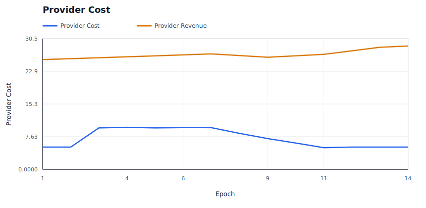

### Provider Churn

Shows modeled provider exits and per-epoch churn events.

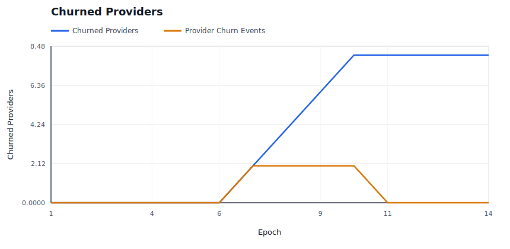

### Provider Supply Entry

Shows reserve provider entry and probationary promotion into active supply.

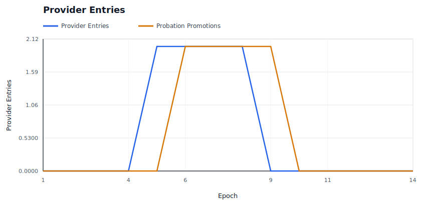

### Burn / Mint Ratio

Shows whether burns are material relative to minted rewards and audit budget.

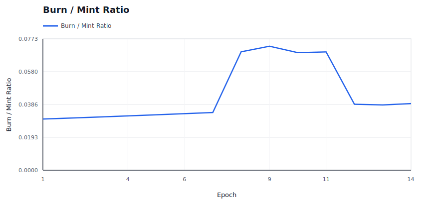

### Price Trajectory

Shows storage price and retrieval price movement under dynamic pricing.

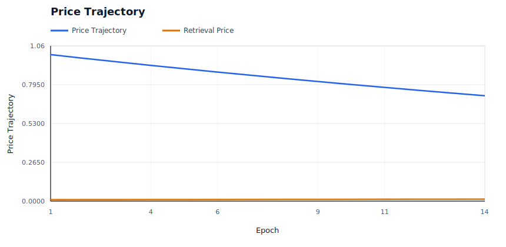

### Retrieval Demand

Shows effective retrieval attempts against latent baseline demand.

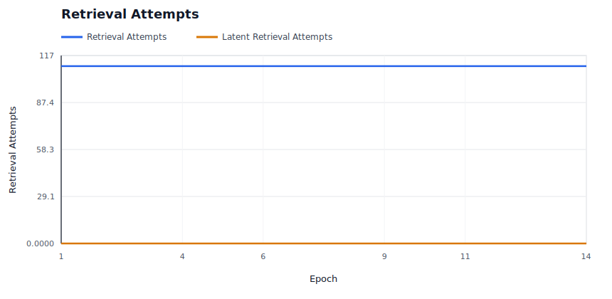

### Storage Demand

Shows modeled new deal demand accepted versus rejected by price.

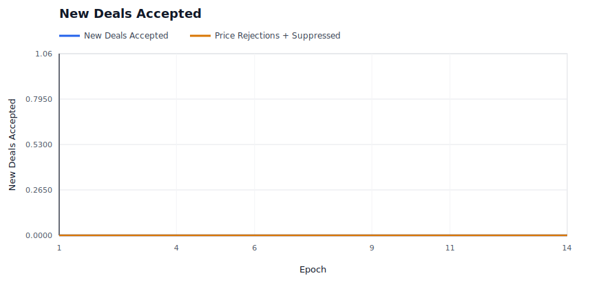

### Capacity Utilization

Shows active storage responsibility against modeled provider capacity.

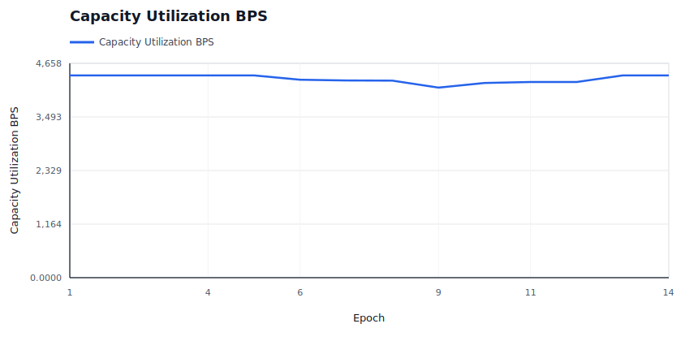

### Saturation And Repair Pressure

Shows provider bandwidth saturation and repair backoffs, which are scale-specific stress signals.

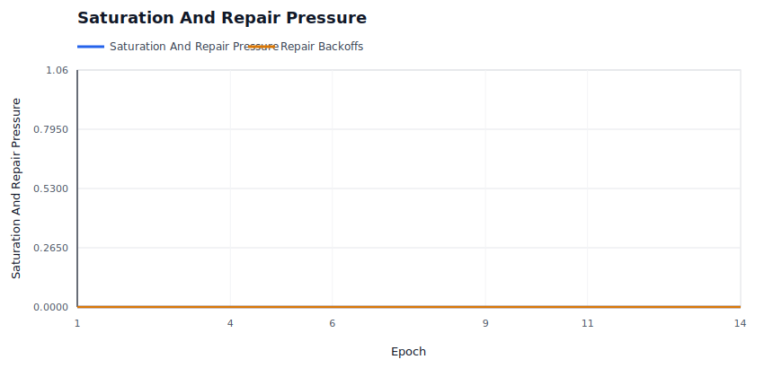

### Repair Backlog

Shows whether started repairs are accumulating faster than they complete.

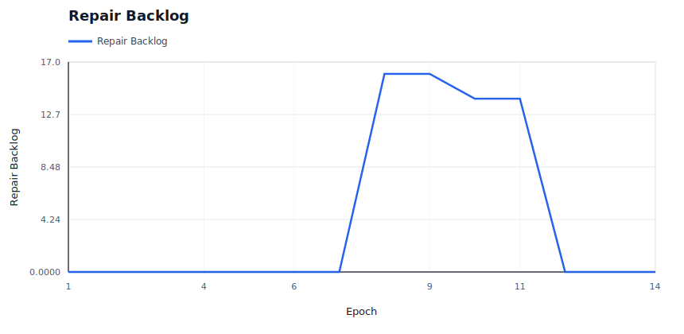

### High-Bandwidth Promotion

Shows capability promotion/demotion state over time for hot-path eligibility.

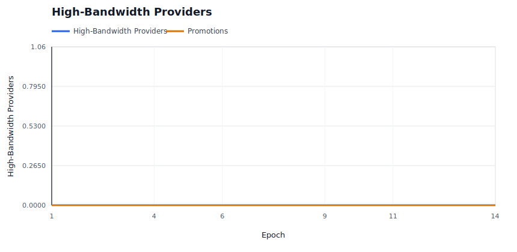

### Hot Retrieval Routing

Shows whether hot retrieval attempts are being served by promoted high-bandwidth providers.

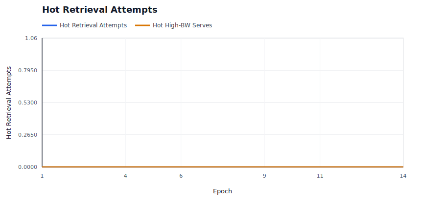

### Performance Tiers

Shows the fast positive tier and Fail-tier service counts under the performance market.

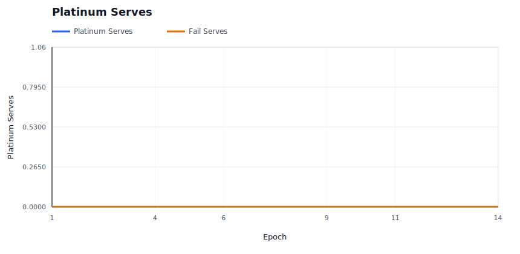

### Operator Concentration

Shows whether operator assignment share is bounded despite provider identity concentration.

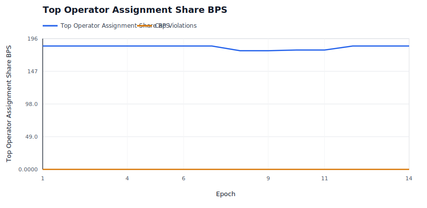

### Evidence Pressure

Shows soft liveness evidence and hard invalid-proof evidence by epoch.

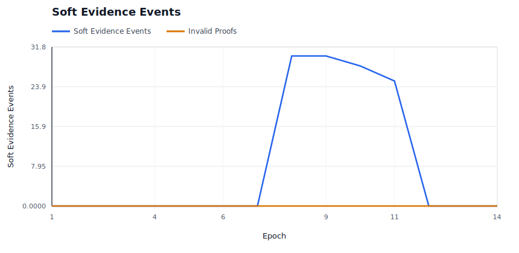

### Evidence Spam Economics

Shows bond burn and bounty payout for low-quality deputy evidence claims.

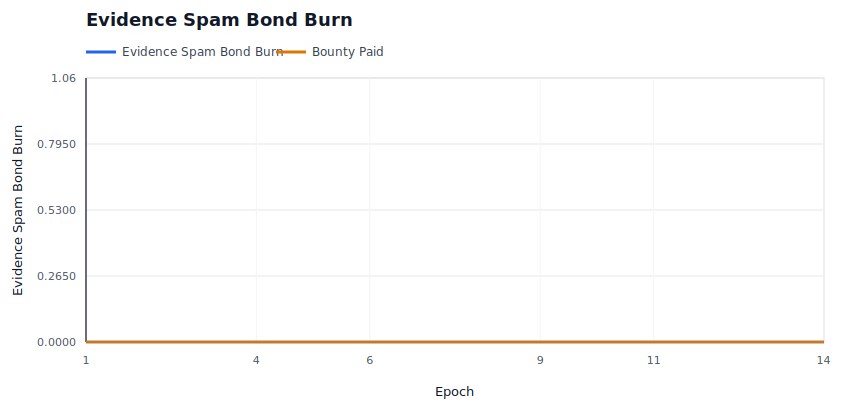

### Audit Budget

Shows whether miss-driven audit demand is spending budget or accumulating carryover.

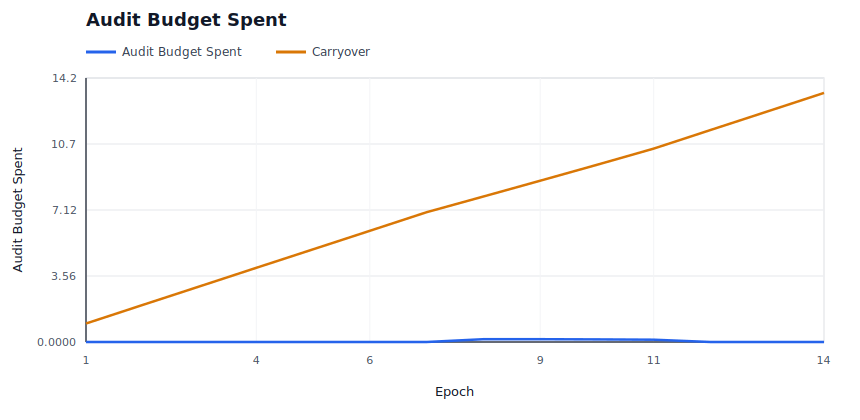

### Audit Backlog

Shows unmet audit demand and exhausted-budget epochs when evidence exceeds available enforcement budget.

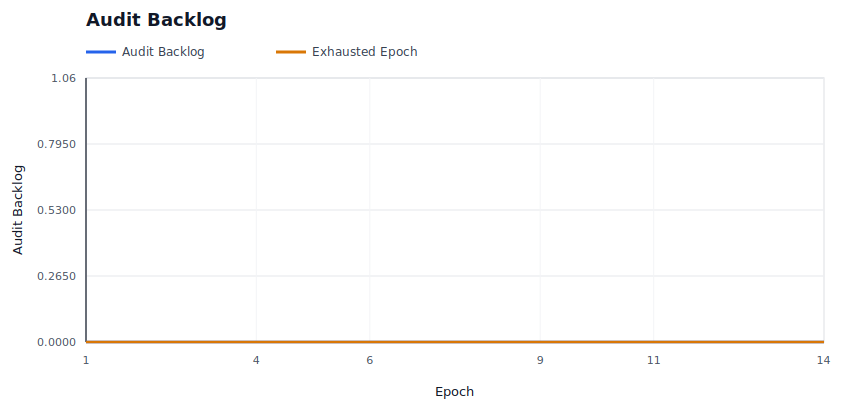

### Elasticity Spend

Shows demand-funded elasticity spend and rejected expansion attempts.

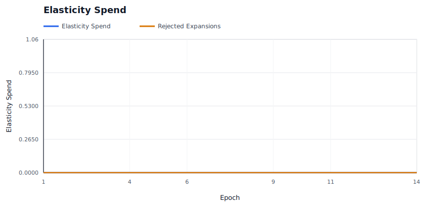

## Raw Artifacts

- `summary.json`: compact machine-readable run summary.
- `epochs.csv`: per-epoch availability, liveness, reward, repair, and economics metrics.
- `providers.csv`: final provider-level economics, fault counters, and capability tier.
- `operators.csv`: final operator-level provider count, assignment share, success, and P&L metrics.
- `slots.csv`: per-slot epoch ledger, including health state and reason.
- `evidence.csv`: policy evidence events.
- `repairs.csv`: repair start, pending-provider readiness, completion, attempt-count, cooldown, candidate-exclusion, attempt-cap, and backoff events.
- `economy.csv`: per-epoch market and accounting ledger.
- `signals.json`: derived availability, saturation, repair, capacity, economic, regional, concentration, and provider bottleneck signals.
