# Policy Simulation Report: Repair Candidate Exhaustion

## Executive Summary

**Verdict:** `PASS`. This run simulates `repair-candidate-exhaustion` with `12` providers, `80` data users, `8` deals, and an RS `8+4` layout for `8` epochs. Enforcement is configured as `REWARD_EXCLUSION`.

Model a network with no spare replacement capacity. The expected behavior is explicit repair backoff and operator visibility, not silent over-assignment.

Expected policy behavior: Repair backoffs are visible, provider capacity is respected, and data-loss events remain zero under the modeled fault.

Observed result: retrieval success was `100.00%`, reward coverage was `94.79%`, repairs started/ready/completed were `0` / `0` / `0`, and `0` providers ended with negative modeled P&L. The run recorded `0` unavailable reads, `0` modeled data-loss events, `0` bandwidth saturation responses and `40` repair backoffs across `8` repair attempts. Slot health recorded `0` suspect slot-epochs and `40` delinquent slot-epochs. High-bandwidth promotions were `0` and final high-bandwidth providers were `0`.

## Review Focus

Use this case to tune assignment headroom, repair attempt caps, and launch-provider minimums.

A human reviewer should focus less on the pass/fail label and more on whether the scenario, assertions, and threshold values encode the policy we actually want to enforce on-chain.

## Run Configuration

| Field | Value |
|---|---:|
| Seed | `37` |
| Providers | `12` |
| Data users | `80` |
| Deals | `8` |
| Epochs | `8` |
| Erasure coding | `K=8`, `M=4`, `N=12` |
| User MDUs per deal | `16` |
| Retrievals/user/epoch | `1` |
| Liveness quota | `2`-`8` blobs/slot/epoch |
| Repair delay | `2` epochs |
| Repair attempt cap/slot | `1` (`0` means unlimited) |
| Repair backoff window | `2` epochs |
| Dynamic pricing | `false` |
| Storage price | `1.0000` |
| New deal requests/epoch | `0` |
| Storage demand price ceiling | `0.0000` (`0` means disabled) |
| Storage demand reference price | `0.0000` (`0` disables elasticity) |
| Storage demand elasticity | `0.00%` |
| Retrieval price/slot | `0.0100` |
| Provider capacity range | `8`-`8` slots |
| Provider bandwidth range | `0`-`0` serves/epoch (`0` means unlimited) |
| Service class | `General` |
| Performance market | `false` |
| Provider latency range | `0`-`0` ms |
| Latency tier windows | Platinum <= `100` ms, Gold <= `250` ms, Silver <= `500` ms |
| High-bandwidth promotion | `false` |
| High-bandwidth capacity threshold | `0` serves/epoch |
| Hot retrieval share | `0.00%` |
| Operators | `12` |
| Dominant operator provider share | `0.00%` |
| Operator assignment cap/deal | `0` (`0` means disabled) |
| Provider regions | `global` |

## Economic Assumptions

The economic model is intentionally simple and deterministic. It is useful for comparing policy directions, not for setting final token economics without external market data.

| Assumption | Value | Interpretation |
|---|---:|---|
| Storage price | `1.0000` | Unitless price applied by the controller, demand-elasticity curve, and optional affordability gate. |
| New deal requests/epoch | `0` | Latent modeled write demand before optional price elasticity suppression. Effective requests are accepted only when price and capacity gates pass. |
| Storage demand price ceiling | `0.0000` | If non-zero, new deal demand above this storage price is rejected as unaffordable. |
| Storage demand reference price | `0.0000` | If non-zero with elasticity enabled, demand scales around this price before hard affordability rejection. |
| Storage demand elasticity | `0.00%` | Demand multiplier change for a 100% price move relative to the reference price, clamped by configured min/max demand bps. |
| Storage target utilization | `70.00%` | If dynamic pricing is enabled, utilization above this target steps storage price up, otherwise down. |
| Retrieval price per slot | `0.0100` | Paid per successful provider slot served, before the configured variable burn. |
| Retrieval target per epoch | `80` | If dynamic pricing is enabled, retrieval attempts above this target step retrieval price up, otherwise down. |
| Retrieval demand shocks | `[]` | Optional epoch-scoped retrieval demand multipliers used to test price shock response and oscillation. |
| Dynamic pricing max step | `5.00%` | Per-epoch controller movement cap. Lower values are safer but slower to equilibrate. |
| Base reward per slot | `0.0200` | Modeled issuance/subsidy paid only to reward-eligible active slots. |
| Provider storage cost/slot/epoch | `0.0100` | Simplified provider cost basis; jitter may create marginal-provider distress. |
| Provider bandwidth cost/retrieval | `0.0010` | Simplified egress cost basis for retrieval-heavy scenarios. |
| Provider cost shocks | `[]` | Optional epoch-scoped fixed/storage/bandwidth cost multipliers used to model sudden operator cost pressure. |
| Provider churn policy | enabled `False`, threshold `0.0000`, after `1` epochs, cap `0`/epoch | Converts sustained negative economics into draining exits; cap `0` means unbounded by this policy. |
| Provider churn floor | `0` providers | Prevents an economic shock fixture from exiting the entire active set unless intentionally configured. |
| Provider supply entry | enabled `False`, reserve `0`, cap `1`/epoch, probation `1` epochs | Moves reserve providers through probation before they become assignment-eligible active supply. |
| Supply entry triggers | utilization >= `0.00%` or storage price >= `disabled` | If both are zero, configured reserve supply enters as soon as the epoch window opens. |
| Performance reward per serve | `0.0000` | Optional tiered QoS reward. Multipliers are applied by latency tier and Fail tier receives the configured fail multiplier. |
| Audit budget per epoch | `1.0000` | Minted audit budget; spending is capped by available budget and unmet miss-driven demand carries forward as backlog. |
| Evidence spam claims/epoch | `0` | Synthetic low-quality deputy claims used to test bond burn and bounty gating economics. |
| Evidence bond / bounty | `0.0000` / `0.0000` | Spam claims burn bond unless convicted; bounty is paid only on convicted evidence. |
| Retrieval burn | `5.00%` | Fraction of variable retrieval fees burned before provider payout. |

## What Happened

User-facing retrieval availability stayed intact: every modeled retrieval completed successfully. That does not mean every provider behaved correctly; it means redundancy, routing, or deputy service absorbed the fault.

The policy layer recorded `80` evidence events: `80` soft, `0` threshold, `0` hard, and `0` spam events. Soft evidence is suitable for repair and reward exclusion; hard or convicted threshold evidence is the category that can later justify slashing or stronger sanctions.

Repair was exercised: `0` repair operations started, `0` produced pending-provider readiness evidence, and `0` completed. The simulator models this as make-before-break reassignment, so the old assignment remains visible until replacement work catches up and the readiness gate is satisfied.

Reward exclusion was active: `0.8000` modeled reward units were burned instead of paid to non-compliant slots.

Repair coordination was constrained: `40` repair backoffs occurred across `8` repair attempts. Cooldown backoffs accounted for `16` events and attempt-cap backoffs accounted for `16` events.

The directly implicated provider set begins with: `sp-000`.

## Diagnostic Signals

These are derived from the raw CSV/JSON outputs and are intended to make scale behavior reviewable without manually scanning ledgers.

| Signal | Value | Why It Matters |
|---|---:|---|
| Worst epoch success | `100.00%` at epoch `1` | Identifies the availability cliff instead of hiding it in aggregate success. |
| Unavailable reads | `0` | Temporary read failures are a scale/reliability signal; they are not automatically permanent data loss. |
| Modeled data-loss events | `0` | Durability-loss signal. This should remain zero for current scale fixtures. |
| Degraded epochs | `0` | Counts epochs with unavailable reads or success below 99.9%. |
| Recovery epoch after worst | `2` | Shows whether the network returned to clean steady state after the worst point. |
| Saturation rate | `0.00%` | Provider bandwidth saturation per retrieval attempt. |
| Peak saturation | `0` at epoch `1` | Reveals when bandwidth, not storage correctness, became the bottleneck. |
| Repair readiness ratio | `100.00%` | Measures whether pending providers catch up before promotion. |
| Repair completion ratio | `100.00%` | Measures whether healing catches up with detection. |
| Repair attempts | `8` | Counts bounded attempts to open a repair or discover replacement pressure. |
| Repair backoff pressure | `40` backoffs per started repair | Shows whether repair coordination is saturated. |
| Repair backoffs per attempt | `5` | Distinguishes capacity/cooldown pressure from successful repair starts. |
| Repair cooldowns / attempt caps | `16` / `16` | Shows whether throttling, rather than candidate selection alone, is bounding repair churn. |
| Suspect / delinquent slot-epochs | `0` / `40` | Separates early warning state from threshold-crossed delinquency. |
| Final repair backlog | `0` slots | Started repairs minus completed repairs at run end. |
| High-bandwidth providers | `0` | Providers currently eligible for hot/high-bandwidth routing. |
| High-bandwidth promotions/demotions | `0` / `0` | Shows capability changes under measured demand. |
| Hot high-bandwidth serves/retrieval | `0` | Measures whether hot retrievals actually use promoted providers. |
| Avg latency / Fail tier rate | `0` ms / `0.00%` | Separates correctness from QoS: slow-but-valid service can be available while still earning lower or no performance rewards. |
| Platinum / Gold / Silver / Fail serves | `0` / `0` / `0` / `0` | Shows the latency-tier distribution for performance-market policy. |
| Performance reward paid | `0.0000` | Quantifies the tiered QoS reward stream separately from baseline storage and retrieval settlement. |
| Provider latency p10 / p50 / p90 | `0` / `0` / `0` ms | Shows whether aggregate averages hide slow provider tails. |
| New deal latent/effective demand | `0` / `0` | Shows how much modeled write demand survived the price-elasticity curve. |
| New deal demand accepted/rejected/suppressed | `0` / `0` / `0` | Shows whether modeled write demand is entering the network, blocked by price/capacity, or never arriving because quotes are unattractive. |
| New deal effective/latent acceptance | `0.00%` / `0.00%` | Demand-side market health signal; a technically available network can still fail if users cannot afford storage. |
| Audit demand / spent | `0.4000` / `0.4000` | Shows whether enforcement evidence consumed the available audit budget. |
| Audit backlog / exhausted epochs | `0.0000` / `0` | Makes budget exhaustion explicit instead of hiding unmet audit work behind capped spending. |
| Evidence spam claims / convictions | `0` / `0` | Shows whether the evidence-market spam fixture exercised low-quality claims and any successful convictions. |
| Evidence spam bond / net gain | `0.0000` / `0.0000` | Spam should be negative-EV unless conviction-gated bounties justify the claim volume. |
| Top operator provider share | `8.33%` | Shows whether many SP identities are controlled by one operator. |
| Top operator assignment share | `8.33%` | Shows whether placement caps translate identity concentration into slot concentration. |
| Max operator slots/deal | `1` | Checks per-deal blast-radius limits against operator Sybil concentration. |
| Operator cap violations | `0` | Counts deals where operator slot concentration exceeded the configured cap. |
| Final storage utilization | `100.00%` | Active slots versus modeled provider capacity. |
| Provider utilization p50 / p90 / max | `100.00%` / `100.00%` / `100.00%` | Detects assignment concentration and capacity cliffs. |
| Provider P&L p10 / p50 / p90 | `3.8950` / `4.0820` / `4.2435` | Shows whether aggregate P&L hides marginal-provider distress. |
| Provider cost shock epochs/providers | `0` / `0` | Shows when external cost pressure was active and how much of the provider population it affected. |
| Max cost shock fixed/storage/bandwidth | `100.00%` / `100.00%` / `100.00%` | Distinguishes fixed-cost, storage-cost, and egress-cost shocks. |
| Provider churn events / final churned | `0` / `0` | Shows whether sustained economic distress became modeled provider exits rather than only a warning label. |
| Provider entries / probation promotions | `0` / `0` | Shows whether reserve supply entered and cleared readiness gating before receiving normal placement. |
| Reserve / probationary / entered-active providers | `0` / `0` / `0` | Separates unused reserve supply, in-flight onboarding, and newly promoted active supply. |
| Churn pressure provider-epochs / peak | `2` / `1` | Shows the breadth and duration of providers below the configured churn threshold. |
| Active / exited / reserve provider capacity | `96` / `0` / `0` slots | Measures supply remaining, removed, and still waiting outside normal placement. |
| Peak assigned slots on churned providers | `0` | Shows the maximum repair burden created by economic exits. |
| Storage price start/end/range | `1.0000` -> `1.0000` (`1.0000`-`1.0000`) | Shows dynamic pricing movement and bounds. |
| Retrieval price start/end/range | `0.0100` -> `0.0100` (`0.0100`-`0.0100`) | Shows whether demand pressure moved retrieval pricing. |
| Retrieval latent/effective attempts | `640` / `640` | Shows how much retrieval load was added by demand-shock multipliers. |
| Retrieval demand shock epochs/multiplier | `0` / `100.00%` | Shows the size and duration of the modeled read-demand shock. |
| Price direction changes storage/retrieval | `0` / `0` | Detects controller oscillation rather than relying on visual inspection. |

### Regional Signals

| Region | Providers | Utilization | Offline Responses | Saturated Responses | Negative P&L Providers | Avg P&L |
|---|---:|---:|---:|---:|---:|---:|
| `global` | 12 | 100.00% | 280 | 0 | 0 | 3.8000 |

### Top Bottleneck Providers

| Provider | Region | Slots/Capacity | Utilization | Bandwidth Cap | Attempts | Offline | Saturated | P&L |
|---|---|---:|---:|---:|---:|---:|---:|---:|
| `sp-000` | `global` | 8/8 | 100.00% | 0 | 444 | 280 | 0 | 0.8340 |
| `sp-008` | `global` | 8/8 | 100.00% | 0 | 471 | 0 | 0 | 4.2435 |
| `sp-011` | `global` | 8/8 | 100.00% | 0 | 471 | 0 | 0 | 4.2435 |
| `sp-009` | `global` | 8/8 | 100.00% | 0 | 460 | 0 | 0 | 4.1500 |
| `sp-002` | `global` | 8/8 | 100.00% | 0 | 457 | 0 | 0 | 4.1245 |
| `sp-004` | `global` | 8/8 | 100.00% | 0 | 453 | 0 | 0 | 4.0905 |
| `sp-010` | `global` | 8/8 | 100.00% | 0 | 452 | 0 | 0 | 4.0820 |
| `sp-001` | `global` | 8/8 | 100.00% | 0 | 446 | 0 | 0 | 4.0310 |

### Top Operators

| Operator | Providers | Provider Share | Assigned Slots | Assignment Share | Retrieval Attempts | Success | P&L |
|---|---:|---:|---:|---:|---:|---:|---:|
| `op-000` | 1 | 8.33% | 8 | 8.33% | 444 | 36.94% | 0.8340 |
| `op-001` | 1 | 8.33% | 8 | 8.33% | 446 | 100.00% | 4.0310 |
| `op-002` | 1 | 8.33% | 8 | 8.33% | 457 | 100.00% | 4.1245 |
| `op-003` | 1 | 8.33% | 8 | 8.33% | 430 | 100.00% | 3.8950 |
| `op-004` | 1 | 8.33% | 8 | 8.33% | 453 | 100.00% | 4.0905 |
| `op-005` | 1 | 8.33% | 8 | 8.33% | 436 | 100.00% | 3.9460 |
| `op-006` | 1 | 8.33% | 8 | 8.33% | 434 | 100.00% | 3.9290 |
| `op-007` | 1 | 8.33% | 8 | 8.33% | 446 | 100.00% | 4.0310 |

### Timeline

| Epoch | Retrieval Success | Evidence | Repairs Started | Repairs Ready | Repairs Completed | Reward Burned | Provider P&L | Notes |
|---:|---:|---:|---:|---:|---:|---:|---:|---|
| 1 | 100.00% | 0 | 0 | 0 | 0 | 0.0000 | 5.8000 | steady state |
| 2 | 100.00% | 77 | 0 | 0 | 0 | 0.1600 | 5.6400 | 61 offline responses, 8 quota misses, 8 repair backoffs, 8 delinquent slots |
| 3 | 100.00% | 74 | 0 | 0 | 0 | 0.1600 | 5.6400 | 58 offline responses, 8 quota misses, 8 repair backoffs, 8 repair cooldowns, 8 delinquent slots |
| 4 | 100.00% | 73 | 0 | 0 | 0 | 0.1600 | 5.6400 | 57 offline responses, 8 quota misses, 8 repair backoffs, 8 attempt caps, 8 delinquent slots |
| 5 | 100.00% | 63 | 0 | 0 | 0 | 0.1600 | 5.6400 | 47 offline responses, 8 quota misses, 8 repair backoffs, 8 repair cooldowns, 8 delinquent slots |
| 6 | 100.00% | 73 | 0 | 0 | 0 | 0.1600 | 5.6400 | 57 offline responses, 8 quota misses, 8 repair backoffs, 8 attempt caps, 8 delinquent slots |
| 7 | 100.00% | 0 | 0 | 0 | 0 | 0.0000 | 5.8000 | steady state |
| 8 | 100.00% | 0 | 0 | 0 | 0 | 0.0000 | 5.8000 | steady state |

## Enforcement Interpretation

The simulator recorded `80` evidence events and `40` repair ledger events. The first evidence epoch was `2` and the first repair-start epoch was `none`.

Evidence by reason:

- `deputy_served_zero_direct`: `40`
- `quota_shortfall`: `40`

Evidence by provider:

- `sp-000`: `80`

Repair summary:

- Repairs started: `0`
- Repairs marked ready: `0`
- Repairs completed: `0`
- Repair attempts: `8`
- Repair backoffs: `40`
- Repair cooldown backoffs: `16`
- Repair attempt-cap backoffs: `16`
- Suspect slot-epochs: `0`
- Delinquent slot-epochs: `40`
- Final active slots in last epoch: `96`

Candidate exclusion summary:

| Candidate Mode | No-Candidate Events | Eligible | Current Deal | Current Provider | Draining | Jailed | Capacity-Bound |
|---|---:|---:|---:|---:|---:|---:|---:|
| `fallback` | 8 | 0 | 0 | 8 | 0 | 0 | 88 |

### Repair Ledger Excerpt

| Epoch | Event | Deal | Slot | Old Provider | New Provider | Reason | Attempt | Cooldown Until |
|---:|---|---:|---:|---|---|---|---:|---:|
| 2 | `repair_backoff` | 1 | 0 | `sp-000` | `` | `no_candidate` | 1 | 4 |
| 2 | `repair_backoff` | 2 | 0 | `sp-000` | `` | `no_candidate` | 1 | 4 |
| 2 | `repair_backoff` | 3 | 0 | `sp-000` | `` | `no_candidate` | 1 | 4 |
| 2 | `repair_backoff` | 4 | 0 | `sp-000` | `` | `no_candidate` | 1 | 4 |
| 2 | `repair_backoff` | 5 | 0 | `sp-000` | `` | `no_candidate` | 1 | 4 |
| 2 | `repair_backoff` | 6 | 0 | `sp-000` | `` | `no_candidate` | 1 | 4 |
| 2 | `repair_backoff` | 7 | 0 | `sp-000` | `` | `no_candidate` | 1 | 4 |
| 2 | `repair_backoff` | 8 | 0 | `sp-000` | `` | `no_candidate` | 1 | 4 |
| 3 | `repair_backoff` | 1 | 0 | `sp-000` | `` | `repair_cooldown` | 1 | 4 |
| 3 | `repair_backoff` | 2 | 0 | `sp-000` | `` | `repair_cooldown` | 1 | 4 |
| 3 | `repair_backoff` | 3 | 0 | `sp-000` | `` | `repair_cooldown` | 1 | 4 |
| 3 | `repair_backoff` | 4 | 0 | `sp-000` | `` | `repair_cooldown` | 1 | 4 |
| ... | ... | ... | ... | ... | ... | `28` more events omitted | ... | ... |

## Economic Interpretation

The run minted `23.3600` reward/audit units and burned `4.0000` units, for a burn-to-mint ratio of `17.12%`.

Providers earned `63.2000` in modeled revenue against `17.6000` in modeled cost, ending with aggregate P&L `45.6000`.

Retrieval accounting paid providers `48.6400`, burned `0.6400` in base fees, and burned `2.5600` in variable retrieval fees.

Performance-tier accounting paid `0.0000` in QoS rewards.

Audit accounting saw `0.4000` of demand, spent `0.4000`, and ended with `0.0000` backlog after `0` exhausted epochs.

No provider ended with negative modeled P&L under the current assumptions.

Final modeled storage price was `1.0000` and retrieval price per slot was `0.0100`.

### Provider P&L Extremes

| Provider | Assigned Slots | Revenue | Cost | Slashed | P&L | Churn Risk |
|---|---:|---:|---:|---:|---:|---:|
| `sp-000` | 8 | 0.4800 + 1.5580 | 1.2040 | 0.0000 | 0.8340 | no |
| `sp-003` | 8 | 1.2800 + 4.0850 | 1.4700 | 0.0000 | 3.8950 | no |
| `sp-006` | 8 | 1.2800 + 4.1230 | 1.4740 | 0.0000 | 3.9290 | no |
| `sp-005` | 8 | 1.2800 + 4.1420 | 1.4760 | 0.0000 | 3.9460 | no |
| `sp-001` | 8 | 1.2800 + 4.2370 | 1.4860 | 0.0000 | 4.0310 | no |

## Assertion Contract

Assertions are the machine-readable policy contract for this fixture. Passing means this simulator run satisfied the current contract; it does not mean the policy is production-ready.

| Assertion | Status | Meaning | Detail |
|---|---|---|---|
| `min_success_rate` | `PASS` | Availability floor: user-facing reads must stay above this success rate. | success_rate=1, required>=0.95 |
| `min_offline_responses` | `PASS` | Custom assertion. Review the detail and fixture threshold. | offline_responses=280, required>=1 |
| `min_repair_attempts` | `PASS` | Repair attempt accounting: constrained fixtures must visibly attempt repair before backing off. | repair_attempts=8, required>=1 |
| `min_repair_backoffs` | `PASS` | Scale fixture must expose healing coordination pressure. | repair_backoffs=40, required>=1 |
| `min_repair_cooldowns` | `PASS` | Repair cooldown accounting: repeated retry pressure must be throttled and visible. | repair_cooldowns=16, required>=1 |
| `min_repair_attempt_caps` | `PASS` | Repair attempt-cap accounting: bounded retry fixtures must hit and report the cap. | repair_attempt_caps=16, required>=1 |
| `max_providers_over_capacity` | `PASS` | Assignment must respect modeled provider capacity. | providers_over_capacity=0, required<=0 |
| `max_data_loss_events` | `PASS` | Durability invariant: stress may allow unavailable reads, but modeled data loss must stay at zero. | data_loss_events=0, required<=0 |
| `max_paid_corrupt_bytes` | `PASS` | Corrupt data must not earn payment. | paid_corrupt_bytes=0, required<=0 |

## Evidence Ledger Excerpt

These rows are representative raw evidence events. Use `evidence.csv` for the complete ledger.

| Epoch | Deal | Slot | Provider | Class | Reason | Consequence |
|---:|---:|---:|---|---|---|---|
| 2 | 1 | 0 | `sp-000` | `soft` | `deputy_served_zero_direct` | `repair_candidate` |
| 2 | 1 | 0 | `sp-000` | `soft` | `quota_shortfall` | `repair_candidate` |
| 2 | 2 | 0 | `sp-000` | `soft` | `deputy_served_zero_direct` | `repair_candidate` |
| 2 | 2 | 0 | `sp-000` | `soft` | `quota_shortfall` | `repair_candidate` |
| 2 | 3 | 0 | `sp-000` | `soft` | `deputy_served_zero_direct` | `repair_candidate` |
| 2 | 3 | 0 | `sp-000` | `soft` | `quota_shortfall` | `repair_candidate` |
| 2 | 4 | 0 | `sp-000` | `soft` | `deputy_served_zero_direct` | `repair_candidate` |
| 2 | 4 | 0 | `sp-000` | `soft` | `quota_shortfall` | `repair_candidate` |
| 2 | 5 | 0 | `sp-000` | `soft` | `deputy_served_zero_direct` | `repair_candidate` |
| 2 | 5 | 0 | `sp-000` | `soft` | `quota_shortfall` | `repair_candidate` |
| 2 | 6 | 0 | `sp-000` | `soft` | `deputy_served_zero_direct` | `repair_candidate` |
| 2 | 6 | 0 | `sp-000` | `soft` | `quota_shortfall` | `repair_candidate` |
| ... | ... | ... | ... | ... | ... | `68` more events omitted |

## Generated Graphs

The following SVG graphs are generated beside this report and embedded here with relative Markdown links so the report is readable as a self-contained artifact in GitHub or a local Markdown viewer.

### Retrieval Success Rate

Should stay near 1.0 unless availability is actually lost.

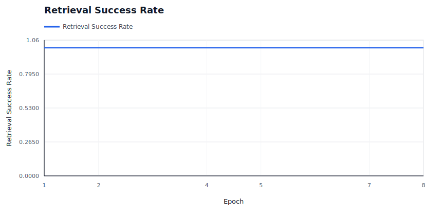

### Slot State Transitions

Shows active slots and repair slots; spikes indicate reassignment churn.

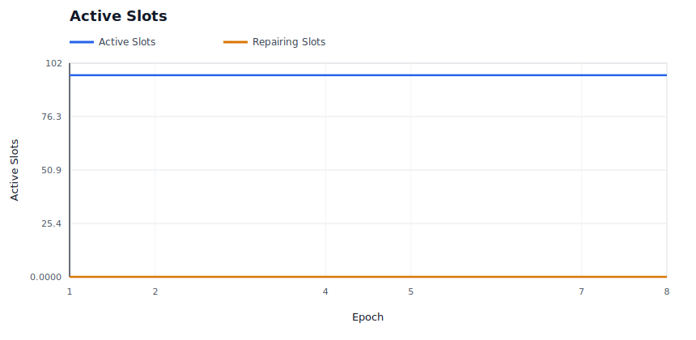

### Provider P&L

Shows aggregate provider economics over time.

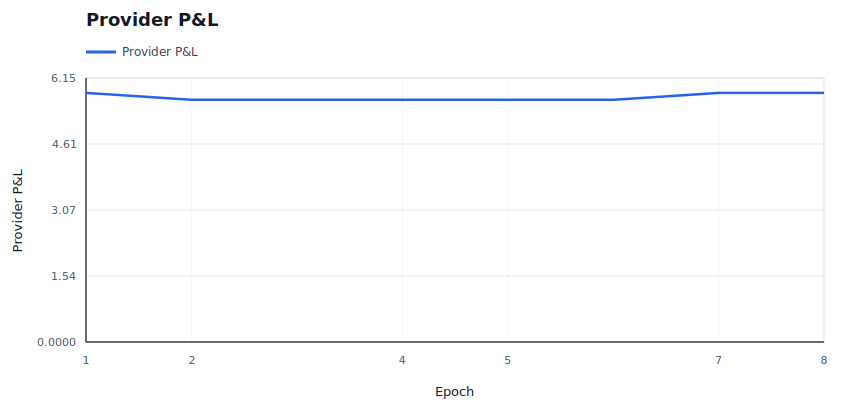

### Provider Cost Shock

Shows modeled provider cost pressure against provider revenue.

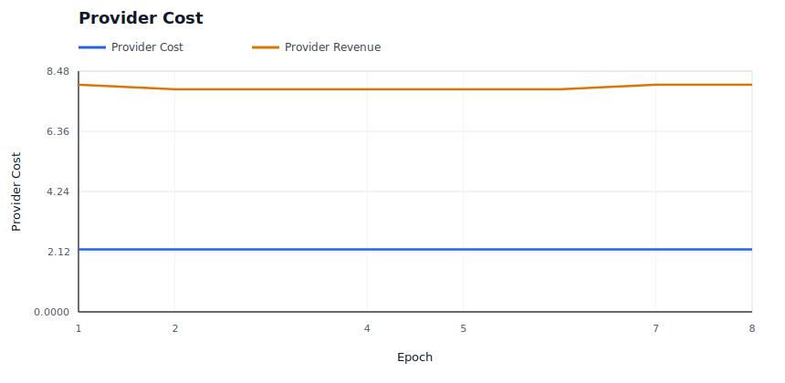

### Provider Churn

Shows modeled provider exits and per-epoch churn events.

### Provider Supply Entry

Shows reserve provider entry and probationary promotion into active supply.

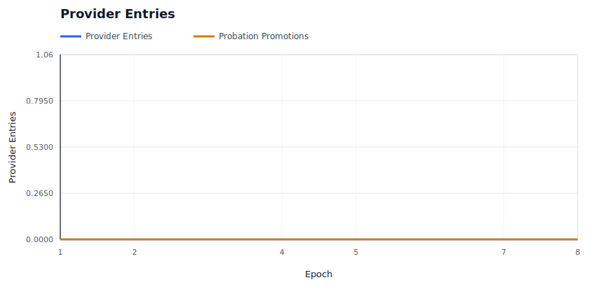

### Burn / Mint Ratio

Shows whether burns are material relative to minted rewards and audit budget.

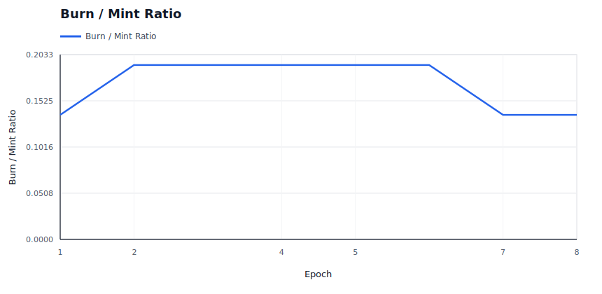

### Price Trajectory

Shows storage price and retrieval price movement under dynamic pricing.

### Retrieval Demand

Shows effective retrieval attempts against latent baseline demand.

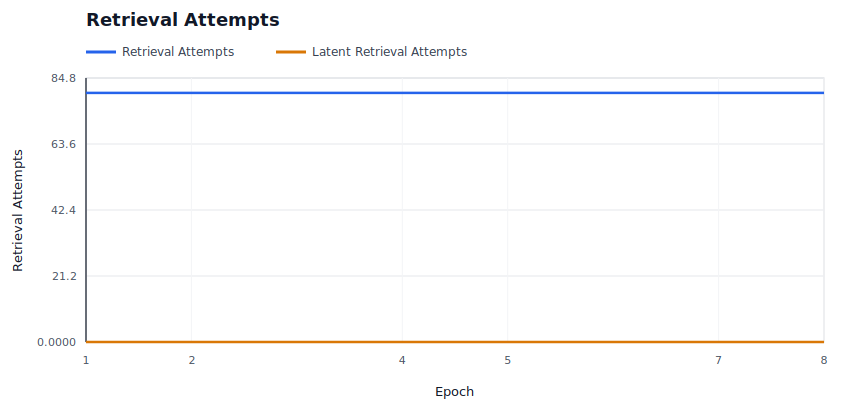

### Storage Demand

Shows modeled new deal demand accepted versus rejected by price.

### Capacity Utilization

Shows active storage responsibility against modeled provider capacity.

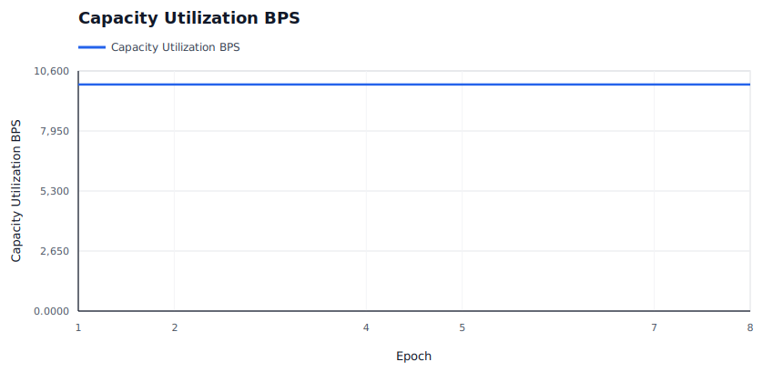

### Saturation And Repair Pressure

Shows provider bandwidth saturation and repair backoffs, which are scale-specific stress signals.

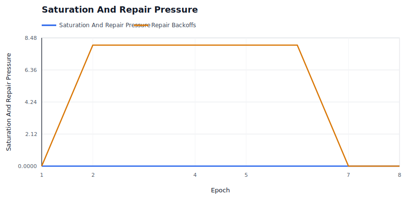

### Repair Backlog

Shows whether started repairs are accumulating faster than they complete.

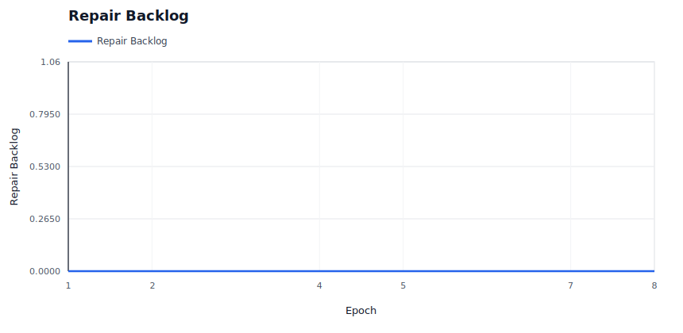

### High-Bandwidth Promotion

Shows capability promotion/demotion state over time for hot-path eligibility.

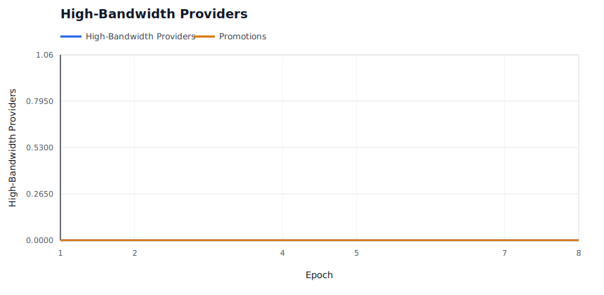

### Hot Retrieval Routing

Shows whether hot retrieval attempts are being served by promoted high-bandwidth providers.

### Performance Tiers

Shows the fast positive tier and Fail-tier service counts under the performance market.

### Operator Concentration

Shows whether operator assignment share is bounded despite provider identity concentration.

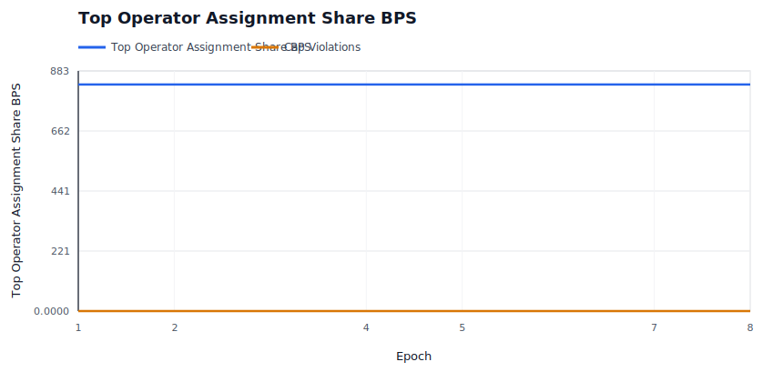

### Evidence Pressure

Shows soft liveness evidence and hard invalid-proof evidence by epoch.

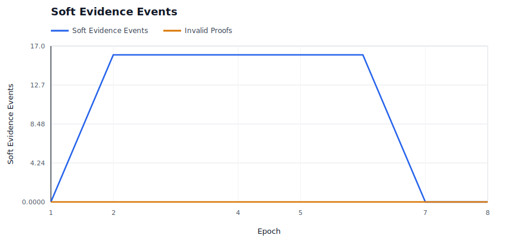

### Evidence Spam Economics

Shows bond burn and bounty payout for low-quality deputy evidence claims.

### Audit Budget

Shows whether miss-driven audit demand is spending budget or accumulating carryover.

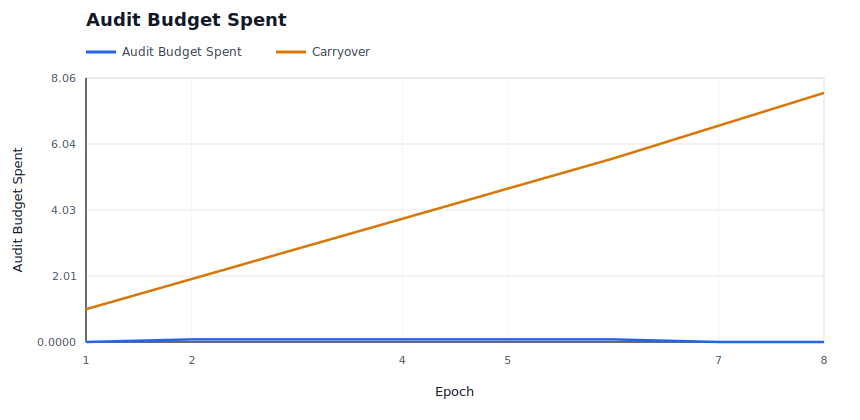

### Audit Backlog

Shows unmet audit demand and exhausted-budget epochs when evidence exceeds available enforcement budget.

### Elasticity Spend

Shows demand-funded elasticity spend and rejected expansion attempts.

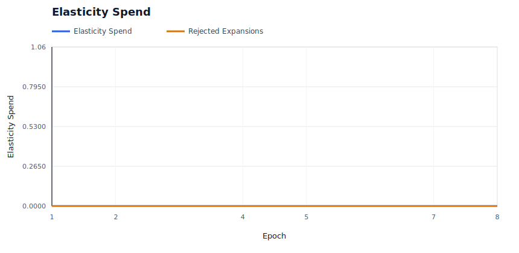

## Raw Artifacts

- `summary.json`: compact machine-readable run summary.
- `epochs.csv`: per-epoch availability, liveness, reward, repair, and economics metrics.
- `providers.csv`: final provider-level economics, fault counters, and capability tier.
- `operators.csv`: final operator-level provider count, assignment share, success, and P&L metrics.
- `slots.csv`: per-slot epoch ledger, including health state and reason.
- `evidence.csv`: policy evidence events.
- `repairs.csv`: repair start, pending-provider readiness, completion, attempt-count, cooldown, candidate-exclusion, attempt-cap, and backoff events.
- `economy.csv`: per-epoch market and accounting ledger.
- `signals.json`: derived availability, saturation, repair, capacity, economic, regional, concentration, and provider bottleneck signals.
