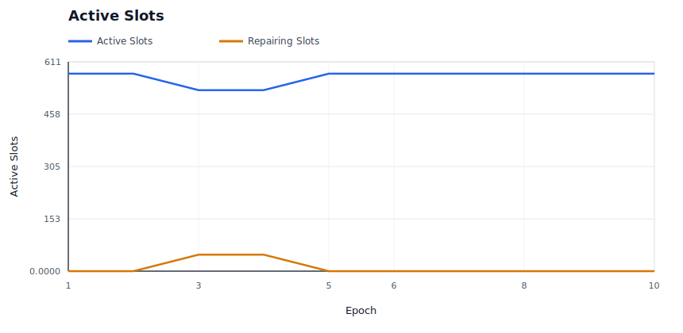
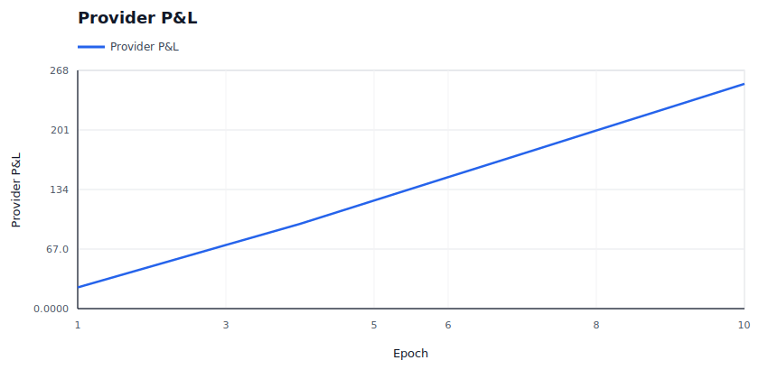
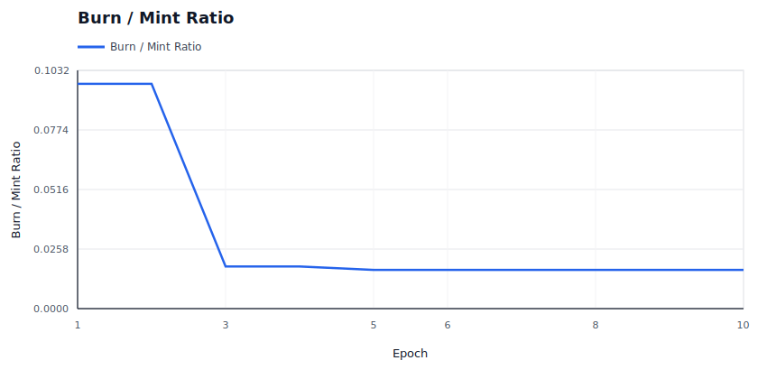
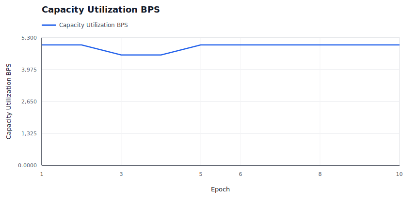
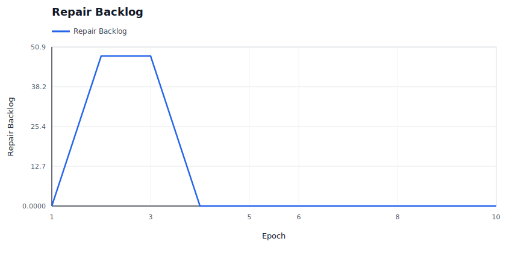

# Policy Simulation Report: Subsidy Farming

## Executive Summary

**Verdict:** `PASS`. This run simulates `subsidy-farming` with `72` providers, `100` data users, `48` deals, and an RS `8+4` layout for `10` epochs. Enforcement is configured as `REWARD_EXCLUSION`.

Model providers attempting to collect base rewards while skipping useful liveness work. The policy concern is reward leakage, not retrieval correctness alone.

Expected policy behavior: Quota misses are visible, reward coverage falls for non-compliant responsibility, and corrupt/data-loss safety invariants stay clean.

Observed result: retrieval success was `100.00%`, reward coverage was `98.31%`, repairs started/completed were `48` / `48`, and `6` providers ended with negative modeled P&L. The run recorded `0` unavailable reads, `0` modeled data-loss events, `0` bandwidth saturation responses and `0` repair backoffs.

## Review Focus

Use this before implementing base-reward gating and subsidy-farming controls.

A human reviewer should focus less on the pass/fail label and more on whether the scenario, assertions, and threshold values encode the policy we actually want to enforce on-chain.

## Run Configuration

| Field | Value |
|---|---:|
| Seed | `35` |
| Providers | `72` |
| Data users | `100` |
| Deals | `48` |
| Epochs | `10` |
| Erasure coding | `K=8`, `M=4`, `N=12` |
| User MDUs per deal | `16` |
| Retrievals/user/epoch | `1` |
| Liveness quota | `2`-`8` blobs/slot/epoch |
| Repair delay | `2` epochs |
| Dynamic pricing | `false` |
| Storage price | `1.0000` |
| Retrieval price/slot | `0.0100` |
| Provider capacity range | `16`-`16` slots |
| Provider bandwidth range | `0`-`0` serves/epoch (`0` means unlimited) |
| Provider regions | `global` |

## Economic Assumptions

The economic model is intentionally simple and deterministic. It is useful for comparing policy directions, not for setting final token economics without external market data.

| Assumption | Value | Interpretation |
|---|---:|---|
| Storage price | `1.0000` | Unitless price applied by the controller; current simulator does not yet model user demand elasticity against this quote. |
| Storage target utilization | `70.00%` | If dynamic pricing is enabled, utilization above this target steps storage price up, otherwise down. |
| Retrieval price per slot | `0.0100` | Paid per successful provider slot served, before the configured variable burn. |
| Retrieval target per epoch | `80` | If dynamic pricing is enabled, retrieval attempts above this target step retrieval price up, otherwise down. |
| Dynamic pricing max step | `5.00%` | Per-epoch controller movement cap. Lower values are safer but slower to equilibrate. |
| Base reward per slot | `0.0500` | Modeled issuance/subsidy paid only to reward-eligible active slots. |
| Provider storage cost/slot/epoch | `0.0100` | Simplified provider cost basis; jitter may create marginal-provider distress. |
| Provider bandwidth cost/retrieval | `0.0010` | Simplified egress cost basis for retrieval-heavy scenarios. |
| Audit budget per epoch | `1.0000` | Minted audit budget; spending is capped by available budget and miss-driven demand. |
| Retrieval burn | `5.00%` | Fraction of variable retrieval fees burned before provider payout. |

## What Happened

User-facing retrieval availability stayed intact: every modeled retrieval completed successfully. That does not mean every provider behaved correctly; it means redundancy, routing, or deputy service absorbed the fault.

The policy layer recorded `96` evidence events: `96` soft events and `0` hard events. Soft evidence is suitable for repair and reward exclusion; hard evidence is the category that can later justify slashing or stronger sanctions.

Repair was exercised: `48` repair operations started and `48` completed. The simulator models this as make-before-break reassignment, so the old assignment remains visible while replacement work catches up.

Reward exclusion was active: `4.8000` modeled reward units were burned instead of paid to non-compliant slots.

## Diagnostic Signals

These are derived from the raw CSV/JSON outputs and are intended to make scale behavior reviewable without manually scanning ledgers.

| Signal | Value | Why It Matters |
|---|---:|---|
| Worst epoch success | `100.00%` at epoch `1` | Identifies the availability cliff instead of hiding it in aggregate success. |
| Unavailable reads | `0` | Temporary read failures are a scale/reliability signal; they are not automatically permanent data loss. |
| Modeled data-loss events | `0` | Durability-loss signal. This should remain zero for current scale fixtures. |
| Degraded epochs | `0` | Counts epochs with unavailable reads or success below 99.9%. |
| Recovery epoch after worst | `2` | Shows whether the network returned to clean steady state after the worst point. |
| Saturation rate | `0.00%` | Provider bandwidth saturation per retrieval attempt. |
| Peak saturation | `0` at epoch `1` | Reveals when bandwidth, not storage correctness, became the bottleneck. |
| Repair completion ratio | `100.00%` | Measures whether healing catches up with detection. |
| Repair backoff pressure | `0` backoffs per started repair | Shows whether repair coordination is saturated. |
| Final repair backlog | `0` slots | Started repairs minus completed repairs at run end. |
| Final storage utilization | `50.00%` | Active slots versus modeled provider capacity. |
| Provider utilization p50 / p90 / max | `50.00%` / `62.50%` / `75.00%` | Detects assignment concentration and capacity cliffs. |
| Provider P&L p10 / p50 / p90 | `3.5330` / `3.7030` / `4.3075` | Shows whether aggregate P&L hides marginal-provider distress. |
| Storage price start/end/range | `1.0000` -> `1.0000` (`1.0000`-`1.0000`) | Shows dynamic pricing movement and bounds. |
| Retrieval price start/end/range | `0.0100` -> `0.0100` (`0.0100`-`0.0100`) | Shows whether demand pressure moved retrieval pricing. |

### Regional Signals

| Region | Providers | Utilization | Offline Responses | Saturated Responses | Negative P&L Providers | Avg P&L |
|---|---:|---:|---:|---:|---:|---:|
| `global` | 72 | 50.00% | 0 | 0 | 6 | 3.5111 |

### Top Bottleneck Providers

| Provider | Region | Slots/Capacity | Utilization | Bandwidth Cap | Attempts | Offline | Saturated | P&L |
|---|---|---:|---:|---:|---:|---:|---:|---:|
| `sp-055` | `global` | 9/16 | 56.25% | 0 | 149 | 0 | 0 | 4.1965 |
| `sp-021` | `global` | 11/16 | 68.75% | 0 | 148 | 0 | 0 | 4.6480 |
| `sp-022` | `global` | 10/16 | 62.50% | 0 | 144 | 0 | 0 | 4.3840 |
| `sp-053` | `global` | 9/16 | 56.25% | 0 | 143 | 0 | 0 | 4.1455 |
| `sp-069` | `global` | 9/16 | 56.25% | 0 | 141 | 0 | 0 | 4.1285 |
| `sp-067` | `global` | 11/16 | 68.75% | 0 | 140 | 0 | 0 | 4.5800 |
| `sp-014` | `global` | 10/16 | 62.50% | 0 | 138 | 0 | 0 | 4.3330 |
| `sp-025` | `global` | 12/16 | 75.00% | 0 | 136 | 0 | 0 | 4.7760 |

### Timeline

| Epoch | Retrieval Success | Evidence | Repairs Started | Repairs Completed | Reward Burned | Provider P&L | Notes |
|---:|---:|---:|---:|---:|---:|---:|---|
| 1 | 100.00% | 48 | 0 | 0 | 2.4000 | 23.8400 | 48 quota misses |
| 2 | 100.00% | 48 | 48 | 0 | 2.4000 | 47.6800 | 48 quota misses |
| 3 | 100.00% | 0 | 0 | 0 | 0.0000 | 71.5200 | 48 slots repairing |
| 4 | 100.00% | 0 | 0 | 48 | 0.0000 | 95.3600 | 48 slots repairing |
| 5 | 100.00% | 0 | 0 | 0 | 0.0000 | 121.6000 | steady state |
| 6 | 100.00% | 0 | 0 | 0 | 0.0000 | 147.8400 | steady state |
| 7 | 100.00% | 0 | 0 | 0 | 0.0000 | 174.0800 | steady state |
| 8 | 100.00% | 0 | 0 | 0 | 0.0000 | 200.3200 | steady state |
| 9 | 100.00% | 0 | 0 | 0 | 0.0000 | 226.5600 | steady state |
| 10 | 100.00% | 0 | 0 | 0 | 0.0000 | 252.8000 | steady state |

## Enforcement Interpretation

The simulator recorded `96` evidence events and `96` repair ledger events. The first evidence epoch was `1` and the first repair-start epoch was `2`.

Evidence by reason:

- `quota_shortfall`: `96`

Evidence by provider:

- `sp-000`: `16`
- `sp-001`: `16`
- `sp-002`: `16`
- `sp-003`: `16`
- `sp-004`: `16`
- `sp-005`: `16`

Repair summary:

- Repairs started: `48`
- Repairs completed: `48`
- Repair backoffs: `0`
- Final active slots in last epoch: `576`

### Repair Ledger Excerpt

| Epoch | Event | Deal | Slot | Old Provider | New Provider | Reason |
|---:|---|---:|---:|---|---|---|
| 2 | `repair_started` | 1 | 0 | `sp-000` | `sp-031` | `quota_shortfall` |
| 2 | `repair_started` | 1 | 1 | `sp-001` | `sp-027` | `quota_shortfall` |
| 2 | `repair_started` | 1 | 2 | `sp-002` | `sp-028` | `quota_shortfall` |
| 2 | `repair_started` | 1 | 3 | `sp-003` | `sp-055` | `quota_shortfall` |
| 2 | `repair_started` | 1 | 4 | `sp-004` | `sp-022` | `quota_shortfall` |
| 2 | `repair_started` | 1 | 5 | `sp-005` | `sp-039` | `quota_shortfall` |
| 2 | `repair_started` | 7 | 0 | `sp-000` | `sp-025` | `quota_shortfall` |
| 2 | `repair_started` | 7 | 1 | `sp-001` | `sp-048` | `quota_shortfall` |
| 2 | `repair_started` | 7 | 2 | `sp-002` | `sp-021` | `quota_shortfall` |
| 2 | `repair_started` | 7 | 3 | `sp-003` | `sp-067` | `quota_shortfall` |
| 2 | `repair_started` | 7 | 4 | `sp-004` | `sp-058` | `quota_shortfall` |
| 2 | `repair_started` | 7 | 5 | `sp-005` | `sp-023` | `quota_shortfall` |
| ... | ... | ... | ... | ... | ... | `84` more events omitted |

## Economic Interpretation

The run minted `293.2000` reward/audit units and burned `9.8000` units, for a burn-to-mint ratio of `3.34%`.

Providers earned `354.4000` in modeled revenue against `101.6000` in modeled cost, ending with aggregate P&L `252.8000`.

Retrieval accounting paid providers `76.0000`, burned `1.0000` in base fees, and burned `4.0000` in variable retrieval fees.

`6` providers ended with negative P&L and `6` were marked as churn risk. That is economically important even when retrieval success is perfect.

Final modeled storage price was `1.0000` and retrieval price per slot was `0.0100`.

### Provider P&L Extremes

| Provider | Assigned Slots | Revenue | Cost | Slashed | P&L | Churn Risk |
|---|---:|---:|---:|---:|---:|---:|
| `sp-004` | 0 | 0.0000 + 0.1805 | 0.7590 | 0.0000 | -0.5785 | yes |
| `sp-002` | 0 | 0.0000 + 0.2090 | 0.7620 | 0.0000 | -0.5530 | yes |
| `sp-000` | 0 | 0.0000 + 0.2185 | 0.7630 | 0.0000 | -0.5445 | yes |
| `sp-001` | 0 | 0.0000 + 0.2185 | 0.7630 | 0.0000 | -0.5445 | yes |
| `sp-003` | 0 | 0.0000 + 0.2185 | 0.7630 | 0.0000 | -0.5445 | yes |

## Assertion Contract

Assertions are the machine-readable policy contract for this fixture. Passing means this simulator run satisfied the current contract; it does not mean the policy is production-ready.

| Assertion | Status | Meaning | Detail |
|---|---|---|---|
| `min_success_rate` | `PASS` | Availability floor: user-facing reads must stay above this success rate. | success_rate=1, required>=0.99 |
| `min_quota_misses` | `PASS` | Fault fixture must generate quota evidence. | quota_misses=96, required>=1 |
| `max_reward_coverage` | `PASS` | Custom assertion. Review the detail and fixture threshold. | reward_coverage=0.983050847458, required<=0.995 |
| `max_data_loss_events` | `PASS` | Durability invariant: stress may allow unavailable reads, but modeled data loss must stay at zero. | data_loss_events=0, required<=0 |
| `max_paid_corrupt_bytes` | `PASS` | Corrupt data must not earn payment. | paid_corrupt_bytes=0, required<=0 |

## Evidence Ledger Excerpt

These rows are representative raw evidence events. Use `evidence.csv` for the complete ledger.

| Epoch | Deal | Slot | Provider | Class | Reason | Consequence |
|---:|---:|---:|---|---|---|---|
| 1 | 1 | 0 | `sp-000` | `soft` | `quota_shortfall` | `repair_candidate` |
| 1 | 1 | 1 | `sp-001` | `soft` | `quota_shortfall` | `repair_candidate` |
| 1 | 1 | 2 | `sp-002` | `soft` | `quota_shortfall` | `repair_candidate` |
| 1 | 1 | 3 | `sp-003` | `soft` | `quota_shortfall` | `repair_candidate` |
| 1 | 1 | 4 | `sp-004` | `soft` | `quota_shortfall` | `repair_candidate` |
| 1 | 1 | 5 | `sp-005` | `soft` | `quota_shortfall` | `repair_candidate` |
| 1 | 7 | 0 | `sp-000` | `soft` | `quota_shortfall` | `repair_candidate` |
| 1 | 7 | 1 | `sp-001` | `soft` | `quota_shortfall` | `repair_candidate` |
| 1 | 7 | 2 | `sp-002` | `soft` | `quota_shortfall` | `repair_candidate` |
| 1 | 7 | 3 | `sp-003` | `soft` | `quota_shortfall` | `repair_candidate` |
| 1 | 7 | 4 | `sp-004` | `soft` | `quota_shortfall` | `repair_candidate` |
| 1 | 7 | 5 | `sp-005` | `soft` | `quota_shortfall` | `repair_candidate` |
| ... | ... | ... | ... | ... | ... | `84` more events omitted |

## Generated Graphs

The following SVG graphs are generated beside this report and embedded here with relative Markdown links so the report is readable as a self-contained artifact in GitHub or a local Markdown viewer.

### Retrieval Success Rate

Should stay near 1.0 unless availability is actually lost.

### Slot State Transitions

Shows active slots and repair slots; spikes indicate reassignment churn.

### Provider P&L

Shows aggregate provider economics over time.

### Burn / Mint Ratio

Shows whether burns are material relative to minted rewards and audit budget.

### Price Trajectory

Shows storage price and retrieval price movement under dynamic pricing.

### Capacity Utilization

Shows active storage responsibility against modeled provider capacity.

### Saturation And Repair Pressure

Shows provider bandwidth saturation and repair backoffs, which are scale-specific stress signals.

### Repair Backlog

Shows whether started repairs are accumulating faster than they complete.

## Raw Artifacts

- `summary.json`: compact machine-readable run summary.
- `epochs.csv`: per-epoch availability, liveness, reward, repair, and economics metrics.
- `providers.csv`: final provider-level economics and fault counters.
- `slots.csv`: per-slot epoch ledger.
- `evidence.csv`: policy evidence events.
- `repairs.csv`: repair start/completion events.
- `economy.csv`: per-epoch market and accounting ledger.
- `signals.json`: derived availability, saturation, repair, capacity, economic, regional, and provider bottleneck signals.
