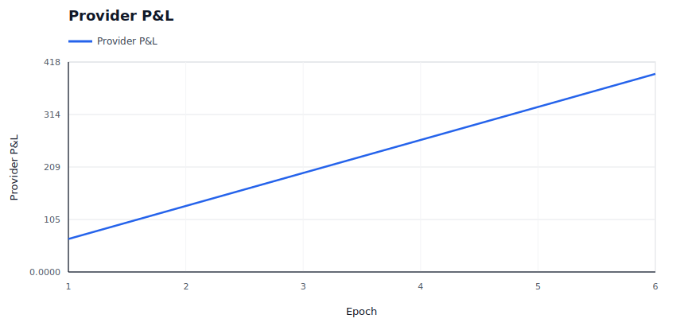
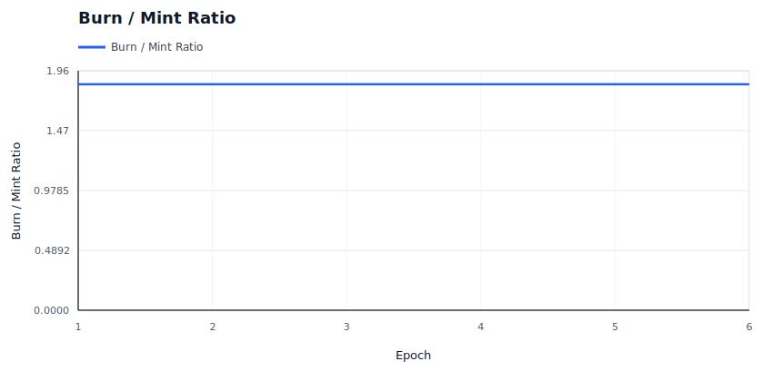
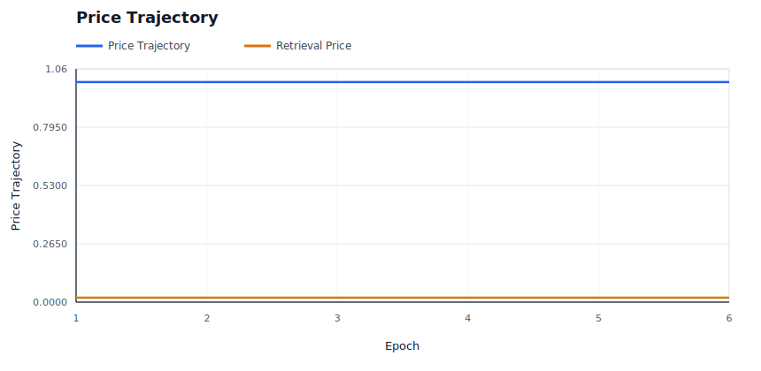
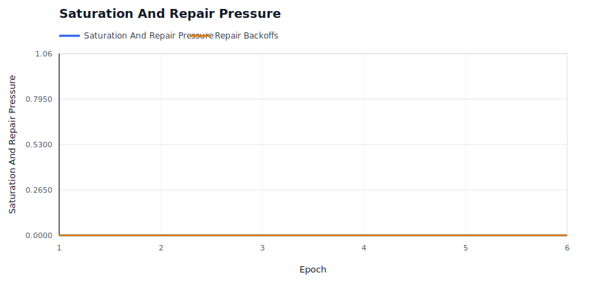
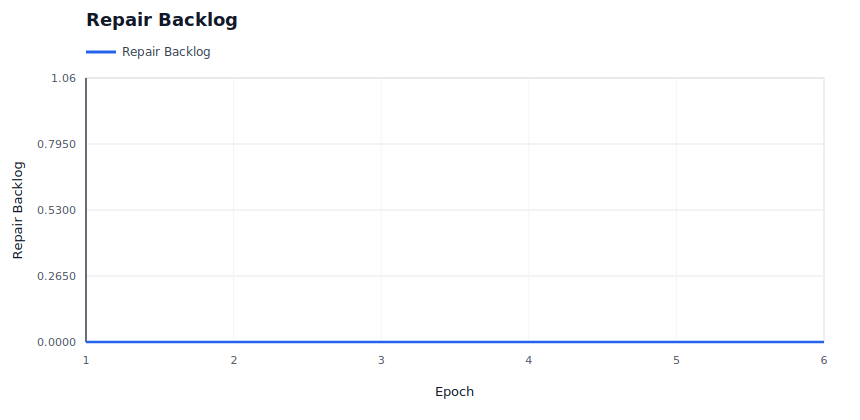

# Policy Simulation Report: Wash Retrieval Demand

## Executive Summary

**Verdict:** `PASS`. This run simulates `wash-retrieval` with `48` providers, `120` data users, `24` deals, and an RS `8+4` layout for `6` epochs. Enforcement is configured as `REWARD_EXCLUSION`.

Model artificial retrieval demand. The policy question is whether fake activity can farm rewards for free, or whether requester/session fees and burns make the attack costly.

Expected policy behavior: Retrievals succeed, but base fees and variable burns are visible and non-zero.

Observed result: retrieval success was `100.00%`, reward coverage was `100.00%`, repairs started/ready/completed were `0` / `0` / `0`, and `0` providers ended with negative modeled P&L. The run recorded `0` unavailable reads, `0` modeled data-loss events, `0` bandwidth saturation responses and `0` repair backoffs across `0` repair attempts. Slot health recorded `0` suspect slot-epochs and `0` delinquent slot-epochs. High-bandwidth promotions were `0` and final high-bandwidth providers were `0`.

## Review Focus

Check whether burn and payout ratios are strong enough to make wash traffic irrational.

A human reviewer should focus less on the pass/fail label and more on whether the scenario, assertions, and threshold values encode the policy we actually want to enforce on-chain.

## Run Configuration

| Field | Value |
|---|---:|
| Seed | `7` |
| Providers | `48` |
| Data users | `120` |
| Deals | `24` |
| Epochs | `6` |
| Erasure coding | `K=8`, `M=4`, `N=12` |
| User MDUs per deal | `16` |
| Retrievals/user/epoch | `4` |
| Liveness quota | `2`-`8` blobs/slot/epoch |
| Repair delay | `2` epochs |
| Repair attempt cap/slot | `0` (`0` means unlimited) |
| Repair backoff window | `0` epochs |
| Dynamic pricing | `false` |
| Storage price | `1.0000` |
| Retrieval price/slot | `0.0200` |
| Provider capacity range | `16`-`16` slots |
| Provider bandwidth range | `0`-`0` serves/epoch (`0` means unlimited) |
| High-bandwidth promotion | `false` |
| High-bandwidth capacity threshold | `0` serves/epoch |
| Hot retrieval share | `0.00%` |
| Provider regions | `global` |

## Economic Assumptions

The economic model is intentionally simple and deterministic. It is useful for comparing policy directions, not for setting final token economics without external market data.

| Assumption | Value | Interpretation |
|---|---:|---|
| Storage price | `1.0000` | Unitless price applied by the controller; current simulator does not yet model user demand elasticity against this quote. |
| Storage target utilization | `70.00%` | If dynamic pricing is enabled, utilization above this target steps storage price up, otherwise down. |
| Retrieval price per slot | `0.0200` | Paid per successful provider slot served, before the configured variable burn. |
| Retrieval target per epoch | `80` | If dynamic pricing is enabled, retrieval attempts above this target step retrieval price up, otherwise down. |
| Dynamic pricing max step | `5.00%` | Per-epoch controller movement cap. Lower values are safer but slower to equilibrate. |
| Base reward per slot | `0.0200` | Modeled issuance/subsidy paid only to reward-eligible active slots. |
| Provider storage cost/slot/epoch | `0.0100` | Simplified provider cost basis; jitter may create marginal-provider distress. |
| Provider bandwidth cost/retrieval | `0.0010` | Simplified egress cost basis for retrieval-heavy scenarios. |
| Audit budget per epoch | `1.0000` | Minted audit budget; spending is capped by available budget and miss-driven demand. |
| Retrieval burn | `10.00%` | Fraction of variable retrieval fees burned before provider payout. |

## What Happened

User-facing retrieval availability stayed intact and no operational enforcement evidence was recorded. For this run, the main question is the scenario-specific control or economic result rather than recovery from a provider fault.

The policy layer recorded no evidence events, which is expected only for cooperative or pure-market control scenarios.

No repair events occurred. For healthy or economic-only scenarios this is correct; for fault scenarios it may mean the policy is too passive.

## Diagnostic Signals

These are derived from the raw CSV/JSON outputs and are intended to make scale behavior reviewable without manually scanning ledgers.

| Signal | Value | Why It Matters |
|---|---:|---|
| Worst epoch success | `100.00%` at epoch `1` | Identifies the availability cliff instead of hiding it in aggregate success. |
| Unavailable reads | `0` | Temporary read failures are a scale/reliability signal; they are not automatically permanent data loss. |
| Modeled data-loss events | `0` | Durability-loss signal. This should remain zero for current scale fixtures. |
| Degraded epochs | `0` | Counts epochs with unavailable reads or success below 99.9%. |
| Recovery epoch after worst | `2` | Shows whether the network returned to clean steady state after the worst point. |
| Saturation rate | `0.00%` | Provider bandwidth saturation per retrieval attempt. |
| Peak saturation | `0` at epoch `1` | Reveals when bandwidth, not storage correctness, became the bottleneck. |
| Repair readiness ratio | `100.00%` | Measures whether pending providers catch up before promotion. |
| Repair completion ratio | `100.00%` | Measures whether healing catches up with detection. |
| Repair attempts | `0` | Counts bounded attempts to open a repair or discover replacement pressure. |
| Repair backoff pressure | `0` backoffs per started repair | Shows whether repair coordination is saturated. |
| Repair backoffs per attempt | `0` | Distinguishes capacity/cooldown pressure from successful repair starts. |
| Repair cooldowns / attempt caps | `0` / `0` | Shows whether throttling, rather than candidate selection alone, is bounding repair churn. |
| Suspect / delinquent slot-epochs | `0` / `0` | Separates early warning state from threshold-crossed delinquency. |
| Final repair backlog | `0` slots | Started repairs minus completed repairs at run end. |
| High-bandwidth providers | `0` | Providers currently eligible for hot/high-bandwidth routing. |
| High-bandwidth promotions/demotions | `0` / `0` | Shows capability changes under measured demand. |
| Hot high-bandwidth serves/retrieval | `0` | Measures whether hot retrievals actually use promoted providers. |
| Final storage utilization | `37.50%` | Active slots versus modeled provider capacity. |
| Provider utilization p50 / p90 / max | `37.50%` / `37.50%` / `37.50%` | Detects assignment concentration and capacity cliffs. |
| Provider P&L p10 / p50 / p90 | `7.9310` / `8.1860` / `8.5600` | Shows whether aggregate P&L hides marginal-provider distress. |
| Storage price start/end/range | `1.0000` -> `1.0000` (`1.0000`-`1.0000`) | Shows dynamic pricing movement and bounds. |
| Retrieval price start/end/range | `0.0200` -> `0.0200` (`0.0200`-`0.0200`) | Shows whether demand pressure moved retrieval pricing. |

### Regional Signals

| Region | Providers | Utilization | Offline Responses | Saturated Responses | Negative P&L Providers | Avg P&L |
|---|---:|---:|---:|---:|---:|---:|
| `global` | 48 | 37.50% | 0 | 0 | 0 | 8.2200 |

### Top Bottleneck Providers

| Provider | Region | Slots/Capacity | Utilization | Bandwidth Cap | Attempts | Offline | Saturated | P&L |
|---|---|---:|---:|---:|---:|---:|---:|---:|
| `sp-009` | `global` | 6/16 | 37.50% | 0 | 511 | 0 | 0 | 8.7470 |
| `sp-006` | `global` | 6/16 | 37.50% | 0 | 507 | 0 | 0 | 8.6790 |
| `sp-007` | `global` | 6/16 | 37.50% | 0 | 507 | 0 | 0 | 8.6790 |
| `sp-030` | `global` | 6/16 | 37.50% | 0 | 506 | 0 | 0 | 8.6620 |
| `sp-010` | `global` | 6/16 | 37.50% | 0 | 500 | 0 | 0 | 8.5600 |
| `sp-044` | `global` | 6/16 | 37.50% | 0 | 500 | 0 | 0 | 8.5600 |
| `sp-029` | `global` | 6/16 | 37.50% | 0 | 499 | 0 | 0 | 8.5430 |
| `sp-003` | `global` | 6/16 | 37.50% | 0 | 498 | 0 | 0 | 8.5260 |

### Timeline

| Epoch | Retrieval Success | Evidence | Repairs Started | Repairs Ready | Repairs Completed | Reward Burned | Provider P&L | Notes |
|---:|---:|---:|---:|---:|---:|---:|---:|---|
| 1 | 100.00% | 0 | 0 | 0 | 0 | 0.0000 | 65.7600 | steady state |
| 2 | 100.00% | 0 | 0 | 0 | 0 | 0.0000 | 65.7600 | steady state |
| 3 | 100.00% | 0 | 0 | 0 | 0 | 0.0000 | 65.7600 | steady state |
| 4 | 100.00% | 0 | 0 | 0 | 0 | 0.0000 | 65.7600 | steady state |
| 5 | 100.00% | 0 | 0 | 0 | 0 | 0.0000 | 65.7600 | steady state |
| 6 | 100.00% | 0 | 0 | 0 | 0 | 0.0000 | 65.7600 | steady state |

## Enforcement Interpretation

The simulator recorded `0` evidence events and `0` repair ledger events. The first evidence epoch was `none` and the first repair-start epoch was `none`.

Evidence by reason:

- None recorded.

Evidence by provider:

- None recorded.

Repair summary:

- Repairs started: `0`
- Repairs marked ready: `0`
- Repairs completed: `0`
- Repair attempts: `0`
- Repair backoffs: `0`
- Repair cooldown backoffs: `0`
- Repair attempt-cap backoffs: `0`
- Suspect slot-epochs: `0`
- Delinquent slot-epochs: `0`
- Final active slots in last epoch: `288`

Candidate exclusion summary:

- No no-candidate repair backoffs were recorded.

### Repair Ledger Excerpt

- No repair ledger events were recorded.

## Economic Interpretation

The run minted `40.5600` reward/audit units and burned `74.8800` units, for a burn-to-mint ratio of `184.62%`.

Providers earned `449.2800` in modeled revenue against `54.7200` in modeled cost, ending with aggregate P&L `394.5600`.

Retrieval accounting paid providers `414.7200`, burned `28.8000` in base fees, and burned `46.0800` in variable retrieval fees.

No provider ended with negative modeled P&L under the current assumptions.

Final modeled storage price was `1.0000` and retrieval price per slot was `0.0200`.

### Provider P&L Extremes

| Provider | Assigned Slots | Revenue | Cost | Slashed | P&L | Churn Risk |
|---|---:|---:|---:|---:|---:|---:|
| `sp-015` | 6 | 0.7200 + 8.0820 | 1.1090 | 0.0000 | 7.6930 | no |
| `sp-018` | 6 | 0.7200 + 8.2260 | 1.1170 | 0.0000 | 7.8290 | no |
| `sp-047` | 6 | 0.7200 + 8.2440 | 1.1180 | 0.0000 | 7.8460 | no |
| `sp-016` | 6 | 0.7200 + 8.2980 | 1.1210 | 0.0000 | 7.8970 | no |
| `sp-020` | 6 | 0.7200 + 8.3160 | 1.1220 | 0.0000 | 7.9140 | no |

## Assertion Contract

Assertions are the machine-readable policy contract for this fixture. Passing means this simulator run satisfied the current contract; it does not mean the policy is production-ready.

| Assertion | Status | Meaning | Detail |
|---|---|---|---|
| `min_success_rate` | `PASS` | Availability floor: user-facing reads must stay above this success rate. | success_rate=1, required>=1 |
| `min_retrieval_base_burned` | `PASS` | Requester/session demand must pay a non-zero base burn. | retrieval_base_burned=28.8, required>=1 |
| `max_data_loss_events` | `PASS` | Durability invariant: stress may allow unavailable reads, but modeled data loss must stay at zero. | data_loss_events=0, required<=0 |
| `min_retrieval_variable_burned` | `PASS` | Variable retrieval activity must contribute non-zero burn. | retrieval_variable_burned=46.08, required>=1 |

## Evidence Ledger Excerpt

These rows are representative raw evidence events. Use `evidence.csv` for the complete ledger.

| Epoch | Deal | Slot | Provider | Class | Reason | Consequence |
|---:|---:|---:|---|---|---|---|
| n/a | n/a | n/a | n/a | n/a | n/a | No evidence events were recorded. |

## Generated Graphs

The following SVG graphs are generated beside this report and embedded here with relative Markdown links so the report is readable as a self-contained artifact in GitHub or a local Markdown viewer.

### Retrieval Success Rate

Should stay near 1.0 unless availability is actually lost.

### Slot State Transitions

Shows active slots and repair slots; spikes indicate reassignment churn.

### Provider P&L

Shows aggregate provider economics over time.

### Burn / Mint Ratio

Shows whether burns are material relative to minted rewards and audit budget.

### Price Trajectory

Shows storage price and retrieval price movement under dynamic pricing.

### Capacity Utilization

Shows active storage responsibility against modeled provider capacity.

### Saturation And Repair Pressure

Shows provider bandwidth saturation and repair backoffs, which are scale-specific stress signals.

### Repair Backlog

Shows whether started repairs are accumulating faster than they complete.

### High-Bandwidth Promotion

Shows capability promotion/demotion state over time for hot-path eligibility.

### Hot Retrieval Routing

Shows whether hot retrieval attempts are being served by promoted high-bandwidth providers.

## Raw Artifacts

- `summary.json`: compact machine-readable run summary.
- `epochs.csv`: per-epoch availability, liveness, reward, repair, and economics metrics.
- `providers.csv`: final provider-level economics, fault counters, and capability tier.
- `slots.csv`: per-slot epoch ledger, including health state and reason.
- `evidence.csv`: policy evidence events.
- `repairs.csv`: repair start, pending-provider readiness, completion, attempt-count, cooldown, candidate-exclusion, attempt-cap, and backoff events.
- `economy.csv`: per-epoch market and accounting ledger.
- `signals.json`: derived availability, saturation, repair, capacity, economic, regional, and provider bottleneck signals.
