# PolyStore Economic Modeling & Policy Spec (Draft v0.1)

Last updated: 2026-01-22

This report is an *off-chain modeling* synthesis to support early parameter selection and implementation planning.
It is not an oracle and it does not imply any on-chain USD targeting.

## 1. What we are modeling

We model:

- A **data-scaled** base reward pool where protocol issuance is a basis-point fraction of notional “slot rent”:
  `issuance ∝ storage_price × active_bytes × emission_bps(t)`.

- A simplified “cost-of-service” equilibrium mapping to estimate **implied storage price (USD)** and **implied NIL token price (USD)** under different network growth scenarios.

- Simple “black swan” shocks to stress-test dynamics.

## 2. Emission curve (how it manifests)

The recommended emission curve is a **bounded decay-to-tail** schedule:
- Start with a stronger bootstrap subsidy.
- Halve the **excess over the tail** on a regular interval.
- Keep a bounded tail emission to avoid a cliff.

In bps terms:
- `start_bps = 425`
- `tail_bps  = 25`
- `excess halves every 12 months` (illustrative)

### 2.1 Visual: monthly issuance vs active storage

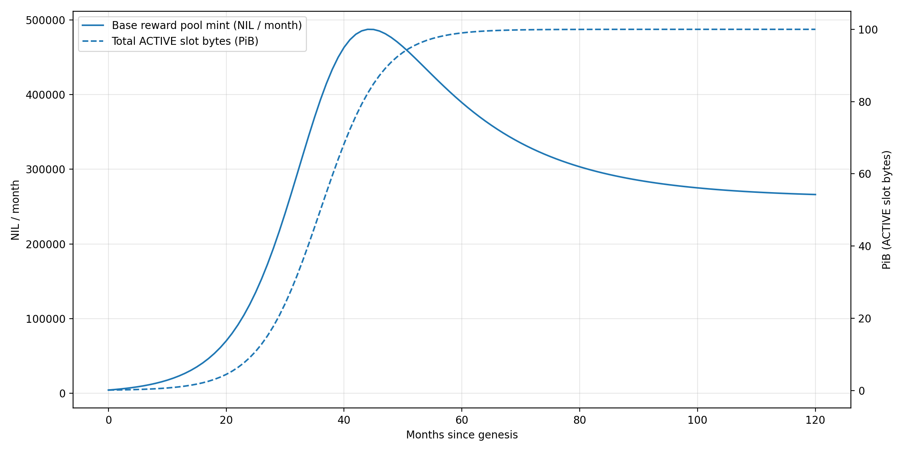

### 2.2 Visual: cumulative issuance (Base scenario)

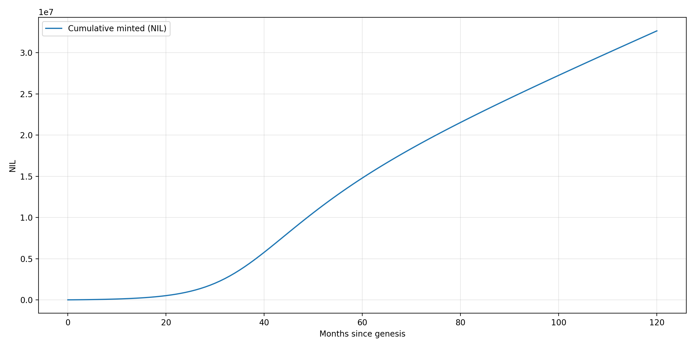

## 3. Market dynamics simulation

### 3.1 Assumptions (explicit)

**Active storage growth** (illustrative logistic scenarios):
- Slow: 10 PiB cap
- Base: 100 PiB cap
- Aggressive: 1 EiB (1000 PiB) cap

**Cost curve** (USD per GiB-month):
- `cost = cost_at_1pib * active_pib^(-alpha)`
- `alpha = 0.1`
- `cost_at_1pib ≈ $0.0079 / GiB-month`

**Storage fee normalization:**
- For the model we set `storage_price = 1 NIL / GiB-month` as a unit normalization.
  The chain does *not* target this; it’s simply a convenient unit.

**Equilibrium mapping (simplified):**
- Providers receive (in NIL): storage fees + base reward issuance.
- Token price in USD is set so that provider income covers assumed USD costs:
  `token_price_usd = cost_usd_per_gibmonth / (storage_price_nil_per_gibmonth * (1 + bps/10_000))`.

This is a deliberately simple mapping to reason about subsidy intensity and affordability.

### 3.2 Results

#### Active storage growth scenarios

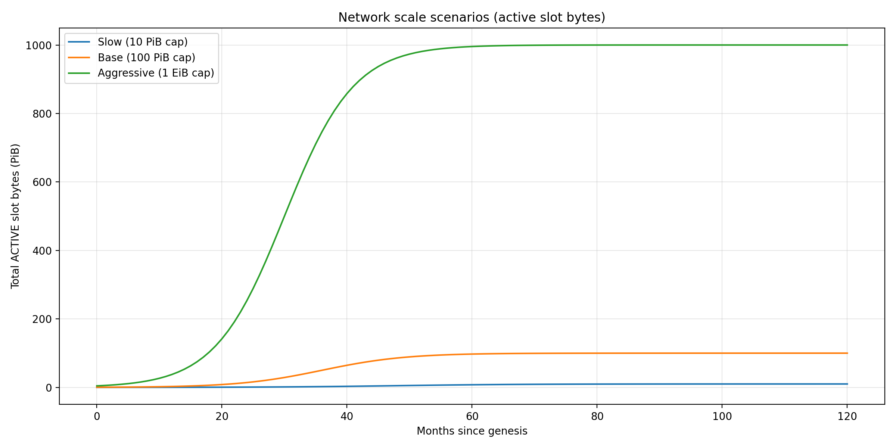

#### Storage price (USD) vs assumed cost

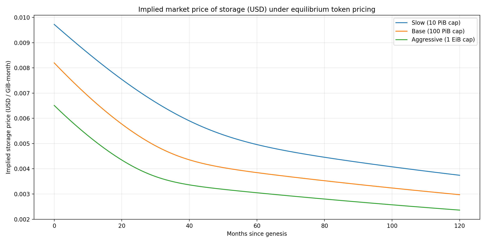

#### NIL token price (USD)

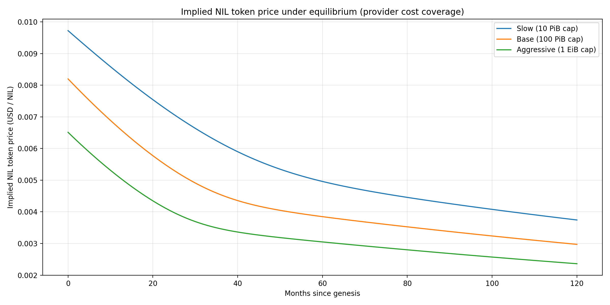

#### Monthly issuance (NIL)

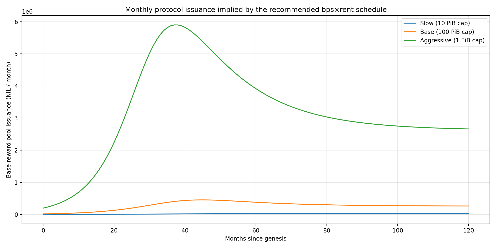

### 3.3 Scenario summary tables

### Slow (10 PiB cap)

nth | Active (PiB) | Cost ($/GiB-mo) | Storage ($/GiB-mo) | Token ($/NIL) | Issuance (k NIL/mo) | Cum Issuance (M NIL) | bps |
- | --- | --- | --- | --- | --- | --- | --- |
| 0.082 | 0.0102 | 0.0097 | 0.0097 | 3.6 | 0.00 | 425.0 |
 | 0.266 | 0.0086 | 0.0084 | 0.0084 | 6.3 | 0.06 | 225.0 |
 | 0.832 | 0.0073 | 0.0072 | 0.0072 | 10.9 | 0.17 | 125.0 |
 | 2.315 | 0.0062 | 0.0062 | 0.0062 | 18.2 | 0.34 | 75.0 |
 | 7.685 | 0.0050 | 0.0050 | 0.0050 | 30.2 | 0.96 | 37.5 |
0 | 9.993 | 0.0038 | 0.0037 | 0.0037 | 26.6 | 2.66 | 25.4 |


Base (100 PiB cap)

nth | Active (PiB) | Cost ($/GiB-mo) | Storage ($/GiB-mo) | Token ($/NIL) | Issuance (k NIL/mo) | Cum Issuance (M NIL) | bps |
- | --- | --- | --- | --- | --- | --- | --- |
| 0.450 | 0.0086 | 0.0082 | 0.0082 | 20.0 | 0.02 | 425.0 |
 | 2.660 | 0.0068 | 0.0066 | 0.0066 | 62.8 | 0.49 | 225.0 |
 | 14.185 | 0.0055 | 0.0054 | 0.0054 | 185.9 | 1.93 | 125.0 |
 | 50.000 | 0.0046 | 0.0045 | 0.0045 | 393.2 | 5.51 | 75.0 |
 | 97.340 | 0.0039 | 0.0038 | 0.0038 | 382.8 | 15.81 | 37.5 |
0 | 100.000 | 0.0030 | 0.0030 | 0.0030 | 266.2 | 33.62 | 25.4 |


Aggressive (1 EiB cap)

nth | Active (PiB) | Cost ($/GiB-mo) | Storage ($/GiB-mo) | Token ($/NIL) | Issuance (k NIL/mo) | Cum Issuance (M NIL) | bps |
- | --- | --- | --- | --- | --- | --- | --- |
| 4.496 | 0.0068 | 0.0065 | 0.0065 | 200.4 | 0.20 | 425.0 |
 | 37.688 | 0.0052 | 0.0051 | 0.0051 | 889.2 | 6.11 | 225.0 |
 | 253.506 | 0.0041 | 0.0040 | 0.0040 | 3322.8 | 30.24 | 125.0 |
 | 746.494 | 0.0035 | 0.0035 | 0.0035 | 5870.7 | 89.95 | 75.0 |
 | 995.504 | 0.0031 | 0.0030 | 0.0030 | 3914.5 | 209.47 | 37.5 |
0 | 1000.000 | 0.0024 | 0.0024 | 0.0024 | 2662.4 | 388.03 | 25.4 |


## 4. Sensitivity to underlying storage cost assumptions

These plots vary the baseline cost curve up/down and observe the implied equilibrium price.

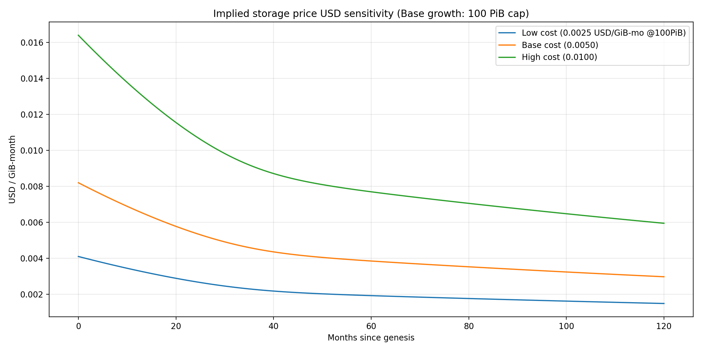


## 5. Black swan shock resilience (illustrative)

We model a combined shock:
- demand contraction (active storage drops 35% instantly, then recovers with 6-month half-life),
- cost spike (+60% at shock month, decays with 9-month half-life).

#### Active storage under shock vs baseline

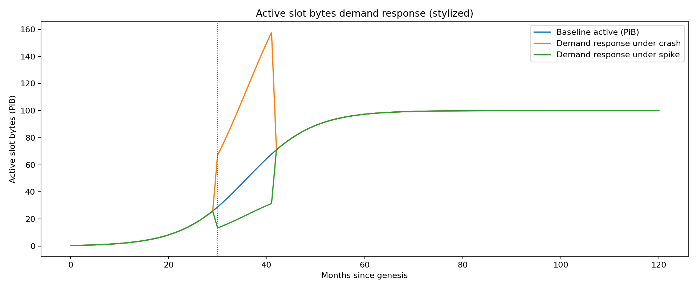

#### Storage price response

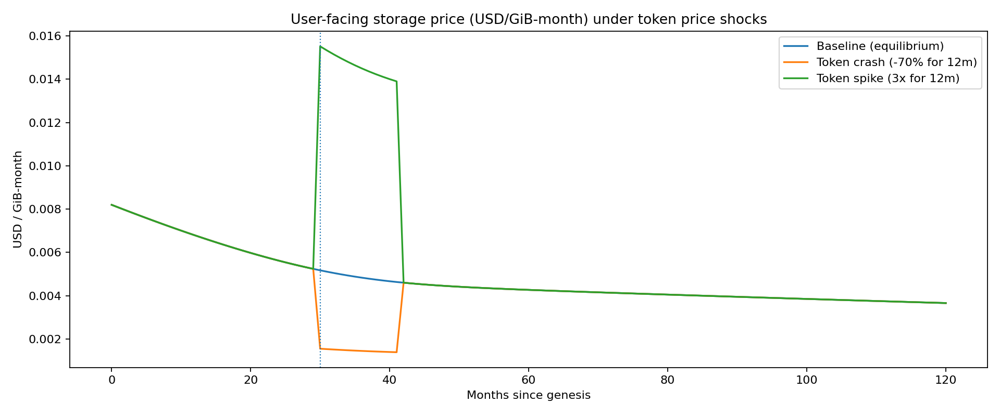

#### Issuance response (data-scaled)

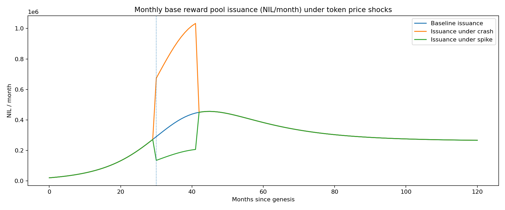

#### Provider profitability proxy

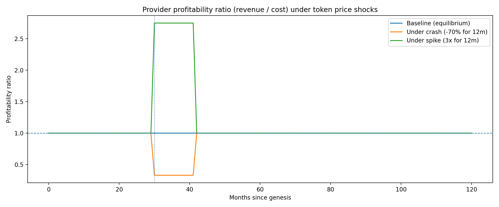

## 6. Interpretation & parameter-selection guidance (executive)

1. **bps is a strong “single knob.”**
   Framing base rewards as a bps share of notional rent makes subsidy intensity easy to reason about and adjust.

2. **Data-scaling makes absolute issuance grow with network usage without requiring a hard ceiling.**
   Per-byte subsidy still declines via bps decay.

3. **Bounded tail emission avoids a cliff.**
   A cliff is one of the most common “death spiral accelerators” when providers’ expected income abruptly drops.

4. **Shock resilience depends on repair + pricing control.**
   Data-scaled issuance automatically contracts when the network contracts; this is good for inflation control but can amplify provider stress.
   Governance must be ready to temporarily raise bps or lengthen halving intervals if a systemic shock threatens liveness.

5. **The biggest missing piece is storage escrow end-of-life semantics.**
   If storage lock-in behaves like a refundable deposit, self-dealing can farm emissions. If it behaves like a fee (consumed/burned over time),
   farming is naturally limited.

## 7. How to reproduce outputs

From the `src/` folder:

```bash
pip install -r requirements.txt
python run_all.py
```

Outputs will be written to `outputs/`.

